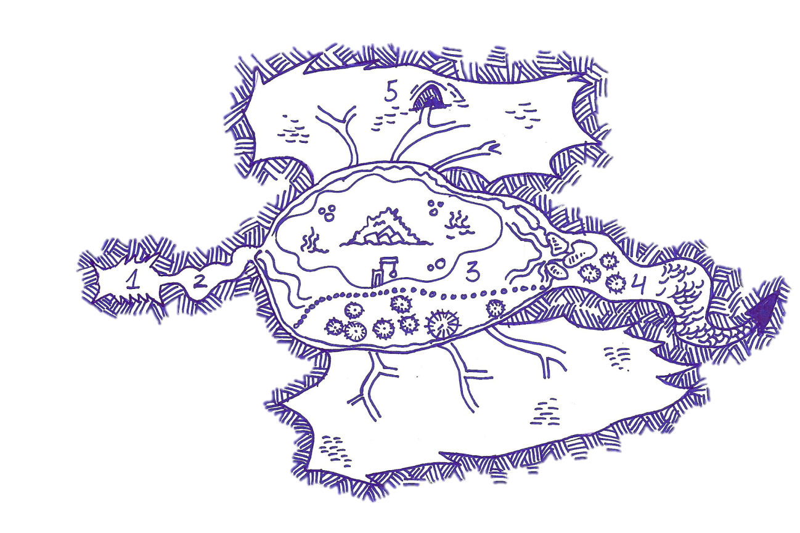

# Nivel 3: El Dragón, por José Manuel Palacios

## Mapa del nivel

<p align="center">
  
</p>

## Conexiones con otros niveles
* Zona 1: la Boca conecta con un túnel que se divide en dos, por lado derecho conduce a la [sala 7 del nivel 1](./nivel-01.md) y por el otro a una salida oculta en un lateral de la Montaña en [el exterior](./05-exterior.md).
* Zona 4: hay unas escalerillas que conectan con la [sala 17 del nivel 2](./nivel-02.md) y también hay una trampa que conduce a la [sala 2 del nivel 2](./nivel-02.md).
* Zona 5: hay una conexión con la entrada al [nivel 7](./nivel-07.md), El laberinto de Khagramar, en la sala 1.

## El Pozo de Shamarakan, historia del nivel

Hace muchos años, cuando la montaña era gobernada por el rey hechicero Azur I "El Loco", en este nivel se extendía un extenso jardín donde las concubinas reales pasaban el día ocupadas en telares, bañándose en cristalinas fuentes o gozando de dulces y manjares que los eunucos traían de las cocinas de los niveles inferiores. Azur apenas prestaba atención a estas mujeres, que eran colmadas de regalos y tenían una vida indolente, prisioneras en la jaula de oro de los hermosos jardines del serrallo.

Un día, el rey Azur recibió un regalo peculiar de un extraño viajero al que ofreció su hospitalidad. Debido a la modestia del mismo, Azur no prestó demasiada atención al principio a lo que tenía entre manos. Se trataba de un huevo de obsidiana de gran tamaño, decorado con ribetes de oro y zafiros. El huevo fue entregado a sus concubinas y alojado en el jardín en un pequeño pedestal, reposando sobre cojines de plumas.

Hasta que un día, un esclavo derribó una lámpara de aceite sobre el huevo. Las llamas lo envolvieron antes de que nadie pudiera apartarlo. Pero el huevo no se consumió, se quebró liberando de su interior un pequeño dragón rojo. Azur se sintió altamente complacido por el resultado. El esclavo fue la primera comida del dragón que Azur llamó Shamarakan. Shamarakan se convirtió en la mascota de Azur que lo cuidaba y mimaba más que a sus concubinas. Pronto el dragón alcanzó el tamaño de un caballo y Azur pasaba las horas en su compañía, alimentándolo, agasajándolo y enviándole todo tipo de sacrificios. Las concubinas, celosas, quisieron contratar unos asesinos para que les librase del dragón y recuperar las atenciones de Azur. Pagaron con sus joyas, sus sedas y sus cuerpos. Pero Azur, que era un paranoico descubrió su conspiración. Ordenó a sus hombres que las apresaran y todas ellas fueron despedazadas para alimentar al dragón.

Sin las concubinas allí, el jardín acabó descuidado y abandonado. Mientras, la bestia siguió creciendo, hasta que se hizo tan grande que era incapaz de salir por los tragaluces del techo por los que solía hacerlo para cazar o acompañar a su amo. El dragón siguió creciendo y creciendo, irradiado por la magia de la montaña. Azur no atendía a razones y todos los consejeros que trataron de advertirle de los peligros de hacer crecer tanto al dragón, acabaron entre sus dientes. Pasaron los años y Shamarakan siguió creciendo, mientras que Azur sacrificaba a sus súbditos y su ganado para alimentar al dragón, diezmando la población bajo un reinado de terror. Los sirvientes huyeron y Azur se encontró un día solo en las gigantescas estancias, sin más compañía que el descomunal dragón.

En un ataque de lucidez, Azur se dió cuenta de que el tamaño de Shamarakan era tal que amenazaba con derrumbar toda la montaña. Azur trató de destruir al dragón, y este lo atacó con furia. Lucharon durante 7 días y 7 noches y finalmente, Azur consiguió sumir a Shamarakan en un sueño comatoso del que no debería despertar. Sin embargo, antes de que consiguiese su objetivo, el dragón lo devoró, y junto con él su Vara de Archimago, fuente de gran parte de su poder. Su combate hizo que la montaña se derrumbase parcialmente sobre los jardines. Sepultando al descomunal dragón, que permanece vivo gracias a la magia de Azur y de su Vara de Archimago, en un estado de animación suspendida. Sus fauces, abiertas, dan paso a una angosta cueva por la que el fuego asciende de vez en cuando... y dan a una caverna hedionda donde los hombres lagarto, adoradores del dios Shamarakan, realizan sacrificios en el lago de ácido que se ha formado en el estómago del dragón...

## Zona 1: La Boca 

Hay un largo túnel antes de acceder a esta sala. El túnel se divide en dos, por un lado desemboca en [el exterior de la Montaña](./05-exterior.md), en una salida muy difícil de encontrar desde el exterior y que solo conocen los hombres lagarto, mientras que el otro lado desemboca en una masa palpitante completamente opaca de color negro del tamaño de un hombre que solo puede ser atravesada desde el [nivel 1 en la sala 7](./nivel-01.md), pero no en sentido contrario. Ni la luz ni el sonido pueden traspasarla, en ningún sentido. 

Al final del túnel está la entrada al Dragón, unos descomunales arcos de herradura dan paso a una sala alargada de unos 9 metros de largo y 6 de ancho. 12 extrañas columnas de marfil amarillento, como si fuesen cuernos que brotan del suelo rojizo, jalonan esta sala que conduce a un pasillo oscuro y angosto. El hedor que proviene del mismo es capaz de marear al hombre más curtido. El suelo y las paredes de aspecto coriáceo de rojo vivo, parecen pulsantes. Una extraña alfombra rojiza correosa se extiende hacia el interior del pasadizo. 

Cuando los personajes investiguen en la Boca, se puede producir un encuentro:

**Tabla de encuentros aleatorios de La Boca:**
```
1d20    Resultado 

1-9     Nada, despejado (por ahora...) 

10-15   Patrulla de hombres lagarto. 

16-20   Llamarada 
```

### Patrulla de hombres lagarto 

Una patrulla de 3d4 hombres lagarto hace su aparición. Pueden venir de una expedición de caza o disponerse a salir. Los hombres lagarto obedecen al gran sacerdote de Shamarakan, llamado "Ulk-Ultar". Los infieles deben ser purgados y conducidos al interior para ser sacrificados en el "Lago de Fuego". Los hombres lagarto están armados con lanzas y hachas, visten restos de armaduras de aventureros capturados anteriormente y son fanáticamente leales a su líder. Sin embargo, no lucharán hasta la muerte. Si los personajes se rinden, los capturarán y llevarán al interior. Si los personajes derrotan al menos al 80% de ellos, el resto huirá por el pasadizo de El Cuello en dirección a la Panza y el poblado, donde buscarán refuerzos. 

### Llamarada

De pronto se forma una increíble corriente de aire, como si fuese aspirado a gran velocidad al interior del pasadizo. Cualquiera que no salga inmediatamente de la estancia verá cómo se ilumina con una lengua de fuego que proviene del pasadizo e inunda la sala, calcinando todo (y a todos) los que se encuentren allí, daños graves (6d6). Se permite Tiro de Salvación (o similar) para medio daño.

## Zona 2: El Cuello 

Un angosto túnel redondo, de unos 3 metros de diámetro, que hace varios giros retorcidos como su fuera una espiral. Las paredes, de rojo intenso, parecen rezumar un limo viscoso y maloliente. El suelo es blando y gomoso y parece latir bajo los pies con frecuencia. En algunas áreas crecen hongos de color violáceo que parecen brillar con una apagada fosforescencia. Las esporas de estos hongos son altamente tóxicas y cualquier personaje que las toque o examine de cerca puede inhalarlas sin querer (Tiro de Salvación o similar para evitarlo). Las esporas producen daño por veneno 2d6, alucinaciones y fiebre alta (penalización seria a la actividad de -4 o -20%). 

El cuello posee un ecosistema propio que los hombres lagarto han aprendido a evitar. 

**Tabla de encuentros aleatorios de El Cuello:**
```
1d20    Resultado
1-4     Nada, despejado (por ahora...) 
5-8     Patrulla de hombres lagarto. 
9-10    Llamarada
11-13   Cieno Gris 
14-18   Cubo Gelatinoso 
19-20   Gusano Carroñero 
```

### Llamarada

De pronto se forma una increíble corriente de aire, como si fuese aspirado a gran velocidad al interior del pasadizo. Cualquiera que no salga inmediatamente de la estancia verá cómo se ilumina con una lengua de fuego que proviene del pasadizo e inunda la sala, calcinando todo (y a todos) los que se encuentren allí, daños graves (6d6). Se permite Tiro de Salvación (o similar) para medio daño.  
### Cieno Gris 

Este cieno altamente corrosivo se pega a los techos y se deja caer sobre los incautos, adhiriéndose a ellos y devorándolos vivos. Este cieno daña también el equipo de los personajes, disolviendo (Tiro de Salvación o similar para evitarlo) cuero, madera, tela y corroyendo poco a poco el metal. 

### Cubo Gelatinoso 

Difícil de ver en la penumbra, se desliza por el cuello tratando de absorber cualquier cosa viva que encuentre en su camino. 

### Gusano Carroñero 

Un parásito enorme que recorre El Cuello en busca de presas. Su veneno paralizante le convierte en un adversario peligroso. 

### Patrulla de hombres lagarto 

Una patrulla de 3d4 hombres lagarto hace su aparición. Pueden venir de una expedición de caza o disponerse a salir. Los hombres lagarto obedecen al gran sacerdote de Shamarakan, llamado "Ulk-Ultar". Los infieles deben ser purgados y conducidos al interior para ser sacrificados en el "Lago de Fuego". Los hombres lagarto están armados con mazas y porras, visten restos de armaduras de aventureros capturados anteriormente y son fanáticamente leales a su líder. Sin embargo, no lucharán hasta la muerte. Si los personajes se rinden, los capturarán y llevarán al interior. Si los personajes derrotan al menos al 80% de ellos, el resto huirá por el pasadizo de El Cuello en dirección a la Panza y el poblado, donde buscarán refuerzos. 

## Zona 3: La Panza 

El pasillo serpenteante acaba en una improvisada barricada hecha de huesos afilados y atados con cuerdas y correas. Está sucia y llena de restos de sangre. Esta barricada se encuentra custodiada por un grupo de Hombres Lagarto (al menos 2d4). Que tratarán de detener a cualquier intruso y en última instancia dar la alarma (con un cuerno que uno de ellos porta). Si se da la alarma, el pueblo de hombres lagarto se pondrá en pie de guerra. 

Tras la barricada se encuentra propiamente la Panza. 

Una descomunal caverna se abre decenas de metros hacia el interior, tenuemente iluminado por los extraños hongos luminiscentes que crecen salvajemente por las paredes. Estas, muestran un aspecto rojizo y veteado que parece pulsar y latir cada cierto tiempo. La roca parece gomosa y suave al tacto y parece rezumar un icor espeso y caliente que produce quemazón. El olor a almizcle impregna toda la sala. A la izquierda de la entrada se puede ver un gran lago de una sustancia verde y humeante, y en el centro el mismo, una pequeña isla en la que destacan varios esqueletos crucificados en postes. En el lado derecho de la entrada se pueden ver un grupo de chozas de madera, rodeadas de una empalizada, con un gran portalón doble flanqueado por dos tótems hechos con cientos de huesos y calaveras y coronados por máscaras que representan un dragón. El camino hasta la puerta está jalonado por postes donde se pudren cadáveres de todo tipo de humanoides. Una clara señal de "No eres bien recibido aquí". 

## Subsección 1: El pueblo 

El pueblo de hombres lagarto acoge a un clan entero formado por unos 30 guerreros, 8 guerreros de élite, el sacerdote Ulk-Ultar y unos 144 no combatientes entre mujeres y niños. Llegado el caso, las mujeres lagarto también lucharán con ferocidad, sobre todo si los personajes llegan a la sección 1.3. La Guardería donde se incuban los huevos. Los hombres lagarto de esta zona llevan siglos viviendo aquí, gobernados por una teocracia con un gran sacerdote al frente. Su dogma incluye los sacrificios al gran Dios Shamarakan en el Lago de Fuego, para purgar sus pecados y afrentas. Así cuando Shamarakan despierte de nuevo y gobierne el mundo, ellos serán su mano derecha. Estarán entre los elegidos. Su culto es sangriento, violento e incluye danzas rituales, escarificaciones, combates sangrientos e incluso canibalismo. 

El poblado está construido sobre todo con lianas y maderas, y reforzado con todo tipo de materiales traído del exterior. Tiene una empalizada de unos 2 metros de altura y de afiladas púas que rodea el perímetro. La entrada está jalonada por los dos tótems, una montaña de huesos y calaveras acumuladas con el tiempo y sobre los que se han colocado máscaras de dragón. La puerta es bastante resistente y pesa unos 200 kilos (ya que tiene piedras atadas para hacerla más pesada) y se abre como si se tratase de un rastrillo, gracias a un mecanismo de tornos que hay en el interior. 

Ten en cuenta que los hombres lagarto son xenófobos, violentos y siguen una religión donde los demás son vistos como herejes, impíos cuando no como simple alimento. Los extraños NO son bienvenidos y los hombres lagarto responderán con violencia y crueldad a cualquier intrusión. Si un grupo armado entra aquí, el poblado luchará a muerte por defenderse. Si por el contrario son los PJs los que se rinden o caen, bueno... alguno puede ser hecho prisionero para el sacrificio, para servir como alimento, o si es una mujer, para el harén del Ulk-Uktar. En cada visita que se haga a esta zona hay un 20% de posibilidades de que el pueblo esté vacío, y los hombres lagarto se encuentren en la isla del lago (a la que llegan en canoas) sacrificando a alguien (sumergiéndolo poco a poco en ácido) mientras cantan, bailan y gritan en éxtasis en una ceremonia horripilante. En este caso, la guardia en el pueblo será mínima. 

1. **Chozas**

   En estas chozas malolientes viven los hombres lagarto, el mobiliario es muy variopinto, robado de otros niveles del dungeon y decorado con todo tipo de objetos robados a aventureros y otras criaturas. Normalmente vive una familia de entre 5 y 7 miembros en cada choza, con un macho, varias hembras y su prole. Hay un 5% de que haya algo realmente útil o un objeto mágico poco poderoso en alguna de las chozas. 

2. **Almacén**

   En este almacén se guardan los excedentes de comida (incluyendo, en unos garfios colgados del techo los restos de aventureros poco afortunados y otras criaturas) y otros objetos de valor de la comunidad. 
Aquí se puede encontrar casi de todo, una cantidad grande de equipo común (casi todo en mal estado) y un 10% de posibilidades de 1d4 objetos mágicos menores. 

   El almacén siempre está custodiado por 2 guerreros. 

3. **Guardería de huevos**

   Esta gran sala tiene el suelo de piedra y abundantes cestos donde se depositan los huevos de los que nacerán futuros hombres lagarto. En ollas metálicas hay colocadas piedras calientes el calor es sofocante. 

   En la guardería habrá al menos 3d6 huevos sin eclosionar y siempre 2d4 mujeres lagarto y al menos 1 guerrero en la puerta. 

4. **Sala Común**

   Esta es la sala común donde Ulk-Uktar imparte justicia desde un trono hecho de calaveras y huesos. Se trata de una enorme nave con un atrio, donde arde el fuego. A ambos lados de este fuego hay mesas bajas donde los hombres lagarto se sientan sobre alfombras y esteras. Las paredes de la choza poseen unas pinturas donde se muestra la historia de Shamarakan y su despertar en el futuro para gobernar el mundo. 

   Los aposentos de Ulk Ultar se encuentran al fondo de la sala, siempre custodiados por 4 guerreros de élite, leales guardaespaldas. También tiene un auténtico harén con todo tipo de mujeres, no sólo mujeres lagarto, sino humanas, enanas e incluso una halfling. Hay 12 mujeres cautivas, todas ellas desnudas y con un grillete al cuello para encadenarlas juntas por la noche cuando no tienen que satisfacer los lascivos instintos de su captor. Se encuentran en mal estado físico y mental, tan traumatizadas que lucharán para no ser rescatadas. 

   Ulk-Ultar viste un taparrabos y una máscara de dragón pintada que le da un aspecto terrorífico. Además es anormalmente grande y fuerte, lo que lo convierte en un adversario terrible. Suele blandir una maza de hueso decorada y llena de muescas. Los abalorios que porta tienen un valor alto (sobre 200 no). Ulk-Ultar tiene una llave con forma de calavera (Skullkey) colgada del cuello. No sabe para qué sirve, pero cree que es valiosa y no se separa de ella. 

   La maza es +1 y con un crítico hace 1D6 de daño extra por energía negativa. Un personaje bueno sentirá aversión inmediatamente por tal objeto maldito. 

   Ulk-Ultar es un hechicero decente posee también un laboratorio. En todo momento hay 2 pociones (aleatorias) y un 20% de 1d4 objetos menores. También hay un alambique donde destila una pegajosa sustancia. Habrá al menos 4 redomas completas llenas. Se trata de un Aceite de Protección contra el Ácido. También se encuentra en el laboratorio el Plan, una gran piedra tallada que pertenece a los goblins del nivel 1.Todos los objetos que son bañados con este aceite quedan a salvo del ácido durante 6 semanas. En los seres vivos la duración se reduce a 6 horas. En los objetos la inmunidad es completa. En los personajes la inmunidad elimina 1/2 del daño, o la totalidad si se supera un Tiro de Salvación o similar. 

5. **Armería**
 
   Esta es la armería de los hombres lagarto, una choza redondeada llena de estantes donde reposan armas y armaduras (en diversos estados de conservación) de sus víctimas. Hay un 50% de posibilidades de encontrar cualquier arma común en un estado de uso aceptable. También hay un 5% de encontrar algún arma mágica de poder bajo. 
6. **Prisión**

   Más que prisión, esta zona es básicamente un corral donde los prisioneros son arrojados desnudos, con un grillete en el cuello con el que se les encadena por la noche a una argolla en un poste central. Hay un 50% de posibilidades de que haya un prisionero aquí, esperando para ser convertido en alimento o ser sacrificado. Normalmente hay uno o dos guerreros en la zona vigilando a los prisioneros. 

## Subsección 2: El Lago y la Isla 

El lago es una fétida ciénaga de un líquido ácido que corroe con rapidez todo lo que toca y aspecto infecto. En el centro de la misma hay una isla que parece formada de huesos, rocas y todo tipo de objetos que no se funden con el ácido. En la orilla de la isla hay un patíbulo, con una grúa que permitiría bajar poco a poco a persona hasta el ácido, para que se consumiera lentamente. Hay pasarelas construidas sobre pilares de rocas. Toda la zona está impregnada de un insoportable hedor. 

Una salpicadura de ácido requiere una Tirada de Salvación (o similar) o sufrir 1 punto de daño. Mientras que meter un brazo o una pierna hace 1d4 por asalto. Meter medio cuerpo 2d6 y zambullirse 4D6 de daño. Sin tiro de salvación posible, meterse en ácido ¡DUELE!. Los objetos que porte el personaje deben hacer una Tirada de Salvación o similar en cada asalto que permanezcan en el ácido. Si la fallan quedarán inservibles. 

Los hombres lagarto emplean unas canoas de cuero tratadas alquímicamente (con el Aceite de Protección contra el Ácido) para moverse por el lago. Y utilizan pértigas tratadas para impulsarlas. 

En la isla hay poco o nada de valor. Pero si algún personaje es capturado, puede ser conducido a esta zona para ser sacrificado. 

Lo que no saben es que bajo la pila de huesos y de rocas se encuentra enterrada la Vara de Archimago de Azur. Si los personajes son magos o hechiceros pueden notar la magia que emana de la isla... llamándoles.

Para llegar a las cavidades del ala y los conductos interiores que la atraviesan hay que cruzar unas pasarelas inestables hasta allí.

## Zona 4: El aparato digestivo del Dragón

Esa zona es el aparato digestivo de la bestia durmiente. Aún está caliente. Andando por la zona se puede pisar una pisar una vejiga gigante y caer al nivel inferior. Es una trampa que conduce a la [sala 2 del nivel 2](./nivel-02.md).

Antaño alguien encontró una salida a los túneles naturales de la Montaña y cavaron construyeron unas escalerillas serperteantes que conectan también con el [nivel 2 (sala 17)](./nivel-02.md).

## Zona 5: Las Alas

Cruzando el lago de ácido se pueden encontrar unas cavidades circulares, es el esqueleto del Dragón. Se puede acceder al interior de una de ellas que es la más grande, lo suficiente como para que una criatura mediana pase agachada y acceda  al interior de las alas. Dentro hay un conducto por el que entra aire y por el que se conecta con la red de cavernas del interior de la Montaña Soberana y se acaba llegando a la sala 1 del nivel 7.
