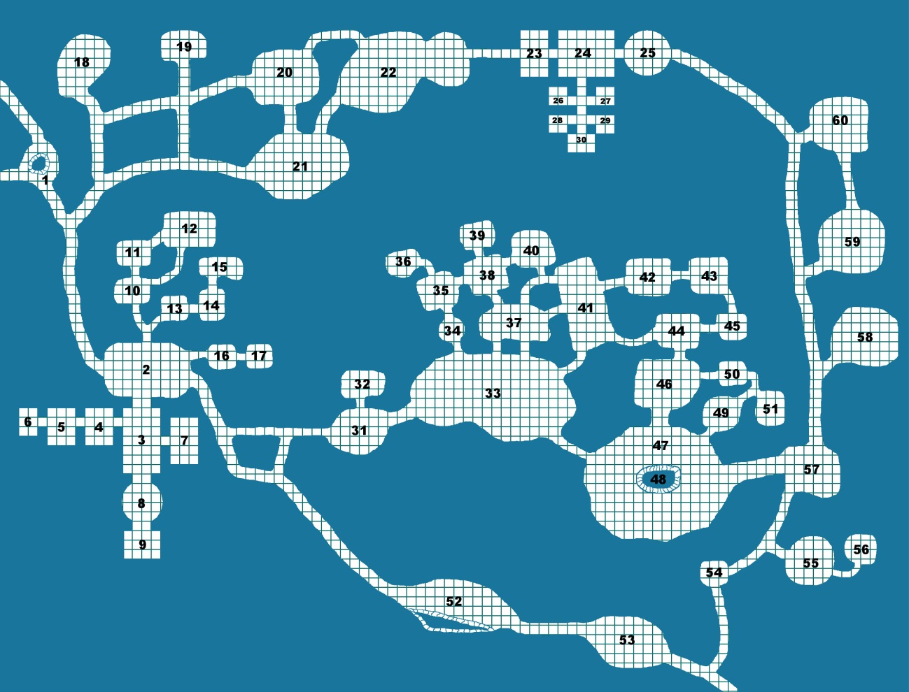

# NIVEL 5: Hobgoblins y micónidos, por Carlos de la Cruz.

## Mapa del nivel


<p align="center">
  
</p>

## Conexiones con otros niveles

* La sección 1, el Pozo: tiene tres dos accesos a otros niveles, la salida oeste lleva por un túnel resbaladizo y descendente lleno de residuos, a la [sala 4 del nivel 2](./nivel-02.md). El acceso norte se bifurca y conduce a las puertas de la [zona 8 en el nivel 4](./nivel-04.md). La salida sur lleva al interior del propio nivel
* Entre las secciones 53 y 54 hay un túnel que conduce a [la entrada del nivel 8](./nivel-08.md).

## Introducción

Gran parte de la comida que se obtiene en la Montaña Soberana proviene del exterior, pagada como tributos de las gentes de la región a los Reyes de la Montaña. Sin embargo, ahora no existe un Rey, y los habitantes de la gran montaña deben apañarse como pueden. Una de las fuentes de alimento más fiables son los hongos que cultiva la XIIIª Legión de Kangg, una tribu hobgoblin. En realidad, la que cultivan sus esclavos micónidos (los hombres hongo).

La XIIIª Legión de Kangg era una unidad militar de hobgoblins que durante años había servido a los Reyes de la Montaña. Después de la desaparición del último Rey, su líder, el Centurión Norens, decidió asegurar su propio futuro y se llevó a sus soldados más leales hasta las cuevas que ocupa hoy, esclavizando a los micónidos que vivían allí, y obligándoles a entregarles parte de su cosecha. Al controlar esta fuente de alimentos, Norens y sus hobgoblins se aseguraron una posición preeminente en lo que queda de la sociedad de la Montaña Soberana.

Aunque la XIIIª Legión ha sufrido muchas bajas y ya apenas quedan unos pocos soldados, muchas mujeres hobgoblin acudieron a Norens en busca de protección, y la tribu está creciendo de nuevo. La alianza de Norens con el caudillo ogro Oglub le ha dado la fuerza militar necesaria para seguir controlando esta sección de la Montaña.

Las mujeres hobgoblin utilizan los hongos que cultivan los micónidos para crear varios productos. El principal es una harina que puede hornearse para hacer un pan resistente y nutritivo. Pero también comercian con champiñones y musgos desecados, brebajes destilados y setas alucinógenas. Con los hongos más bastos crían escarabajos de fuego que suponen una bienvenida variedad para su dieta.

La principal razón de que Oglub y sus ogros (los Asesinos de Oglub) sigan ayudando a los hobgoblins es que reciben parte de las ganancias comerciales, y por otro lado, porque el hijo de Oglub, Orgub, está estudiando las enseñanzas de Kangg, Dios de la Guerra, bajo la tutela del chamán hobgoblin Uder. Quizá cuando Orgub haya aprendido todo lo necesario, la alianza deje de ser provechosa para los ogros.

Los habitantes de la Montaña Soberana que desean comerciar con los hobgoblins pueden hacerlo en una cueva cercana a su cubil. En esa cueva hay un templo a Bargulis, Dios del Intercambio Fructífero. Cada semana, la Sombra de Bargulis saca del templo el Sarcófago de Bargulis, un cofre dentro del cual se dice que habita el dios, y cuya influencia hace que sea imposible alzar un arma con violencia, al menos mientras el sonido que emana del Sarcófago sea audible. Gracias a esta magia, una vez por semana gentes de toda la Montaña pueden comerciar entre sí sin miedo a caer víctimas de una emboscada (aunque pueden sufrir la emboscada de camino...). 

Junto al Templo de Bargulis vive una tribu de bugbears, los Siniestros Servidores de Sareb. Su jefe, Sareb, alquila a sus guerreros como ladrones y asesinos. Sareb no desea nada más en este mundo que sojuzgar a los hobgoblins, pero sabe que mientras la XIIIª Legión esté aliada con los ogros, no podrá conseguirlo.

Se dice que cerca del hogar de los hobgoblins existe una tumba donde yacen viejos Reyes de la Montaña, que fueron enterrados con sus objetos mágicos. Sin embargo, también se rumorea que dicha tumba está protegida por terribles guardianes y astutas trampas. Pocos se han atrevido a buscar este lugar, y menos aún han regresado para contarlo.

## Facciones y Líderes

### La XIIIª Legión de Kangg, hobgoblins

**Norens, Jefe Hobgoblin**. Un viejo soldado que aprovechó su ocasión y se hizo con el control de su propia tribu. Es el líder indiscutible de su tribu, y sabe que su seguridad depende de que mantengan la alianza con Oglub y sus ogros, por lo que tratará de mantenerla a toda costa. 

Norens dispone de los siguientes objetos mágicos: 

* Los Ojos del Carisma, unas lentes que lleva sobre sus ojos y que le permiten lanzar el conjuro Hechizar Persona a voluntad (sólo un objetivo por turno). Sólo se puede evitar caer bajo el poder de las lentes si se pasa una tirada de salvación contra conjuros con un -2. 
* Un Anillo de Invisibilidad.

**Narkag, hijo de Norens, Subjefe Hobgoblin**. El hijo mayor de Norens es un gran guerrero, y probablemente heredará el liderazgo de la tribu. Su padre delega en él las tareas de liderazgo cuando hay que ir a comerciar con los hongos, y Narkag ha empezado a explorar diversas partes de la Montaña y sus túneles. Es un hobgoblin inquieto, y en una de sus salidas encontró a la lamia Nadirasi. Narkag consiguió no caer bajo el influjo de la lamia, y de vez en cuando la visita. La lamia corresponde a su atención con halagos y promesas, esperando poder utilizar al joven hobgoblin para tomar el control de toda su tribu, cuando el tiempo sea propicio.

**Varkag, Matriarca Hobgoblin**. Varkag es la líder no oficial de las mujeres hobgoblin. Sabe preparar todo tipo de hongos, es la mejor partera de la región, y gobierna a las mujeres con puño de hierro. Opina que Norens es demasiado viejo para seguir liderándoles, y que Narkag (su hijo preferido) debería desafiar al jefe y asumir el control.

Varkag dispone de un objeto mágico: un Vial de Agua Inagotable.

**Uder, Chamán Hobgoblin**. Uder es un sacerdote de Kangg, Dios de la Guerra. Lleva muchos años sirviendo bajo las órdenes de Norens, y es su mano derecha. Es el encargado de liderar los ritos religiosos y las ofrendas a Kangg, y también de entrenar a los jóvenes para que aprendan disciplina militar y tácticas de guerra. Ha aceptado al ogro Orgub como discípulo a regañadientes, sólo porque Norens se lo ha ordenado. Pero se está resistiendo a enseñarle magia, con la excusa de que aún no está preparado.

Uder es un clérigo de nivel 6.

Uder dispone de los siguientes objetos mágicos:

* 1 poción de Fuerza de Gigante.
* 1 vara de Detectar Enemigos.
* 10 viales de Polvo de Aparición (detecta seres invisibles y ocultos).

**Ufniki, Doctor Brujo Hobgoblin**. Ufniki es un mago medianamente poderoso, pero cobarde y poco ambicioso. Nunca habría destacado en la antigua Legión, pero ahora es el único brujo que queda, y eso le da un estatus del que lleva años aprovechándose para obtener riqueza y prestigio. Todo el mundo le trata con respeto y miedo y Norens se lo permite porque la amenaza de su magia es una de las razones de que bugbears y ogros mantengan el actual status quo. 

Ufniki es un Mago de nivel 6, y conoce los siguientes hechizos: Sueño, Oscuridad, Telaraña, ESP, Bola de Fuego y Dispersar Magia.

Ufniki dispone de los siguientes objetos mágicos:

* Pergamino de Guardia contra Muertos Vivientes.
* Anillo de Protección +2 
* Varita de Polimorfizar (9 cargas)

### Tribu de los Asesinos de Oglub, ogros

**Oglub, Jefe ogro**. Oglub es un ogro brutal y despiadado. Pero no es idiota. Ha conseguido unir a una gran cantidad de miembros de su raza, y ha establecido una alianza con Norens el hobgoblin. Sus ogros patrullan estos túneles junto a los hobgoblins, y esto ha permitido que ambas tribus prosperen. Sin embargo, a Oglub no le importaría esclavizar a los hobgoblins si tuviera la oportunidad. Si no lo hace es por el temor que le provoca la magia que pueden llegar a esgrimir el chamán y el doctor brujo de los hobgoblins. Pero eso puede cambiar pronto, cuando su hijo Orgub aprenda los secretos del Dios Kangg. Entonces, puede que las cosas cambien en estas cuevas…

Oglub tiene un Hacha +2.

**Orgub, hijo de Oglub, Iniciado de Kangg**. Orgub es el discípulo de Uder, el chamán hobgoblin. Desde hace unos meses estudia bajo su tutela, tratando de aprender los secretos mágicos de Kangg, el Dios de la Guerra. Esta es una de las bases del acuerdo entre ogros y hobgoblins, y Orgub se está esforzando todo lo que puede, pero las lecciones de Uder están siendo difíciles de aprender, y Orgub teme decepcionar a su padre. Sobre todo porque su padre devora a aquellos que le decepcionan.

### Tribu de los Siniestros Servidores de Sareb, bugbears

**Sareb, Jefe Bugbear**. Sareb pertenecía a una unidad de exploradores que servía al Rey de la Montaña. Cuando el Rey desapareció, Sareb trabajó como asesino a sueldo para cualquiera que pudiera pagarle. Al fin su fama fue lo suficientemente grande como para atraer a una buena cantidad de bugbears que le sirven fielmente. Les ha entrenado y enseñado muchos secretos, y ahora se gana la vida alquilando sus servicios al mejor postor. Conoce a Norens de los viejos tiempos, y sabe que es un líder astuto y peligroso. Pero nada le gustaría más que controlar por completo el comercio de hongos. Si tan solo pudiera atraer a esos malditos ogros a su bando…

Sareb tiene una Daga +2, +3 contra Hombres Bestia.

### Habitantes del Templo de Bargulis

**La Sombra de Bargulis, Espectro**. Este espectro, conocido como la Sombra de Bargulis, fue convocado desde el Otro Lado para proteger el tesoro del templo. Cada semana, ordena a las estatuas de hierro que habitan el templo que lleven el Sarcófago de Bargulis hasta la zona comercial, y luego flota hasta el techo, mientras una música sobrenatural emerge del sarcófago. Si alguien se atreve a tocar el Sarcófago, o intenta entrar en el templo para robar el tesoro, usará todos sus poderes para acabar con el desdichado. Lleva décadas cumpliendo su misión, y no descansará jamás.

**Nain Forjarroja, Líder Enano**. Nain es un herrero, y el líder de una pequeña familia formada por su esposa (Kani) e hijo (Dain), dos hermanos (Nari y Nôri) y un viejo compañero de aventuras (Oin). Nain vive en el Templo de Bargulis, en unas estancias que han reacondicionado para convertirlas en su hogar. En una gran sala, Nain y sus hermanos han instalado una forja, y se dedican a crear herramientas y armas que venden en el mercado. Nain cree que vivir en el templo les protege hasta cierto punto, pero ha dado instrucciones a sus familiares para que nadie trate de entrar en las salas donde se guarda el Sarcófago de Bargulis, ni allí donde se guarda el tesoro. Por el momento, todos les han hecho caso, pero cada día que pasa el amigo de Nain, Oin, se pregunta qué tesoros se guardarán allí... 

**Ain y Nid, Gárgolas**. Estas dos gárgolas viven frente a la entrada del Templo de Bargulis prácticamente desde su fundación. Duermen en dos agujeros excavados a varios metros sobre la entrada, y se enfrentarán a cualquier fuerza invasora que trate de entrar en el Templo. Le han cogido cariño a los enanos de Nain, que les han regalado algunas joyas y adornos, y lucharán para protegerles si estuvieran en peligro.

### Otros seres

**Nadirasi, Lamia**. Nadirasi es una lamia mitad mujer mitad serpiente. Reside en una pequeña casa de piedra construida en una de las cuevas más solitarias, y está protegida por un grupo de guerreros humanos a los que esclavizó con sus poderes hace meses. Sus protectores van cambiando con el tiempo, a medida que envejecen o mueren protegiendo a su ama. Nadirasi es presumida y cobarde, y tiene la vaga esperanza de conquistar a los hobgoblins a través del joven Narkag, el hijo de Norens. Sin embargo, lo que realmente querría es poder entrar en la tumba de los viejos reyes que se encuentra a pocos metros de su cubil. Pero teme las trampas que podría encontrar dentro, por lo que, de cuando en cuando, envía a aventureros hacia allí, con la esperanza de que le allanen el camino.

**Los Señores del Polvo, Momias**. Los restos momificados de cinco Reyes de la Montaña que fueron enterrados en esta tumba. Cada Rey está sentado en un trono, rodeado de sus tesoros y objetos mágicos, y cobrarán vida si alguien osa penetrar en su tumba.

## Leyenda de las salas del nivel

### Sección 1 - El pozo

Esta cueva tiene tres salidas. Las salidas norte y oeste. La salida oeste lleva a la sala 4 del  nivel de las alcantarillas. La salida norte  conduce al nivel 1, en su salida por el suroeste del mapa entre las salas 4 y 13, de donde suelen llegar grupos de gente dispuesta a comerciar. La salida del sur lleva al Templo de Bargulis. En el centro de esta cueva hay un gran foso del que no se puede ver el fondo, y del que, cada cierto tiempo, surgen monstruos.

Si algún aventurero arroja algún tipo de objeto al foso, llamará la atención de los seres que allí moran. El Dungeon Master deberá hacer una tirada para determinar si alguno de ellos sube a investigar:


```
Tirada (1d6) Monstruo
1-2          Ningún monstruo
3            Ciempiés gigante (1d6)
4            Zombies (1d6)
5            Araña gigante (tarántula) (1d2)
6            Ankheg (1)
```

### Sección 2 - El mercado

Esta cueva rectangular es el lugar donde se reúnen los habitantes de la Montaña Soberana para comerciar, principalmente con los hongos que traen los hobgoblins. 

En la salida norte hay dos grandes puertas de bronce que se mantienen por lo general cerradas. Las gárgolas Ain y Nid viven en esta sala, en dos agujeros en la pared excavados por encima de las escaleras que llevan al Templo de Bargulis. Si alguien llama a las puertas de bronce desde el túnel, normalmente son los bugbears los que acuden a interesarse por la identidad de los visitantes, pero ocasionalmente Ain y Nid han abierto las puertas.

Hay un pozo del que los enanos y los bugbears que viven junto a esta sala usan para aprovisionarse. Ocasionalmente (1 en 1d6) se pueden encontrar a dos Monos Voladores comprobando que el pozo siga siendo operativo.

Una vez por semana, el Sarcófago de Bargulis (sección 8) es transportado hasta el centro de esta cueva por cuatro estatuas de hierro animadas. La Sombra de Bargulis (sección 9) flota tras el Sarcófago, y cuando las estatuas de hierro lo dejan en el suelo, el espectro abre ligeramente la tapa del gran sarcófago, y una música celestial comienza a sonar. La Sombra de Bargulis flota hasta el techo y allí permanece unas horas, hasta que vuelve a bajar, cierra la tapa, y las estatuas de hierro llevan el Sarcófago de nuevo dentro del templo.

Mientras la música del Sarcófago suena, ningún ser puede alzar un arma contra otro ser. Sí se puede luchar desarmado, y los monstruos y bestias pueden usar sus garras y dientes para luchar.

Si alguien intenta tocar el Sarcófago, la Sombra de Bargulis baja del techo y ataca al infortunado, ayudado por las estatuas de hierro. Si la tapa del Sarcófago se quita por completo, la música aumenta cada vez más su volumen, provocando que el suelo tiemble. En tres asaltos, la intensidad de la música es tan grande que todos los que la oigan sufrirán 1d3 puntos de daño por asalto. Si nadie cierra el Sepucro, finalmente el techo de la sala se derrumbará, matando a todos los que se encuentren en ella.

Si alguien mira en el interior del Sarcófago, verá al Dios Bargulis, que habita en el interior. Si no pasa una tirada de salvación contra hechizo, se quedará inmóvil, incapaz de articular palabra o hacer ningún movimiento, cautivado por su belleza. Por supuesto, la música seguirá sonando y aumentando en intensidad.

Si los aventureros están aquí en día de mercado, habrá 1d6 bugbear en la sala, 1d3 enanos y 2d10 hobgoblins. Además, puede haber representantes de otras regiones de la Montaña. El Dungeon Master debe tirar 1d6 para saber el número de grupos que han viajado hasta el mercado. Para saber la identidad de cada grupo, el Director de Juego debe tirar en la siguiente tabla:

```
Tirada (1d10)           
1              Visitantes del nivel 8
2              Visitantes del nivel 1
3              Visitantes del nivel 3 
                 2d4 hombres-lagarto, que traen el equipo de las víctimas de sus sacrificios para cambiarlas por comida.
4              Visitantes del nivel 4
5              Visitantes del nivel 2
6              Visitantes del nivel 1
7              Visitantes del nivel 9
8              Visitantes del nivel 7
9              Visitantes del nivel 6
10             Visitantes del exterior 
                 puedes elegir de entre los encuentros con criaturas inteligentes de la tabla de infortunios del camino.
```

### Secciones 3 a 9 - El Templo de Bargulis

Este es el Templo del Dios Bargulis, Señor del Comercio y el Intercambio Fructífero. Dentro de este templo no es necesario realizar una tirada de Monstruos Errantes.

### Sección 3 - El Vestíbulo del Templo

Esta sala rectangular está flanqueada por varias columnas a cada lado. La sala no está nunca iluminada y eso hace complicado ver las pequeñas puertas detrás de las columnas que llevan a las habitaciones de los enanos.

Cuando los personajes entren en la sala, el Dungeon Master debe tirar 1d6:

* Con un 1, uno de los enanos estará en el vestíbulo, pasando de la sala 4 a la 7 o viceversa. El enano lleva una pequeña lámpara de aceite para iluminarse.
* Con un 2, el enano Oin estará examinando los relieves de las puertas que llevan a la sala 8, tratando de averiguar cómo abrirlas sin despertar a sus guardianes.
* Con un 3-6, la sala está vacía.

### Sección 4 - Cocina y despensa

Esta sala ha sido habilitada como despensa y cocina de los enanos. Hay utensilios de cocina y un hogar donde Kani, la mujer de Nain, cocina para el pequeño grupo de enanos. En las alacenas hay comida envasada y empaquetada. Un grupo de aventureros podría llegar a empaquetar raciones suficientes para alimentar a 6 personas durante 2 semanas.

Cuando el grupo entre en la sala, el Dungeon Master debe tirar 1d6:

* Con un 1-2, Kani está cocinando en la sala.
* Con un 3, Kani está cocinando en la sala, ayudada por Dain, su hijo.
* Con un 4-6, la cocina está vacía

### Sección 5 – Dormitorio

Este es el dormitorio de Dain, Nari, Nôri y Oin. Hay cuatro pequeñas camas en la sala, y un baúl al lado de cada una de ellas. En los baúles hay ropa y pertenencias personales de poco valor monetario.
Cuando el grupo entre en la sala, el Dungeon Master debe tirar 1d6:

* Con un 1, hay 1d4 enanos durmiendo en la sala.
* Con un 2, hay 1d2 enanos durmiendo en la sala.
* Con un 3-6, la sala está vacía.

### Sección 6 - La habitación de Nain y Kani

En esta sección está el dormitorio de Nain y Kani. Hay una cama grande y dos baúles llenos de ropa. El tesoro de los enanos se encuentra escondido detrás de una pequeña trampilla hábilmente escondida en el suelo (se encontrará como cualquier otra puerta secreta). Dentro de la trampilla hay 800 monedas de plata; dos turquesas (25 mo cada una); una barra de lapislázuli (25 mo); un juego de 10 lentes de relojero (30 mo/lente); un brazalete de bronce (170 mo); un medallón de cobre con arabescos (140 mo); y un jarrón de porcelana (600 mo).

Cuando el grupo de aventureros llegue a esta sala, el Dungeon Master tirará 1d6:

* Con un 1, Nain y Kari están durmiendo en la cama.
* Con un 5-6, la sala está vacía.

### Sección 7 - La forja de los enanos

Antes de que un grupo de aventureros entre en la sala, el Dungeon Master debe tirar 1d6:

* Con un 1-4, Nain, Nari y Nôri están trabajando en la forja. Se oyen ruidos de martilleo desde el exterior.
* Con un 5-6, la puerta está cerrada con llave (Nain siempre lleva la llave encima). En la puerta hay una trampa de aguja. Si no se desactiva, una aguja se clavará en la mano del que intente abrir la puerta. Si no pasa una tirada de salvación contra venenos, caerá al suelo completamente paralizado durante 1d3 horas.

Cuando un grupo de aventureros entre en la sala, se encontrará con la forja de Nain, donde éste y sus dos hermanos pasan la mayor parte del tiempo. Suelen comprar lingotes de metal en el mercado con los que construyen armas, herramientas y joyas por encargo.

En esta sala hay dos yunques, un horno para calentar el metal y varias herramientas de forjado como martillos y tenazas. En un rincón, bien ordenados, hay 20 lingotes de hierro, cada uno valorado en 1 moneda de oro. También hay un Brasero de Conjuración de Elementales de Fuego, que los enanos usan para invocar y controlar a un elemental del fuego que les ayude con su forja (se puede invocar y controlar a un elemental por día; hay que concentrarse para mantenerle bajo control). Normalmente los enanos se turnan para convocar y controlar el metal, mientras los otros dos trabajan en la forja.

### Sección 8 - La Sala del Sarcófago

En el centro de esta sala circular y abovedada descansa el Sarcófago de Bargulis, flanqueado por cuatro estatuas de hierro. Las estatuas se activarán y atacarán a cualquiera que entre en la sala. Las consecuencias de abrir el Sarcófago se detallan en la descripción de la sala 2, aunque dentro de esta sala no suena la música del Sarcófago, por lo que se pueden usar armas con normalidad.

### Sección 9 - La Sombra de Bargulis

En esta sala se encuentra el tesoro del templo de Bargulis: 2.000 monedas de plata; 4.000 monedas de oro; 1 rollo de seda (400 mo; 4 kilos); 10 piezas de marfil (60 mo; 0,5 kilos/pieza); 1 pieza de jade (100 mo); 1 pieza de ónix (50 mo); 3 viales de perfume (125 mo/vial); una capa bordada (1500 mo; 1 kilo); una estatua de alabastro (600 mo); un medallón de platino (1100 mo); un mapa del tesoro que lleva a un botín de 12.000 monedas de oro (detalles por determinar por el Dungeon Master); un escudo +2, con una superficie que siempre se mantiene brillante como un espejo; un Anillo de Protección +2, hecho de oro y con una joya verde que, si se quita del anillo, rompe el encantamiento; una espada +3 que brilla con una tenue luz azul cuando se saca de su vaina, y que aumenta de brillo si se enfrenta a una oscuridad mágica, hasta terminar dispersándola; una poción de invisibilidad; y un pergamino con dos conjuros divinos (Comunión y Bendición)

En una vasija negra descansa la Sombra de Bargulis, un espectro. Normalmente siempre esperará a que alguien coja la vasija negra para atacarle por sorpresa con su terrible toque. Si nadie coje la vasija pero trata de llevarse algo del tesoro, la Sombra de Bargulis saldrá de su vasija para atacar a todo el grupo.

### La Guarida de los Bugbear - Salas 10 a 17

Estas son las habitaciones de los bugbear. Las tiradas de Monstruos Errantes en estas salas siempre darán como resultado 1d3 bugbears armados que intentarán siempre sorprender al grupo. 

Las puertas que llevan desde la sala 2 hasta las guaridas de los bugbears son de madera sólida y se atrancan desde dentro.

### Sección 10 – Cocinas

Esta es la cocina de los bugbear. Tiene un hogar para asar y muchos armarios con provisiones y utensilios de cocina. En este lugar siempre hay 1d3 mujeres bugbear.

### Sección 11 - Despensa

En la despensa de los bugbear se almacenan suficientes provisiones como para alimentar un mes a la tribu.

### Sección 12 - Sala de las mujeres

En esta sala viven las mujeres bugbear con sus hijos (8). Siempre habrá 2d4 mujeres bugbear y 2d4 niños en esta sala. Hay camas para todos y arcones con ropa y otras pequeña propiedades.

### Sección 13 - Sala del Trono

Esta es la sala en la que el Jefe Sareb recibe las peticiones de alquiler de sus servicios. Está adornada con tapices y cortinajes, y con un gran trono en el que el líder de los bugbear escucha las ofertas. Detrás del tapiz que hay tras su trono se encuentra una puerta que lleva a sus aposentos.
En esta sala siempre hay dos guerreros bugbears montando guardia. También duermen aquí, en dos jergones que por lo general están escondidos detrás de unos cortinajes.

### Sección 14 - Dormitorio de Sareb

Sareb duerme en esta sala, junto a su mujer favorita en un momento dado. Hay botellas de vino y un baúl con ropas y algunas pertenencias.

### Sección 15 - Sala del tesoro

La puerta que lleva desde el dormitorio de Sareb a la sala del tesoro es de hierro, y su cerradura es difícil de forzar. Dentro de la sala se encuentra el tesoro de los bugbears: 5.000 monedas de plata; 6.000 monedas de oro; 1 paquete de pieles (500 mo; 5 kilos); 500 plumas (3 mo/pluma; 0,20 kilos/pluma); 1 jarra de porcelana (500 mo; 2 kilos); 7 jarras de aceite para lámpara (20 mo/jarra); 22 botellas de vino (5 mo/botella); 2 jarrones de terracota (100 mo/jarrón; 5 kilos/jarrón); 12 paquetes de pieles (15 mo/paquete; 3 kilos/paquete); 1 collar de colmillos de monstruo (50 mo); 5 viales de perfume (25 mo/vial); 1 topacio (500 mo); 1 cuarzo (10 mo); 1 calcedonia (75 mo); 1 malaquita (10 mo); 1 cristal lunar (50 mo); 1 coral (100 mo); 1 ónice (50 mo); 1 capa de pieles (500 mo; 1 kilo); 2 estatuas (700 mo/estatua; 0,5 kilo/estatua); 1 ópalo (3000 mo); 1 espada +1, con un efecto de Luz de 10 metros de radio, activado siempre que se saca de la vaina; y 1 poción de Velocidad.

### Sección 16 - Dormitorio 

En esta sección duerme una de las dos bandas de bugbears, en sucios jergones. En teoría hay aquí deberían dormir 7 bugbears (el subjefe de Sareb, 1 campeón bugbear y 5 guerreros), pero en la práctica no hay suficiente sitio para todos, y algunos terminan durmiendo con las mujeres (si les dejan), en el suelo de la cocina, o incluso en el mercado (sección 2).

### Sección 17 - Dormitorio

Esta sala es también un dormitorio, para otros 8 bugbears (1 campeón y 7 guerreros). Como la anterior sala, no hay espacio suficiente para que todos duerman cómodamente, por lo que algunos de sus habitantes tienen que dormir en donde puedan cada noche.

### Cavernas de caza - Secciones 18 a 22

Estas cavernas están llenas de ratas, ciempiés gigantes y predadores aún más grandes. Las cavernas tienen estalactitas, estalagmitas y columnas, y el suelo suele estar lleno de restos de comida y porquería que las ratas traen desde otros niveles. 

La tabla de Monstruos Errantes de estas secciones es la siguiente:

```
Con un 1-2: Enjambre de ratas.
Con un 3-4: Ciempiés gigantes (1d6)
Con un 5: Berserkers (1d3)
Con un 6: Arañas gigantes, tarántulas (1d2)
```

### Sección 18 - Caverna del Ankheg

En esta cueva hay una gran cantidad de agujeros en suelo y paredes, de alrededor de un metro de un metro de diámetro. Si el grupo de héroes decide explorar estos pequeños túneles, descubrirán que se retuercen sobre sí mismos y se adentran en la oscuridad, hacia el norte. Avanzar por ellos es peligroso porque tienden a colapsarse. 

Estos túneles los cava un Ankheg que mora por la montaña, yendo de un lugar a otro excavando largas galerías que inevitablemente terminan hundiéndose.

Cuando el grupo entre el la sala, el Dungeon Master debe tirar 1d6:

```
Con un 1, un Ankheg está en cueva, devorando a un ciempiés gigante.
Con un 2, un Ankheg está en uno de los túneles, esperando para atacar por sorpresa a quienquiera que entre.
Con un 3-6, el Ankheg está lejos, cazando en otro lugar.
```

### Sección 19 - Caverna de las tarántulas

En esta caverna viven tres tarántulas gigantes, escondidas en la oscuridad. Las tarántulas no tejen redes para atrapar a sus presas, sino que se esconden en huecos del suelo y las paredes, desde donde atacan rápidamente por sorpresa.

### Sección 20 - Caverna de los ciempiés

En esta caverna hay muchas huellas de ratas, y restos de comida y basura tiradas por el suelo. Un grupo de ciempiés gigantes mora en estas cavernas, alimentándose de las ratas. Los ciempiés vagan de caverna en caverna, pero siempre se encontrarán aquí 1d6+1 de estos monstruos.

### Sección 21 - Caverna de los murales

Esta sección de las cuevas está adornada con grandes pinturas murales que representan a antiguos Reyes de la Montaña usando sus poderes para controlar el clima y la magia de las tierras circundantes. Cualquier hechicero que pase 1d6 horas estudiando estos murales podrá hacer una tirada de salvación contra conjuros. Si la pasa, conseguirá su nivel x 1d6 x 100 puntos de experiencia.

Por supuesto, durante todas esas horas se tendrán que realizar tiradas para determinar si acuden monstruos errantes.

### Sección 22 - Cubil de la Lamia

Los túneles que llevan a esta sección están envueltos en la oscuridad, pero justo en el lugar donde llegan a la sección, se yerguen dos postes con unas calaveras cuyos ojos refulgen con una luz verde. Las calaveras son el foco de un hechizo de Protección contra animales, que es la razón por la cual los ciempiés gigantes y otras alimañas no suelen llegar hasta aquí.

La caverna propiamente dicha está dividida en dos partes diferenciadas. El nivel de la cueva va aumentando, primero progresivamente de oeste a este, y luego de forma más brusca, hasta encontrar, a mitad de la cueva, una empinada cuesta que la divide en dos.

En la parte occidental (la menos elevada) se levanta una pequeña casa de piedra. Dicha casa no tiene más que una puerta y una ventana. En su interior vive Nadirasi, una lamia mitad mujer, mitad serpiente. Está protegida por siete humanos a los que esclavizó hace mucho tiempo (usan las estadísticas de Berserkers), y que se encargan de cazar para ella, cocinar y atender a sus más ínfimos caprichos. 

La lamia siempre intentará seducir y controlar a los miembros del grupo, haciéndose pasar por una sabia consejera puesta aquí por los dioses. La lamia esclaviza a gente con varios fines: reponer a los esclavos que han muerto previamente; para enviarles a intentar abrir la puerta del este, que ella piensa que debe estar guardando un gran tesoro; y para aumentar su influencia entre sus vecinos. Si se siente amenazada en algún momento, ordenará a sus esclavos que ataquen al grupo.

La lamia descansa rodeada de su tesoro: 5.000 monedas de plata; 1.000 monedas de electro; 1.000 monedas de oro; 14 cuernos de animales (20 mo/cuerno; 0,20 kilos/cuerno); 2 barriles de ginebra (200 mo/barril; 12 kilos/barril); 1 caja con cubiertos de oro (225 mo; 10 kilos); 5 cajas con vajilla de cristal (200 mo/caja; 5 kilos/caja); 500 plumas de aves exóticas (3 mo/pluma; 20 kilos en total); 3 collares de plata (50 mo/collar); 1 hematite (10 mo); 1 turquesa (25 mo); 1 zirconio (75 mo); 1 capa de piel (300 mo; 1 kilo); 1 capa de armiño (600 mo; 1 kilo); 1 hueso tallado (30 mo); un espejo de plata pulida (400 mo); un brazalete de oro (600 mo).

En la parte oriental (más elevada) hay una gran puerta de hierro encantado. La puerta tiene una gran cara en relieve, y está dotada de consciencia, por lo puede hablar con el grupo (y de hecho, le gustan los acertijos y las adivinanzas). Sin embargo, nunca dejará pasar a nadie voluntariamente. A ambos lados de la puerta hay dos alcobas donde permanecen inmóviles un total de cuatro estatuas de hierro. Si la puerta se siente amenazada, o si los héroes atacan a las estatuas, estas cobrarán vida y atacarán al grupo.

La puerta puede realizar los siguientes hechizos (cada uno, 1 vez al día): Sueño, Misil Mágico y Fuerza Fantasmal, como si fuera un Hechicero de nivel 3.

### Tumba de los Señores del polvo - Secciones 23 a 30

En esta tumba descansan cinco de los antiguos Reyes de la Montaña. Reinaron hace tanto tiempo que sus nombres se han olvidado, y ya sólo quedan sus cadáveres, animados por la magia de la montaña y protegidos por no-muertos.

En todo este área hay braseros elevados donde arde un fuego mágico inextinguible, que da un aire espectral a las salas. Si los braseros se sacan de este lugar su fuego mágico se extinguirá para siempre, pero cada uno de ellos puede venderse como antigüedades por 25 monedas de oro.

En este área no se realizan tiradas de Monstruos Errantes.

### Sección 23 - Dardos y trampas de pozo

El pasillo que lleva desde la puerta de la sección 22 hasta la sala de la sección 23 está lleno de trampas de dardos. En la mitad del pasillo hay un trozo del suelo que activa una trampa de dardos. Los personajes perceptivos podrían llegar a ver los agujeros que han dejado anteriores activaciones de la trampa en las paredes. Si se activa la trampa, se lanzan 1d10 disparos de ballesta que hacen 1d6 de daño y que golpean de forma aleatoria a los personajes (cada uno de los disparos se efectúa desde distintos lugares). Los esqueletos de esta sección reparan y vuelven a montar la trampa periódicamente. 

En la sala 23 hay cinco esqueletos armados con espadas y arcos de hueso. Hay braseros en cada una de las cuatro esquinas de la sala que arden con un fuego azulado inextinguible. Los esqueletos esperan en la parte oriental de la sala, y frente a ellos hay dos trampas de pozo situadas una frente a la otra. La caída en una de las trampas de pozo hace 1d6 de daño. Los esqueletos usarán sus arcos para disparar a los personajes que entren, y sólo entrarán usarán sus espadas si algún personaje logra llegar al cuerpo a cuerpo contra ellos.

### Sección 24 - Sala de las columnas

En esta sala hay cuatro grandes columnas en las paredes norte y sur. Junto a cada columna hay un brasero de fuego azul que llena la sala de sombras. El suelo está cubierto de huesos y armas herrumbrosas, y cuando el grupo entre en la sala, diez esqueletos se alzarán, armados con espadas, para atacarles.

En la pared del oeste hay una gran cara demoníaca de piedra. Tiene la gran boca abierta, y dos rubíes como ojos. Si alguien arranca un rubí, tanto del hueco dejado por el ojo como de la boca surgirán sendas lenguas de fuego, que harán daño como un bola de fuego lanzada por un hechicero de nivel 5. Si alguien se introduce por la boca de la estatua, llegará hasta una pequeña oquedad. Allí hay una puerta secreta que lleva hasta la sala 25. La puerta secreta se puede abrir tirando de una piedra situada en el suelo.

En la pared sur, entre dos columnas, hay una puerta secreta oculta. Para abrir la puerta se debe empujar una de las piedras de la pared. 

### Sección 25 - Sala de los zombies

En esta sala circular hay diez zombies esperando a que alguien trate de llegar por el túnel que baja hacia la sección 60. Si detectan algún ruido, cogerán una gran piedra circular y la arrojarán túnel abajo. Cualquiera que sea alcanzado por esta piedra sufrirá un daño de 3d10. Los zombies disponen de tres de estas piedras, y cuando las hayan tirada todas, bajarán por el túnel para recuperarlas y volver a almacenarlas en la sala.

Hay cuatro braseros en esta sala, ardiendo con un fuego azul. Cada uno de los braseros está frente a una oquedad en la pared, y en cada oquedad hay una estatua de hierro que atacará a cualquiera que entre en esta sala.

En la parte más oriental de esta sala hay una puerta secreta que se puede encontrar moviendo una piedra del suelo.

### Sección 26 - La tumba del Rey Tarkra Kahn

En esta tumba descansa, en un sarcófago puesto de pie, la momia del Rey Tarkra Kahn. Cuando el grupo entre en su tumba, se levantará para acabar con ellos. Siempre golpeará a sus enemigos con su bastón de oricalco, que transmite su toque maldito igual que si estuviera golpeando con sus manos.

Alrededor de él están los tesoros con los que fue enterrado: 2.000 monedas de plata; 2.000 monedas de electro; 1.000 monedas de oro; 1 ojo de tigre (25 mo); 1 calcedonia (75 mo); 1 jarrón de porcelana donde está guardado el corazón del rey (200 mo); 1 bastón de oricalco, el símbolo de poder del Rey Tarkra (4000 mo); 6 virotes de ballesta +2, irrompibles; 2 pergaminos de Guardia contra la Magia; 1 poción de Control de Dragones.

### Sección 27 - La tumba del Rey Baoun-Set

En esta tumba descansa, en un sarcófago puesto de pie, la momia del Rey Baoun-Set. Cuando el grupo entre en su tumba, se levantará para acabar con ellos. 

Alrededor de él están los tesoros con los que fue enterrado: 2.000 monedas de plata; 1.000 monedas de electro; 1 conjunto de viales de alquimista (200 mo; 5 kilos); 6 sabuesos del infierno disecados en diversas poses de ataque (800 mo/sabueso; 8 kilos/sabueso); 2 pendientes de lapislázuli en las orejas del Rey (25 mo/pendiente); 1 perla (250 mo); 2 discos de bronce, uno en el pecho y otro en la espalda del Rey (200 mo/disco); 1 poción de Polimorfizar; 1 poción de Superheroismo; 1 pergamino con un mapa de la cima de la Montaña Soberana; 1 mapa con 5 hechizos de mago: Detectar Magia, Leer Lenguajes, Detectar el Mal, Detectar Invisibilidad e Infravisión.

### Sección 28 - La tumba del Rey Argu

En esta tumba descansa, en un sarcófago puesto de pie, la momia del Rey Argu. Cuando el grupo entre en su tumba, se levantará para acabar con ellos. El Rey se protege con su armadura lamelar +1 y su escudo +1, y lucha con una antigua espada de acero que transmite su toque helador al golpear, como si estuviera golpeando con sus manos.

Alrededor de él están los tesoros con los que fue enterrado: 2.000 monedas de plata; 2.000 monedas de electro; 1.000 monedas de oro; 8 viales de incienso (25 mo/vial); 1 perla (250 mo); 3 estatuillas (400 mo/estatuilla); 1 mesa de madera noble (200 mo); 1 armadura lamelar +1 (CA 4; 4 kilos); un escudo +1; 1 poción de Controlar Humano; 1 poción de Controlar Animal; 1 pergamino de Guardia contra Elementales.

### Sección 29 - La tumba de la Reina Baali-Set

En esta tumba descansa, en un sarcófago puesto de pie, la momia de la Reina Baali-Set. Cuando el grupo entre en su tumba, se levantará para acabar con ellos. La Reina lucha con su espada +1, que transmite su toque helador, como si estuviera golpeando con sus puños.

Alrededor de él están los tesoros con los que fue enterrada: 2.000 monedas de plata; 2.000 monedas de electro; 1.000 monedas de oro; 1 turquesa (25 mo); 1 esmeralda, dentro de la cuenca del ojo izquierdo (1000 mo); 1 perla, dentro de la cuenca del ojo derecho (4000 mo); 1 capa de piel que es el símbolo de poder de la Reina (1600 mo; 1 kilo); 1 espada +1; 1 poción ESP; 1 pergamino de Guardia contra Licántropos; 1 pergamino con 1 conjuro divino: Plaga de Insectos.

### Sección 30 - La tumba del Rey Tot-Hatt-Baoun

La entrada a esta tumba está oculta tras una puerta secreta. 

En esta tumba descansa, en un sarcófago puesto de pie, la momia del Rey Tot-Hatt-Baoun. Cuando el grupo entre en su tumba, se levantará para acabar con ellos. El Rey se protege con su escudo +1 y lucha con una espada +1 (+2 contra magos), que transmite su toque helador, como si estuviera golpeando con sus puños.

Alrededor de él están los tesoros con los que fue enterrado: 3.000 monedas de plata, 3.000 monedas de electro, 1 tigre disecado (800 mo; 8 kilos); 10 viales de incienso (275 mo/vial); 1 ágate (25 mo); 1 turmalina (100 mo); 1 capa ricamente bordada (1400 mo); 2 brazaletes de oro (600 mo/brazalete); 1 espada +1, +2 contra magos; 1 escudo +1; 1 poción de Clariaudiencia; 1 pergamino de Guardia contra la Magia.

### La guarida de los Hobgoblins - Secciones 31 a 51

El área central de este nivel es la guarida de los hobgoblins liderados por Norens. Los hobgoblins se denominan a sí mismos la XIIIª Legión de Kangg, y antaño formaron parte de dicha fuerza militar, leal a los Reyes de la Montaña. Pero cuando el último rey murió, Norens, uno de los centuriones, convenció a sus hombres más fieles de que se unieran a él, y juntos se hicieron fuertes en estas cuevas. Aquí esclavizaron a los micónidos y consiguieron el control del comercio de los hongos que estos seres cultivaban. La tribu ha ido creciendo en poder, y su riqueza les ha permitido establecer una alianza con los Asesinos de Oglub, una banda de Ogros. 

Las tiradas en la tabla de Monstruos Errantes indican la posibilidad de que los personajes se encuentren con ciertos hobgoblins que vagan por la caverna. El Dungeon Master debe tirar 1d6 en los momentos apropiados:

```
Con un 1, los personajes se encuentran con 1d6 niños hobgoblin.
Con un 2, los personajes se encuentran con 1d6 mujeres hobgoblin.
Con un 3, los personajes se encuentran con 1d3 hobgoblins armados.
Con un 4, los personajes se encuentran con 2d3 hobgoblins armados y liderados por un campeón hobgoblin.
Con un 5, los personajes se encuentran con Ufniki, el Doctor Brujo hobgoblin.
Con un 6, los personajes se encuentran con Uder, el Chamán hobgoblin y Orgub, su aprendiz ogro.
```

### Sección 31 - Entrada oriental

Esta cueva es la entrada oriental al complejo de los hobgoblins. Siempre está iluminada por varias lámparas de aceite, y protegida por 6 guerreros hobgoblin, 1 campeón hobgoblin, y 1 ogro. Si alguien atacara esta sección y el campeón hobgoblin determinara que hay peligro para la tribu, enviaría a uno de los hobgoblin a dar la voz de alarma y ordenaría abrir la puerta que da a la sección 32. Después de abrir la puerta, se retiraría ordenadamente hacia la sección 33.

### Sección 32 - Jaula del oso-lechuza

En esta sala los hobgoblins han encerrado a un oso-lechuza. Mantienen razonablemente bien alimentado al monstruo, y de vez en cuando le arrojan a algún prisionero, riéndose mucho con los gritos de terror del infortunado. En el suelo de la cueva, entre excrementos, se pueden encontrar 3 gemas y 2 joyas.

### Sección 33 - Gran sala común

Esta cueva está dividida en varios niveles. Aquí viven y trabajan habitualmente cuatro grupos de mujeres hobgoblin con sus hijos. Cada grupo familiar tiene a su cargo una hoguera alrededor de la cual se agolpan las mujeres, dedicadas a sus labores (coser y tejer, y preparar comida a partir de hongos, principalmente). En todo momento habrá en esta cueva 1d10+10 mujeres hobgoblin y 2d10+10 niños.

En esta cueva siempre hay 1d6 guerreros hobgoblins montando guardia y socializando. 

### Sección 34 – Dormitorio

Esta cueva se utiliza como dormitorio de dos grupos de guerreros hobgoblins y sus líderes. Hay 10 jergones ordenados en el suelo.

### Sección 35 - Dormitorio

Esta cueva se utiliza como dormitorio de dos grupos de guerreros hobgoblins y sus líderes. Hay 10 jergones ordenados en el suelo.

### Sección 36 - Cueva del doctor brujo

Esta es la cueva de Ufniki, el doctor brujo de la tribu de hobgoblins. Tiene una cama y un baúl donde guarda su tesoro, además de una mesa y una silla donde el hobgoblin realiza sus estudios y experimentos.

El baúl está cerrado con una llave que Ufniki lleva siempre encima, y contiene 200 monedas de oro y una poción de Invisibilidad.

Ufniki es un Mago de nivel 6, y conoce los siguientes hechizos: Sueño, Oscuridad, Telaraña, ESP, Bola de Fuego y Dispersar Magia.

### Sección 37 - Sala de la matriarca

Esta es la sala donde Varkag, la matriarca hobgoblin, vive con las mujeres que gozan de su estima y con sus hijos preferidos. En esta sala se encuentra el pozo del que los hobgoblins obtienen su agua, y aquí Varkag prepara los hongos más especiales, algunos de ellos alucinógenos y otros venenosos. También aquí es donde se destilan las bebidas alcohólicas. En esta sala siempre se encontrará Varkag, acompañada de 1d4+4 mujeres y 1d4+4 niños.

### Sección 38 - Sala de secado

En esta sala hay una gran cantidad de hongos en diversas fases de secado. Muchos hongos necesitan ciertos procesos de preparación antes de ser utilizables. Durante estos procesos, algunos hongos sueltan esporas o huelen mal, y los hobgoblins los dejan aquí durante esos procesos.

En esta sala puede haber diversas nubes de esporas u olores fétidos, dependiendo de los hongos que se encuentren en ellas. Cuando el grupo de personajes entre en esta sala, el Dungeon Master deber tirar 1d6:
- Con un 1-3, los hongos son inofensivos.
- Con un 4, el aire está tan lleno de esporas que los personajes deben superar una tirada de salvación contra venenos o serán presa de una tos tan escandalosa que se deberá hacer inmediatamente una tirada en la tabla de Monstruos Errantes.
- Con un 5, el aire está lleno de olor tan fétido que sólo aquellos personajes que superen una tirada de salvación contra venenos podrán entrar en la sala.
- Con un 6, el aire está lleno de esporas inflamables. Si alguien entra con una antorcha o lámpara encendida, el Dungeon Master debe tirar 1d6: con un 1-3, las esporas se inflaman, y todos los seres vivos que se encuentren en la sala sufren 2d6 de daño por el fuego que cubre la sala en un instante.

### Sección 39 - Celdas

Esta sección está cerrada con una puerta de recio roble. En su interior los hobgoblins encierran a sus cautivos. Actualmente la celda está vacía, pero el Dungeon Master debería hacer que aquí estuviera cualquier persona que convenga a su campaña.

### Sección 40 - Dormitorio de Norens

Este es el dormitorio de Norens, el líder hobgoblin. Tiene una gran cama con dosel, una mesa y un escritorio con mapas de la Montaña y de las tierras circundantes, legajos, y herramientas de escritura. Norens suele preparar frecuentes planes de conquista que nunca llegan a materializarse por falta de fuerza militar.

El tesoro personal de Norens se encuentra en un baúl cerrado con una cerradura de hierro. Norens lleva encima siempre la llave. En el interior del baúl está el uniforme de Norens, que ya no usa nunca, una medalla de oro entregada por valor en combate (25 monedas de oro) y 500 monedas de oro.

Cuando los personajes lleguen a esta sala, el Director de Juego debe lanzar 1d6:

- Con un 1, Norens está durmiendo en la cama, con una de las mujeres hobgoblin.
- Con un 2, Norens está trabajando en su escritorio.
- Con un 3-6, el dormitorio está vacío.

### Sección 41 - La sala del trono

Esta gran sala es la corte de Norens, donde imparte justicia, recibe a enviados de otras partes de la Montaña y celebra las reuniones de su gente y sus oficios religiosos. En el centro hay una gran depresión en el suelo que puede llenarse de carbón, con objeto de asar carne. Hay un agujero de ventilación en el techo que lleva al exterior de la montaña.

En la parte norte de la sala hay un estrado al que se sube por tres escalones. El trono de Norens se encuentra allí, y cuando hay una fiesta se pueden añadir unos tablones que hagan de mesa para comer. Durante las comidas grupales se pueden montar otras dos mesas en la parte central de la sala, a ambos lados de la depresión.

La sala está iluminada por grandes braseros que iluminan tenuemente la sala.

Cuando los personajes lleguen a esta sala, el Director de Juego debe lanzar 1d6:

- Con un 1, hay una celebración en la sala. Prácticamente toda la tribu se encuentra aquí: Norens, su hijo Narkag, la matriarca Varkag, 2 Ogros, 1d6 campeones hobgoblin, 1d6+6 guerreros goblin, 3d10+10 mujeres y 6d10+20 niños hobgoblin. Hay un 50% de posibilidades de que Uder el Chamán y su aprendiz Orgub el ogro se encuentren en la fiesta, y un 25% de que esté Ufniki, el Doctor Brujo. 
- Con un 2, hay una ceremonia religiosa en la sala. Se encuentran en la sala Norens, su hijo Narkag, la matriarca Varkag, Uder el Chamán y su aprendiz Orgub, así como 1d3+3 campeones hobgoblin, 1d10+10 guerreros hobgoblin y 1d10+20 mujeres hobgoblin. En la ceremonia se invoca a Kangg el Guerrero, y los varones hobgoblins ejecutan cánticos y combates rituales bajo la atenta mirada del Chamán.
- Con un 3, Norens está manteniendo una audiencia. Tira 1d6 para determinar la causa. Con un 1-3, es una disputa entre mujeres hobgoblin o guerreros. Con un 4, Norens está conferenciando con el jefe ogro Oglub y 2 de sus ogros. Con un 5-6, Norens está hablando con enviados de otras partes del megadungeon, cuya identidad debe determinar el Dungeon Master.
- Con un 4, la sala está siendo limpiada por un grupo de 1d10 mujeres hobgoblin. Hay 1d3 guerreros hobgoblin holgazaneando mientras las mujeres trabajan.
- Con un 5-6, la sala está vacía, a excepción de 1d3 guerreros hobgoblin que montan guardia.

### Sección 42 - Armería

Esta sala la utilizan los hobgoblins para almacenar herramientas y armas. Todos los hobgoblin mantienen de forma adecuada sus armas y armaduras, y cuando no están de servicio, las guardan aquí. En todo momento habrá almacenadas 20 lanzas, 15 espadas, 15 escudos, 20 arcos compuestos y 20 aljabas con 20 flechas cada una. También hay 10 armaduras de escamas.

Además de las armas, en esta sala se guardan trofeos del pasado de la XIIIª Legión: el propio estandarte de la legión y dos banderas ganadas en combate a los orcos rebeldes de las montañas y a los humanos rebeldes del sur.

La puerta que lleva al gran salón del trono (sección 41) está protegida por una robusta puerta de madera con cerradura. Norens, Narkag, Uder el Chamán y los 6 campeones hobgoblin tienen llaves de esta armería.

### Sección 43 - Sala del tesoro

Esta es la sala donde los hobgoblins mantienen el tesoro de la tribu. Sólo Norens y Uder tienen una copia de la llave que abre la impresionante puerta de hierro que llega desde la sección 42 (la armería).

El tesoro de los hobgoblins consiste en: 13.000 monedas de cobre; 6.000 monedas de plata; 1 montón de madera de buena calidad (5 mo; 18 kilos); 6 barriles de cerveza (10 mo/barril; 8 kilos/barril); 4 bolsas de sal (7 mp/bolsa; 0,5 kilos/bolsa); 6 viales con aceite de lámpara (2 mo/vial; 0,5 kilos/vial); 6 rollos de telas (10 mo/rollo; 4 kilos/rollo); 31 cuernos de animales (20 mo/cuerno; 0,20 kilos/cuerno); 37 botellas de vino (5 mo/botella; 0,5 kilos/botella); 15 rollos de tela teñida (10/rollo; 4 kilos/rollo); 2 jarras de tintes (50 mo/jarra; 5 kilos/jarra); 3 sacos de hojas de té (75 mo/saco; 5 kilos/saco); un baúl con joyas: 2 cuarzos (10 mo/cada uno); 2 ágates, 2 lapislázulis, 3 ojos de tigre, 5 turquesas (25 mo/cada uno), 6 cristales (50 mo/cada uno), 26 27 28 35 30  20 ornamentales, 5 huesos decorados (37 mo/cada uno), 8 espejos de bronce pulido (110 mo/espejo); 7 objetos decorativos de plata (800 mo/objeto); 1 poción de Heroismo; y 1 espada +1 que quema en la mano de cualquier ser con alineamiento Caótico.

Existe una puerta secreta en esta sala, en la pared sur, que lleva a la sección 45. Sólo Norens tiene una llave que abre la puerta, pero la matriarca Varkag conoce su existencia también, y se lo ha contado a su hijo Narkag. Ninguno de los dos ha revelado a Norens que conocen su secreto.

### Sección 44 - Despensa y almacén

Esta sala está llena de comida almacenada por los hobgoblins y materiales de todo tipo: cuerdas, clavos de hierro, madera, brea, herramientas de construcción, etc. Los personajes pueden llevarse de este lugar todo tipo de herramientas útiles para la exploración.

### Sección 45 - Almacén de carbón

En esta sala se almacena el carbón y la madera que se usa para mantener los fuegos encendidos. Los hobgoblins se ocupan de comerciar siempre para mantener un buen suministro. 

La puerta secreta de la pared norte lleva a la sala del tesoro. La llave que abre la puerta secreta de 43 sirve para abrir esta puerta también. Sólo Norens tiene una copia de esta llave.

### Sección 46 - Corrales de escarabajos

Los hobgoblins tienen en esta cueva una serie de cuatro corrales excavados en el suelo, donde crían escarabajos de fuego. Los alimentan a base de desperdicios y las partes desechadas de sus hongos. De los escarabajos se aprovecha su carne, sus glándulas luminosas y su quitina, con la que fabrican armaduras y herramientas.

En cada uno de los cuatro corrales hay 10 ejemplares adultos e innumerables crías jóvenes. Cuando hay que sacrificar a alguna de estas bestias, los hobgoblins los atontan con humo.

### Sección 47 - Sala común

Lo más característico de esta gran cueva es el gran hoyo que se encuentra en su centro, y que es la entrada a las cuevas donde viven los micónidos. Aquí viven y trabajan habitualmente tres grupos de mujeres hobgoblin con sus hijos. Cada grupo familiar tiene a su cargo una hoguera alrededor de la cual se agolpan las hobgoblins, dedicadas a sus labores (coser y tejer, y preparar comida a partir de los productos de los escarabajos, principalmente). En todo momento habrá en esta cueva 1d8+8 mujeres hobgoblin y 2d8+8 niños.

Los hobgoblins recolectan a menudo guano de murciélago procedente de las cuevas de las secciones 58, 59 y 60, y lo arrojan por el hoyo para que los micónidos lo usen como abono para sus hongos. Cada cierto tiempo, los micónidos informan de si necesitan más guano, y cada cierto tiempo, entregan parte de su cosecha a los hobgoblins, subiéndolas con una polea que estos han construido en el borde del hoyo.

En esta cueva siempre hay 5 guerreros hobgoblins, 1 campeón hobgoblin y 2 ogros montando guardia. 

### Sección 48 - Cueva de los micónidos

El hoyo es la entrada a las cuevas de los micónidos. Pequeños túneles se internan en la Montaña, cada uno de ellos repleto de todo tipo de hongos y setas que crecen bajo sus cuidados. El guano que los hobgoblins arrojan periódicamente.por el hoyo ha permitido a los micónidos expandirse como nunca antes, y ahora son más numerosos que nunca.

Los micónidos se comunican entre sí telepáticamente, y tienen una mente comunal que se hace más poderosa e inteligente a medida que su número va creciendo. La supermente espera su tiempo para actuar, y piensa que éste está más cerca que nunca. Por el momento esperan, acumulan guano e investigan. Los hongos que han entregado son de buena calidad, pero han comenzado a alterar sutilmente algunos de ellos. Los hongos alucinógenos, por ejemplo, proporcionan a los que las consumen visiones más potentes, pero también permiten a la mente comunal ver a través de sus ojos, y recabar información de lo que sucede fuera de su territorio.

Los hobgoblins nunca bajan a estas cuevas, y se contentan con recibir el tributo periódicamente. Si bajaran, se encontrarían con la desagradable sorpresa de que los micónidos actualmente superan en número a sus guerreros (actualmente existen 41 micónidos).

### Sección 49 - Templo de Kangg

En esta cueva, Uder ha creado un templo de Kangg, el Dios de la Guerra de los hobgoblins. En un altar situado en la parte sur hay un altar donde el Chamán ofrece sacrificios a su dios, en forma de pequeños animales, ofrendas de alimento que quema en el altar y, muy ocasionalmente, un sacrificio de un ser inteligente, sobre todo cuando es necesario tener suerte en batalla.

El túnel que llega desde la sección 47 está cubierto de pequeñas oquedades donde descansan las calaveras de los guerreros hobgoblins muertos en combate. Todos aquellos que pasen por este túnel y no superen una tirada de salvación contra conjuros sufrirán un -1 a todas sus tiradas de ataque y daño durante 1 hora, como consecuencia del miedo sobrenatural provocada por los espíritus de los hobgoblins.

### Sección 50 – Escuela

En esta pequeña sala Uder enseña a los jóvenes hobgoblins las enseñanzas de Kangg, Dios de la Guerra. Estas enseñanzas no son sólo religiosas, sino también marciales: táctica y lucha. Todos los varones hobgoblins deben entrenar para convertirse en guerreros y soldados de la XIIIª Legión

El Dungeon Master debe tirar 1d6 cuando el grupo entre en esta cueva. 

- Con un 1, Uder se encuentra en la sala junto a su aprendiz Orgub el ogro, enseñando a 1d6+10 jóvenes hobgoblin.
- Con un 2, Orgub se encuentra en esta cueva, recibiendo las enseñanzas de Uder.
- Con un 3-6, la cueva está vacía.

El túnel que llega desde la sección 46 está cubierto de largas oquedades donde se guardan juntas las calaveras de las mujeres hobgoblins muertas y de aquellos varones hobgoblins que no llegaron a convertirse en guerreros. Pasar por este túnel exige una tirada de salvación contra conjuros con las mismas consecuencias que el túnel entre las secciones 49 y 47

### Sección 51 - Sala del Chamán

Este es dormitorio de Uder, el Chamán hobgoblin. Orgub no duerme aquí, sino en las cuevas de los ogros (secciones 55 y 56). El chamán hobgoblin descansa sobre un duro jergón de paja, y tiene una mesa y una silla en la que estudia las enseñanzas de Kangg y escribe a la luz de una lámpara.

### Cuevas exteriores - Salas 52 a 60

Los hobgoblins trataron de mantener el control de estas cuevas tiempo atrás, pero después de perder a bastantes guerreros en sus primeros años en esta zona, decidieron replegarse a las cuevas que controlan actualmente. Cedieron estas cuevas a sus aliados ogros, que son los principales pobladores actuales.

Cualquier zona en la que no haya ningún encuentro puede ser susceptible de albergar un Monstruo Errante. La tabla que se usa en estas zonas es la siguiente (tirar 1d6)

- Con un 1, 1d6 ciempiés gigantes.
- Con un 2, 1d6 zombies.
- Con un 3, 1d6 escarabajos de fuego.
- Con un 4, una patrulla formada por un campeón hobgoblin, 1d6 guerreros hobgoblins y 1 ogro.
- Con un 5, una patrulla formada por 1d3+1 ogros.
- Con un 6, una patrulla formada por Oglub y 1d3+1 ogros.

### Sección 52 - La sala del abismo

En esta cueva hay un gran abismo que se hunde en las profundidades. La cueva está algo inclinada hacia el abismo, lo cual hace que andar por aquí sea algo inquietante. Peor aún, desde este abismo pueden surgir en ocasiones monstruos procedentes de las profundidades. 

Cuando los personajes entren en esta cueva, el Dungeon Master debe tirar 1d6 y consultar la siguiente tabla:

- Con un 1-3, no hay ningún monstruo preparando una emboscada.
- Con un 4, un grupo de 1d6 zombies sube trepando por el abismo.
- Con un 5, un grupo de 1d3 tarántulas gigantes surgen del abismo.
- Con un 6, un ankheg surge de las profundidades.

Debido a la inclinación de la cueva, cualquiera que luche en esta sala y resulte herido debe superar una tirada de salvación contra arma de aliento o comenzará a caer hacia el abismo. Una segunda tirada de salvación fallida hará que se precipite hacia una muerte segura en las profundidades, a menos que alguien detenga su caída.

### Sección 53 - La sala del pozo

En esta cueva hay un antiguo pozo del que se puede extraer agua. Es costumbre de los habitantes de la Montaña reparar este pozo si encuentran algún desperfecto. El pozo se encuentra en la pared norte.

Hace relativamente poco tiempo, un grupo de Monos Voladores estuvieron haciendo reparaciones en el pozo, pero fueron interrumpidos por un monstruo errante (y devorados) mientras trabajaban. En consecuencia, la reparación se quedó a la mitad, y el suelo de madera que hay alrededor de la fuente está en un estado peligroso. Tanto es así que en cuanto tres o cuatro personas de tamaño humano se pongan sobre él, cederá y hará que se abra un gran agujero que lleve al nivel de las alcantarillas.

### Sección 54 – Guardia

En esta cueva, los ogros suelen mantener una guardia permanente de 3 ogros. Por desgracia (para los ogros), el trabajo es aburrido, por lo que hay un 33% de posibilidades de que los tres ogros se hayan emborrachado con ginebra de hongos y estén durmiendo la mona. 

### Sección 55 - Dormitorio de los ogros

En esta sala viven los ogros, que duermen los unos sobre los otros y comen su carne cruda alrededor de un pequeño fuego. En todo momento habrá en esta sala 1 campeón ogro y 1d6 ogros, así como 2d3+1 mujeres ogros y 2d3+1 niños ogro. 

### Sección 56 - Dormitorio del jefe Oglub

Esta es la cueva del Jefe Orgub, y el lugar donde se guarda el tesoro de los ogros (al menos todo aquel que los ogros no llevan encima en sus sacos). El jefe duerme sobre una gran cama, acompañado por su esposa favorita. Su hijo Orgub duerme también aquí, y cada noche su padre le pregunta si ha descubierto ya los secretos de Cangggg, y si ya sabe hacer magia. Su hijo siempre le responde que aún no, y su padre siempre monta en cólera.

El tesoro de los ogros está esparcido por toda la cueva. Consta de 5.000 monedas de cobre, 5 6 6 7 7 9.000 de plata; 2 tapices (5 mo/tapiz; 8 kilos/tapiz); 3 barriles de pescado en salazón (5 mo/barril; 8 kilos/barril); 3 hatillos de leña de buena calidad (5 mo/hatillo; 8 kilos/hatillo); 3 barriles de cerveza (10 mo/barril; 8 kilos/barril); 2 rollos de tela (10 mo/rollo; 4 kilos/rollo); 4 jarrones de terracota (100 mo/jarrón; 5 kilos/jarrón); 3 bolsas de hojas de té (75 mo/bolsa; 5 kilos/bolsa); 1 poción de Controlar Animal.

### Sección 57 - La catarata

Por un gran agujero en el techo cae un torrente de agua a esta cueva, que está húmeda y resbaladiza. Ese mismo agua se pierde por un agujero en el suelo, que hace que el agua se pierda en las profundidades de la montaña. 

Los hobgoblins vienen a este lugar a recoger agua, y siempre hay un 25% de posibilidades de que haya 1 campeón hobgoblin y 1d3+3 guerreros hobgoblin en la zona, escoltando a 1d10+10 mujeres hobgoblins que van a o regresan de las cuevas de los murciélagos que hay al norte.

### Sección 58 - Guano de murciélago

En esta cueva vive una enorme bandada de murciélagos. La cueva tiene una salida al exterior de la montaña, situada en el cénit. Por ahí salen los murciélagos en bandadas todas las noches a buscar alimento. 

En el centro de la cueva hay un enorme montón de excrementos de murciélago. Los insectos recorren constantemente el montón de guano arriba y abajo, y son presa de otros insectos. Antes había menos murciélagos, pues solían caer víctimas de los ciempiés gigantes, pero ahora los hobgoblins mantienen la población de ciempiés bajo control.

Hay un 25% de posibilidades de que haya un grupo de 1d10+10 mujeres hobgoblin llenando grandes cubos con guano que sacan del gran montón con sus palas. Las mujeres siempre están escoltadas por un grupo de 1d3+3 guerreros hobgoblins liderados por 1 campeón.

Cuando es de día, la luz del sol se filtra a través del techo e ilumina parcialmente la cueva.

### Sección 59 - Más guano de murciélago

Esta cueva es similar a la de la sección 58, aunque en lugar de haber una apertura en el techo, hay toda una pared (la oriental) que da al exterior. En esta cueva hay menos murciélagos y el montón de guano es menor.

### Sección 60 - Aún más guano de murciélago

Esta cueva es similar a las de las secciones 58 y 59. El agujero por el que salen los murciélagos está en la pared oriental, aunque no es tan grande como el de la sección 59.
