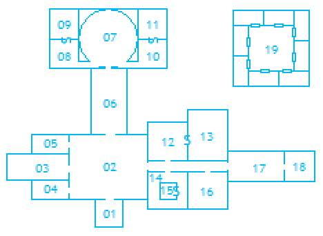

# Nivel 6: El depósito del hechicero, por Jose Carlos Domínguez "Kha"

## Mapa del nivel 

<p align="center">
  
</p>

## Conexiones con otros niveles

* Sala 1: Recibidor, conecta esta sala con un rampa descendente hacia la [zona 23 del nivel 4](./nivel-04.md).
* Sala 12: Biblioteca conecta con la [sala 7 del nivel 2](./nivel-02.md).
* Hay tres salidas de emergencia del nivel que pueden llevar a cualquier otro lugar de la Montaña. Se detalla un poco más adelante.

## Generalidades

Este lugar era en otro tiempo (aunque técnicamente aún lo es) un enorme trastero: un hechicero (en concreto el mismo que diseñó el nivel 7) fue guardando sus cosas en las salas de este nivel: libros, arte, tesoro, restos de laboratorio, cadáveres... No obstante hace mucho, mucho tiempo que el hechicero no ha vuelto y todo está algo patas arriba, lo cual probablemente dificulte algo el saqueo.

Aunque en un principio la única entrada estaba en el nivel 7, debido a diversos accidentes ahora es posible acceder a él a través del nivel 2 escalando por el agujero que abrió un gólem de carga en el suelo ya debilitado por el ácido. No obstante hay más salidas que entradas: tres salidas de emergencia se hallan ocultas por el nivel; si se activan de la forma correcta, llevarán a quien las use a otra parte de la Montaña (a decisión del director) sin posibilidad de regresar por el mismo medio.

El lugar no está totalmente abandonado, sino que se ocupa de su mantenimiento un nutrido grupo de gólems diseñados por el hechicero. Los hay de tres tipos: de mantenimiento, que se aseguran de que todo esté limpio y funcionando; de archivo, que se dedican a contarlo todo, y de carga, que permanecen inactivos a la espera de órdenes. Los gólems de archivo o mantenimiento normalmente no harán caso a los intrusos a no ser que les impidan realizar sus tareas, en cuyo caso podrían acabar terminando por recurrir a la violencia, pero también es posible que simplemente lo dejen estar y se dediquen a otra cosa.

La única forma de comunicarse con los constructos es por medio de un vínculo telepático. Normalmente aquellas criaturas inteligentes que se hallen en su presencia notarán un cierto malestar y dolor cerebral que aumenta cuantos más gólems haya en las cercanías. No obstante es necesario que la persona abra el vínculo telepático con el gólem concentrándose en ello (no es necesaria tirada si se está en calma, solo saber que se puede). Solo si muchos gólems se reúnen con un mismo propósito son capaces de mandar un mensaje telepático por iniciativa propia.

**Gólem de mantenimiento/archivo**:
```
DG: 2D8
Iniciativa: +1 (*+1) 
Velocidad: 14m 
CA: 13 (10 +1 DES +2 natural) 
Ataques: Puños  (x2) (1d4/1d4) 
Ataques especiales: No 
Defensas especiales: No
Características: FUE(-3), DES(+1), CON (-2), INT(+4), SAB(0), CAR(-2) 
Inteligencia: Baja
Alineamiento: Neutral 
Puntos de Fortuna: 0
PX: 40
```

**Gólems de carga**:
```
DG: 3D8
Iniciativa: +1 (*+1) 
Velocidad: 12m 
CA: 13 (10 +1 DES +2 natural) 
Ataques: Puños (x2) +6 (1d4+3/1d4+3) +3 DG +3 FUE)
Ataques especiales: Abrazo 
Defensas especiales: No
Características: FUE(+3), DES(+1), CON (+2), INT(-4), SAB(0), CAR(-2) 
Inteligencia: Inteligencia animal 
Alineamiento: Neutral 
Puntos de Fortuna: 0
PX: 80
```

El número de gólems en cada sala se señala con un número junto al nombre de esta señalando los de mantenimiento, archivo y carga respectivamente. Un porcentaje indica que esas son las probabilidades de que haya uno.

El lugar está convenientemente iluminado por antorchas mágicas que consisten en huesos humanos que arden sin parar con una luz azulada. Lo realmente mágico es el soporte en el que están, pues dejarán de arder si son retirados. Por ello, cualquier hueso de humanoide convenientemente alargado puede servir como antorcha pues, al colocarlo en el soporte, empezará a arder solo. Algunos se han perdido con el tiempo, pero no demasiados.

## Leyenda de salas del nivel
 
### 1. Recibidor (0/0/2)

Esta pequeña columnata lleva a unas enormes puertas de hierro. No están cerradas, pero son pesadas y necesitan mucho músculo para ser abiertas (una tirada de Fuerza, con modificador de -3).

Dos gólems especialmente grandes flanquean las puertas y lo único que saben hacer es abrirlas y cerrarlas, cosa que hacen sin dificultad. Sin embargo es necesario conectarse telepáticamente con ellos para darles la orden.

### 2. Sala de bestias (d6/d6/d4)

La gran sala central sirve como una suerte de recibidor y expositor de criaturas disecadas, la mayoría pertenecientes al hechicero en el pasado. La penumbra que ahora domina la sala puede despistar a los aventureros; realiza una tirada de sorpresa, si la fallan, creerán que las criaturas son reales durante una ronda de combate, para disgusto de los gólems de mantenimiento.

Todas las criaturas están provistas de un pequeño soporte con una placa inscrita (en cursiva) y son:

 * Un hipogrifo. Arfidus. Gran montura, mejor amigo.
 * Una cocatriz. Anaberta.
 * Una serpiente alada. Bela. Siempre vigilante.
 * Un expositor de cristal con catorce cuervos, bajo cada uno hay una placa que reza Valdemar y un número del I al XIV.
 * Una esfinge sin cabeza. ¿Quién es el listo ahora?
 * Una araña gigante. Shila.

Esta sala es una zona de frecuente tránsito de gólems de mantenimiento y contabilidad, por lo que se los ve correr de un lado para otro en las otras tres direcciones.

Dos grandes arcadas se abren en el centro de los muros norte y este. Tres más modestas pueden encontrarse en el muro oeste. Dada la penumbra (pues faltan unas cuantas antorchas), desde un muro no se ven los demás.

Bajo el soporte de la araña gigante se encuentra la entrada secreta al oubliette (19). Se detectará si se dedica un turno para revisar los animales y abrirla es tan sencillo como empujar el animal disecado para que gire sobre un eje. No es demasiado pesado.

### 3. Sala de gólems (d8/d8/d10)

Esta es la sala con mayor cantidad de gólems de todo el nivel, como puede comprobarse nada más entrar. Varios de ellos permanecen de pie, pero sin cabeza, mientras esta se recarga en pedestales especiales (diez alineados a cada lado de la habitación). Otros están tirados en el suelo y no tienen pinta de funcionar.

Dos gólems de mantenimiento se encargan de organizarlo todo, uno por cada lado de la habitación, quitando la cabeza a los recién llegados y poniéndosela de nuevo una vez cargadas. No obstante, el del lado derecho ya no funciona bien e intentará quitarle la cabeza a los aventureros cuando entren, tomándolos por gólems.

### 4. Sala de limpieza. (d8/25%/50%)

Puede verse que es tal por la naturaleza y cantidad de los diversos utensilios de mantenimiento que decoran las paredes: escobas, algunas herramientas. Nada realmente interesante.

Hay bastante tráfico de gólems de mantenimiento entrando y saliendo para coger o dejar cosas. Así como para eliminar residuos echándolos por una trampilla a un sitio cerrado donde tienen está retenido un cubo gelatinoso.

Este cubo contiene 1d6 cosas que no puede digerir. Si los aventureros dedican un turno a ello, podrán pescar una de las cosas de la siguiente tabla.

**Tabla 1: contenidos del cubo gelatinoso (2d8)**
```
2. Corona.
3. Pergamino en un estuche metálico bien cerrado: títulos de propiedad.
4. Pergamino en un estuche metálico bien cerrado: receta de un antídoto muy efectivo.
5. Pergamino en un estuche metálico bien cerrado: vacío.
6. Armadura incompleta.
7. Cráneo humano.
8. Esqueletos de rata entrelazados.
9. Cadera humana.
10. Daga oxidada.
11. Daga enjoyada.
12. Cofre metálico bien cerrado: vacío.
13. Cofre metálico bien cerrado: poción curativa.
14. Rubí del tamaño de un puño.
15. Una llave que funciona en otra parte de la megamazmorra, a discreción del director.
16. Un pequeño demonio. No hay forma de que se calle.
```

En la pared del fondo de la sala hay colgadas unas llaves doradas (no realmente de oro) que no pegan en ese lugar. Hacer tintinear las llaves con algo de fuerza, activa la salida de emergencia secreta que hay en la pared, transportando inmediatamente a aquel que las moviese.

### 5. Archivo (50%/d8/0)

En esta sala no hay más que un libro en un atril de piedra, varios gólems de contabilidad hacen cola para escribir en él y entonces salir. El libro tiene páginas infinitas: es imposible encontrar la primera o la última, así como abrirlo dos veces por la misma página. Imposible excepto para los gólems, claro.

Emplean un complicado sistema de signos ininteligible para el ser humano, pero muy efectivo para llevar la contabilidad, por eso es necesario un gólem traductor que permanece sentado junto al atril. Si se le muestra el libro, traducirá lo que diga. No obstante ya no funciona bien y no es de fiar. Tira en la siguiente cada vez que los personajes dediquen tiempo a que el gólem les interprete algo. No pasa nada si se repite, está loco después de todo.

**Tabla 2: contenidos del nivel, según el gólem intérprete (1d20)**
```
1. Un libro de registros que no se termina nunca.
2. Un crucifijo de hueso usado como salida de emergencia.
3. Tres momias.
4. Una cabeza de esfinge aún viva.
5. [1d6] mil cráneos.
6. [1d8]cientos presos.
7. [1d3] libros.
8. Un dragón.
9. Seiscientas cuarenta y siete ratas.
10. Una tonelada de oro en peso total.
11. Un demonio rana.
12. Un búho que siempre miente y otro que siempre dice la verdad.
13. Un tercio de una taza de harina.
14. [1d20] tapices por valor total de [1d6] monedas de oro.
15. Una estatua maldita.
16. Cinco estatuas malditas.
17. Orcos enjaulados.
18. (Da una descripción pormenorizada de los aventureros).
19. [1d10]  gólems.
20. Un gólem intérprete.
```

Se puede pedir telepáticamente a otro gólem del archivo que traduzca, pero tardará mucho más tiempo.

A los gólems en principio no les molesta que los aventureros manipulen el libro. No obstante, si intentan dañarlo, llevárselo o no les dejan acceder a él durante demasiado tiempo, pueden intentar concentrarse para mandar un mensaje telepático conjunto para pedirles que no lo hagan.

### 6. Sala de cráneos (d4/50%/25%)

Una sala alargada. A ambos lados hay una suerte de pequeñas gradas donde se encuentran, en fila, varios cráneos que portan yelmos de diversa factura (todos oxidados y prácticamente inútiles); antiguos hombres de armas leales al hechicero. 2d6 de ellos son mágicos y se reconoce sobre todo porque tienen runas inscritas sobre ellos. Tira en la tabla siguiente, si los personajes los investigan.

**Tabla 3: cráneos mágicos (1d20)**
```
1. Habla como si estuviera en vida. Lleva bastante bien lo de estar muerto.
2. Habla y ordena que lo lleven al puesto de reclutamiento más cercano para continuar con su trabajo de mercenario. Es una sugerencia mágica difícil de rechazar.
3. Habla y susurra constantemente lo genial que es la otra vida. Si se le hace mucho caso, empiezan a anidar pensamiento suicidas.
4. Tiene joyas en las cuencas oculares por las que lanza rayos. La palabra de activación está inscrita en runas.
5. Aumenta el efecto de los hechizos que se lancen sosteniéndolo.
6. Purifica o envenena (50%) cualquier consumible que se coloque en su interior.
7. Protege contra licántropos.
8. Retira maldiciones leves. Solo una vez por persona.
9. Hace que cualquiera que lo sostenga entre en un estado de furia asesina temporal.
10. Resucita a un solo muerto.
11. Si es molestado, puede desarrollar un cuerpo fantasmal. No puede hacer daño a nadie, así que huirá.
12. Levita, simplemente.
13. Está tan pulido y brillante que podría venderse como una obra de arte.
14. Tiene ricos grabados indescriptibles por toda la parte superior. Mirarlos fíjamente da dolor de cabeza y acaba enloqueciendo.
15. Produce infinitas arañas.
16. Hace que cualquier líquido que toque hierva.
17. Habla. Aún leal al hechicero y gritará todo lo posible para dar la alarma.
18. Causa terror a cualquiera que lo mire.
19. Habla de forma incomprensible, como si tuviese un enjambre de moscas en la boca.
20. Habla y ofrece (1d6: 1.comida, 2. conocimiento del más allá, 3. gratitud eterna, 4. lealtad, 5. la mano de un súcubo/íncubo en matrimonio, 6. curación mágica) a cambio de almas.
```

### 7. Osario (d4/50%/25%)

Una gran capilla circular cubierta de huesos: las paredes están cubiertas de hueso, las columnas tienen cráneos hasta arriba, el techo está cubierto de huesos, los bancos de piedra de la mitad sur están adornados con huesos, el altar del centro está hecho con esqueletos, el podio elevado donde se encuentra está cubierto de huesos y el ábside del fondo está lleno de... sí, huesos.

Dos estrechos pasillos a izquierda y derecha llevan a unas puertas de madera que conducen a los santuarios de la amante (8) y del lugarteniente (10) respectivamente.

En el podio tras el altar puede verse a un grupo de esqueletos ricamente vestidos que se mueven de forma exagerada sin emitir ningún sonido. El hechicero los programó para representar una y otra vez el mismo auto de fe.  Si son interrumpidos, harán lo que pueda para continuar. Si se les ataca, huirán todos para esconderse entre los bancos, adoptarán una posición fetal y no volverán a moverse jamás.

El altar tiene propiedades especiales. Los cráneos que lo adornan tienen joyas en los globos oculares y los huesos tienen pequeñas escenas religiosas en bajorrelieve. Aquel que toque el altar con las manos cubiertas de sangre humana será inmune a las armas comunes durante un día. Pero aquel que lo toque con las manos desnudas deberá superar una tirada de salvación con dificultad 10 o sumirse en una furia asesina hasta que derrame sangre humana. A estos efectos, vale la sangre de cualquier raza humanoide.

En el ábside hay otra salida de emergencia del hechicero que consiste en un crucifijo hecho con tibias con un cráneo en su centro. Emana una energía extraña que hace que su interior brille. El cráneo saludará amablemente a todo el que se acerque. Si se le devuelve el saludo, enviará a esta persona fuera.

### 8. Santuario a su amante (75%/50%/25%)Ç

Una pequeña sala en cuyo centro se encuentra una estatua de una bella mujer sentada con ambas manos sobre su regazo; viste un rico vestido y se adorna con joyas (esculpidas también). Las antorchas de la sala están colocadas para iluminarla directamente.

Los muros están cubiertos de bajo relieves de temas domesticos, pero también y sobre todo amatorios y bastante picantes.

En el soporte de la estatua puede leerse una inscripción: Tú eras lo último que me ataba a los vivos.

En el muro norte hay una puerta secreta difícil de detectar si se busca que lleva al sepulcro (9). Se abre levantando el brazo derecho de la estatua. No es complicado ver que este brazo no está unido al regazo como el izquierdo y que tiene una marca en el hombro donde se  encuentra la articulación que permite moverlo a modo de palanca.

### 9. Sepulcro de la amante (0/0/0)

En el centro de la pequeña habitación hay un sarcófago cerrado que contiene una momia ajada. Yace con un vestido y ricas joyas (un exhuberante collar de rubíes, pendientes y pulseras). Todo junto cuesta 250mo, excepto el vestido, que está casi podrido.

Alrededor hay seis cofres de madera algo podrida por el tiempo. Cada uno de ellos contiene:

* Joyería y piezas preciosas diversas (400+1d6 * 100 mo en total).
* Ropa femenina de calidad (750mo).
* Más ropa (750mo).
* 20 frascos de perfume, solo 2d6 en buen estado (cada uno de estos vale 25mo).
* Ropa de cama de calidad (400mo).
* Un códice de oraciones bellamente iluminado (100mo) y algunos recuerdos sin valor como poemas escritos por el hechicero (bastante malos) o una vieja muñeca.

Tocar la momia o lo que lleve consigo (no está incluido el sarcófago) despertará al fantasma de la amante, llamada Irenra. No se mostrará hostil contra los personajes, pero se comportará como cuando estaba en vida: es gritona, mandona, caprichosa y mimada. No dejará de acusar a los personajes de ladrones y llamar a al hechicero por el nombre de "Cariño" para que la salve y desintegre a los maleantes que les están robando. Una vez liberada es capaz de moverse por todo el nivel. Es probable que acabe olvidándose de los aventureros y vaya a buscar al hechicero hasta aceptar que está muerta y ha pasado mucho tiempo, momento en el que empezará a llorar inconsolablemente.

### 10. Santuario de su lugarteniente (75%/50%/25%)

Una pequeña sala en cuyo centro se encuentra una estatua de un hombre de prominente barba sentado con una mano sobre su regazo en el que hay una espada, y la otra, la derecha, alzada. Viste una armadura completa decorada ricamente grabada. Las antorchas de la sala están colocadas para iluminarlo directamente.

Los muros están cubiertos de bajo relieves de temas militares bastante sangrientos. Se muestran grandes ejércitos con el hombre de la estatua y otro que parece el hechicero al mando cometiendo todo tipo de tropelías contra tropas enemigas.

En el soporte de la estatua puede leerse una inscripción: El tiempo de las armas se ha acabado, viejo amigo. Descansa.

En el muro norte hay una puerta abierta y perfectamente visible que conduce a su sepulcro (11). No es complicado ver que el brazo derecho de la estatua tiene una marca en el hombro donde se encuentra la articulación que permitía moverlo a modo de palanca.

### 11. Sepulcro del lugarteniente (0/0/0)

En el centro de la pequeña habitación hay un sarcófago abierto que contiene una momia ajada. Yace aún con una cota de malla y un yelmo. El yelmo está tan oxidado que ya no es útil, la cota de escamas aún podría servir, pero ofreciendo solo CA+4.

El lugar parece haber sido saqueado no hace mucho: cofres vacíos, cerámica rota, etc. de modo que no queda nada de valor.

### 12. Biblioteca vacía (75%/50%/25%)

Esta sala fue en otro tiempo una biblioteca. Ahora de ella solo quedan los estantes de piedra mayormente vacíos.
Muchos de los libros han desaparecido, el resto están medio derretidos en alguno de los charcos de ácido que anegan el lugar. Mirar alguno de los que todavía son legibles revelará que eran terriblemente aburridos.

Solo un libro permanece en su estantería en la pared este porque no es realmente un libro sino el mecanismo que permite acceder al almacén de restos de laboratorio (13) mediante una puerta secreta.

En la esquina noroeste hay un agujero que lleva a la sala 7 del nivel 2 , lo bastante amplio para que pase una persona con facilidad.

### 13. Almacén de restos de laboratorio (0/0/0)

Un almacén, en efecto. Tiene todos los elementos que cabría esperar en uno: cajas, estanterías, cajoneras, etc. En la mayoría hay documentos destruidos por la humedad, frascos rotos, cosas húmedas, polvo y herramientas diversas.

Si se busca asiduamente durante uno o dos turnos podrán reunirse herramientas quirúrgicas especializadas por valor de 200mo si son vendidas a la persona adecuada.

Además encontrarán 1d12 frascos aún intactos que contienen diversas sustancias (hay un 50% de posibilidades de que incluyan una etiqueta, no pasa nada si se repiten):

**Tabla 4: frascos del laboratorio (d20)**
```
1. Aceite inflamable.
2. Agua pura.
3. Arena.
4. Crema azulada: anestesia la piel donde se aplique.
5. Crema rosada: hace salir berrugas.
6. Cultivo bacteriano.
7. Esporas de hongos.
8. Incienso de la locuacidad. Si es encendido y respirado, no se podrá parar de hablar.
9. Jabón líquido.
10. Líquido azul: poción de insomnio.
11. Líquido blanco y lechoso: cura una enfermedad, pero no hp.
12. Líquido blanco: pegamento extrafuerte.
13. Pimienta.
14. Polvos rojos: quitan puntos de vida.
15. Polvos verdes: urticantes.
16. Sal.
17. Sangre.
18. Vacío, pero intacto.
19. Vinagre.
20. Vino tan delicioso que no se puede parar de beber.
```

También podrán encontrar 1d6 frascos que contienen miembros no-muertos que se mantienen inhertes en un líquido conservante. Si fueran extraídos, podrían moverse con libertad dentro de sus posibilidades.


**Tabla 5. Cosas no-muertas en líquido conservante (1d20)**
```
1. Cabeza de caballo.
2. Ojo de gorgona (en tarro opaco).
3. Mano de gorila.
4. Encefalópodo (el cerebro de un hechicero mutado para que desarrolle tentáculos. Si es liberado intentará clavar sus tentáculos en la cabeza del humanoide más cercano para controlarlo. Conserva hechizos seleccionados al azar).
5. Insecto asesino.
6. Feto humano.
7. Cabeza de cerdo.
8. Pene/Seno de un clérigo de alto nivel.
9. Pie. Parece de alguien que andaba mucho.
10. Rata gigante completa y parcialmente diseccionada.
11. Corazón de orco. Grande y abultado. Aún latiente.
12. Una cabeza, trofeo dejado a medias. Solo la mitad de la cara está reanimada.
13. La lengua de un famoso poeta. Si se pega el oído al cristal, pueden oírse versos que describen tan bien el más allá que conducen a la locura.
14. Dientes de dragón.
15. Vesícula biliar de un lagarto gigante. Terriblemente ácida.
16. Serpientes venenosas.
17. Ciempiés gigante.
18. Un gato parlante, familiar de otro hechicero.
19. Columna vertebral humana con su espina dorsal.
20. Escarabajos devoradores de carne.
```

### 14. Pequeña galería de tapices (d4/50%/25%)

Una serie de doce tapices, probablemente realizados por encargo, cuelgan de las paredes de esta sala y muestran lo que parecen distintos episodios de la vida del hechicero. Están algo deteriorados, pero han sido realizados por un famoso taller, de modo que cada uno puede valer 1200mo si el comprador es el adecuado, la mitad si los venden al primero que se encuentren.

Cada uno representa:

* El hechicero en un asedio, derribando las puertas con su magia. A continuación diversas escenas donde se ven tropas con armadura negra liderados por guerreros de gran tamaño y brillante armadura enfrentándose a los defensores de la fortaleza.
* Una escena del hechicero derrotando a tres personajes con corona, otra de estos personajes rindiéndole pleitesía y después tres representando sus muertes, cada una más aberrante que la anterior.
* El hechicero arrojando a un joven con una espada por un abismo y después asesinando a los que parecen sus aliados. Grandes multitudes lo observan acongojadas.
* En la parte baja: el hechicero rezando, haciendo ofrendas y mostrando una actitud devota en general. En la parte alta: imágenes de ángeles, santos y símbolos sagrados.
* El hechicero montando su hipogrifo sobre un campo de batalla y lanzando lo que parecen conjuros, que caen sobre los enemigos y los destrozan de forma espectacular.
* Diversas escenas cortesanas y bucólicas en las que todos los personajes son esqueletos. Tras este se encuentra la puerta secreta que lleva al cubículo 15.
* Una multitud de escenas de decapitaciones de formas bastante originales.
* Diversas escenas del hechicero acompañado de mujeres, niños y jóvenes. Pueden contarse hasta siete.
* Representa un amplio muestrario de serpientes y monstruos relacionados con sus nombres y propiedades más importantes escritos en un idioma antiguo. Vale el doble para un naturalista o alguien interesado en el tema.
* Diversas escenas que representan al hechicero sometiendo a toda clase de demonios y seres del abismo.
* El hechicero repartiendo justicia desde un trono y entregando comida y objetos de valor a aldeanos.
* Un paisaje desolado lleno de huesos y cráneos, un jinete solitario recorre la línea del horizonte, sobre él la luna y las estrellas muestran la posición que deben tener ciertas constelaciones para realizar un ritual terrible. Un hechicero que sepa esto intentará hacerse con el tapiz a toda costa para bien o para mal.

### 15. Cubículo de la estatuilla (0/0/0)

En este pequeño habitáculo secreto hay un pedestal y sobre él una pequeña estatua de hierro que representa a un demonio.

Esta estatuilla tiene siete rubíes engastados. Tocar una de ellos hace que la estatua lance un conjuro (como lo haría un hechicero de nivel 10) contra un objetivo determinado por aquel que haya tocado la joya. Solo funcionan una vez al día y se vuelven blancos mientras se recargan. Cada uno contiene un conjuro distinto:

* Animar zombies,
* Caminar por las sombras,
* Dominación,
* Geas,
* Palabra poderosa, Arturdir,
* Proyectar imagen,
* y Símbolo de locura.

Intentar destruir o modificar la estatuilla de cualquier forma (como arrancarle las joyas o fundirla) será inútil si no se emplea magia poderosa.

Fue entregada hace mucho tiempo por un demonio a un hechicero inexperto. El pacto consistía en que, una vez hubiese usado la estatuilla 666 veces, el demonio vendría a reclamar su alma. Pasaron cosas, el hechicero murió sin usarla todas las veces, la estatuilla se perdió y acabó en manos de nuestro hechicero.

No se sabe cuántas cargas le restan, así que el demonio puede aparecer en cualquier momento (tira 1d20 en secreto cada vez que usen la estatua y, si el resultado es 20, aparecerá). Cuando aparezca, reclamará el alma del actual propietario de la estatua (el último que la haya usado), en base al contrato. No podía reclamar directamente la del hechicero ya que, de haber muerto antes de usar las 666 cargas, el demonio no habría cumplido su parte del contrato. El desconocimiento de esta cláusula no es excusa ante una corte infernal.

El demonio menor de la cámara 18 es consciente del origen de la estatuilla y la teme en consecuencia.

### 16. Sala vacía (d4/50%/50%)

En esta sala solo hay polvo y trozos irreconocibles de muebles. El polvo y los trozos se deben a que el gólem que la limpiaba dejó de funcionar hace tiempo y los demás no han pensado aún en sustituirlo.

### 17. Sala de trofeos (25%/0/25%)

Esta sala alargada conduce hacia el este y tiene al final una puerta que la separa del dormitorio del monstruo (18). Ambos lados del pasillo están rodeados por unas pequeñas gradas donde se amontonan frascos de líquido conservante con cabezas muertas en su interior, todas ellas trofeos de las andanzas bélicas del hechicero.

La mayoría son de humanos, con algunos elfos, enanos y demás. No obstante unas cuantas (1d6) son especiales:

**Tabla 6. Cabezas trofeo especiales (d12)**
```
1. Un familiar de un personaje.
2. Un personaje no jugador que los personajes conocieron hace tiempo.
3. Un mago rival. Con las técnicas adecuadas pueden extraerse conjuros de su cerebro. Es célebre y un usuario de magia podría reconocerlo por el tatuaje de su frente.
4. Una figura histórica que se creía desaparecida.
5. Un dios menor. Exige que la lleven con su cuerpo para recuperar su poder.
6. Hermosa mujer de una raza exótica inidentificable. En sus mejillas hay grabado a fuego un mapa.
7. Idéntica a un personaje, solo que cinco años más vieja.
8. Tiene rasgos bestiales y prehistóricos. Ni idea de dónde puede haber salido, pero algún estudioso del asunto podría pagar buen dinero por ella.
9. Demilich inherte.
10. Una gran cabeza de rana con una corona.
11. Sátiro con la cara deformada en una horrible mueca. En su lengua hay una moneda de platino.
12. Eso no es una cabeza, es una serpiente.
```

Además una de ellas es la cabeza de la esfinge cuyo cuerpo estaba en la sala de bestias, aunque esto no es inmediatamente evidente al tener cabeza de mujer sin ningún otro rasgo que la delate. Al ser inmortal aún está viva incluso tras ser decapitada y guiñará a quien quiera que se acerque para incitarlo a que la saque (esto será evidente para cualquiera que dedique un poco de tiempo a examinar las cabezas en general). Puede hablar e intercambiar información diversa. No dirá nada si no se le dice algo antes que ella considere de valor equivalente.

### 18. Dormitorio del monstruo (0/0/0)

En esta habitación habita ahora un demonio rana menor fugado del oubliette. Al ser una encarnación de la pereza y la codicia ha reunido todos los libros y el tesoro que ha podido encontrar y ha convertido el sitio en su dormitorio, donde lee continuamente. No plantará mucha cara si se ve superado. Normalmente su primer movimiento será ahuyentar con hechizos y entonces intentar huir por la salida de la pared este. Si esto falla, intentará parlamentar y ofrecer sobornos, aunque aprovechará cualquier momento en el que se baje la guardia para volver a atacar.


**Demonio menor (Ashkigazzael)**
```
DG: 5D8
Iniciativa: +2 (*+1) 
Velocidad: 12m 
CA: 12 (10 +2 DES) 
Ataques: Cuerpo a cuerpo (x2) +3 (1d4/1d4) (+4 DG -1 FUE)
Ataques especiales: Hechizos (cada uno una vez al día):
• Asustar.
• Maldecir.
• Muerte fingida.
• Retener personas.
• Muro de niebla.
Defensas especiales: Solo pueden herirlo armas mágicas o consagradas
Características: FUE(-1), DES(+2), CON(0), INT(-2), SAB(-1), CAR(-1) 
Inteligencia: Media
Alineamiento: Caótico malo 
Puntos de Fortuna: 0
PX: 500
```

Su botín consiste en:

* Un cofre con joyería diversa, monedas y otras piezas preciosas saqueado del sepulcro del lugarteniente (400+1d6 * 100 mo en total).
* Un cofre de ropa de calidad saqueado del sepulcro del lugarteniente (750 mo).
* Un saco de ropa de cama saqueado del sepulcro del lugarteniente (400mo).
* Una armadura de placas de parada con escudo a juego saqueados del sepulcro del lugarteniente (ambos valen el doble del precio de mercado).
* Una espada mágica +1 saqueada del sepulcro del lugarteniente.
* Tres piezas de mobiliario: una cama, un armario y una gran mesa. Decorados por un famoso artesano. Son grandes, pero cada uno vale 5000mo.
* 4d10 libros misceláneos saqueados de la biblioteca, al menos un 10% de ellos serán grimorios con conjuros que los usuarios de magia puedan extraer. Todos serán de los dones de Oscuridad, Corrupción y guerra, y estarán entre los niveles 4 y 9 (1d6+3).

Los gólems temen acercarse al lugar, pues el demonio ya ha destruido a un par de ellos. Pueden reunirse muchos para intentar avisar telepáticamente a los aventureros con la esperanza de que destruyan al demonio y así puedan limpiar el estropicio. No obstante hará falta mucho tacto para convencerlos de que ayuden en la lucha.

La salida de emergencia de la pared este consiste en una cara con la boca abierta, hay que meter la mano y tirar de la palanca. Como ya dijimos, el demonio es consciente de ella y la usará en caso de emergencia.

### 19. Oubliette (d4/50%/d6)

Una pequeña mazmorra con una sala central a la que se accede por las escaleras de caracol que vienen de la sala de bestias (2). Cuenta con ocho calabozos cuyas puertas están colocadas alrededor.

En una de estas puertas estaba encerrado el demonio rana, pero consiguió doblar los barrotes y escapar causando mucho revuelo.

Las otras siete celdas también pueden estar ocupadas. Tira 2d6 veces en la siguiente tabla y recuerda que, aunque haya menos celdas que presos, siempre es posible que dos o más compartan alguna.

**Tabla 7. Presos del oubliette (d12)**
```
1. Un rakhshasa. Vivo, pero muy hambriento. No obstante, no pierde la compostura.
2. Un troll decapitado. Su cuerpo está encadenado y su cabeza enjaulada. No quiere que lo liberen, se conforma con que maten a otro preso en concreto.
3. Un ogro muerto.
4. Otro aventurero, ya viejo y decrépito, atrapado por colarse a robar hace años.
5. Tres kobolds. Los restos a medio devorar de un cuarto.
6. Una doncella que permanece sentada sin moverse ni decir nada. Evita todo contacto, incluso visual. En realidad es un espectro menor que ha escondido su cadáver entre la paja por pudor. Desaparecerá si se entierra el cuerpo como es debido.
7. Un lobo parlante. Asegura que era humano antes de que el brujo lo transformara.
8. Un unicornio lleno de cicatrices.
9. Un esqueleto corriente. Pero hay algo en su caja torácica (tira en la tabla 1).
10. Doppelganger.
11. 1d4 cocatrices. Probablemente la prole no domesticada de Anaberta.
12. Un humano terriblemente mutado, lleno de bocas de todo el cuerpo que gritan sin parar, producto de un fallo alquímico.
```

Los gólems de mantenimiento suelen bajar a alimentar a los presos con las ratas y demás alimañas que pueden cazar, pues las reservas de comida se acabaron hace tiempo. Los gólems de carga de este área no están inactivos, como es lo habitual, sino que han sido programados para evitar fugas, de modo que intentarán bloquear el paso de todo aquel que no sea un gólem. No se pondrán violentos a no ser que los "fugitivos" sean los que comiencen. Se les puede convencer telepáticamente de que no son tales. Uno de ellos fue destrozado por el demonio rana en su huida y está tirado en el suelo.
