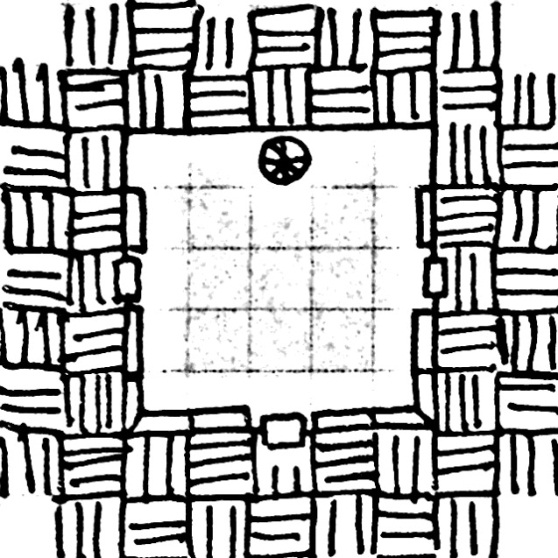
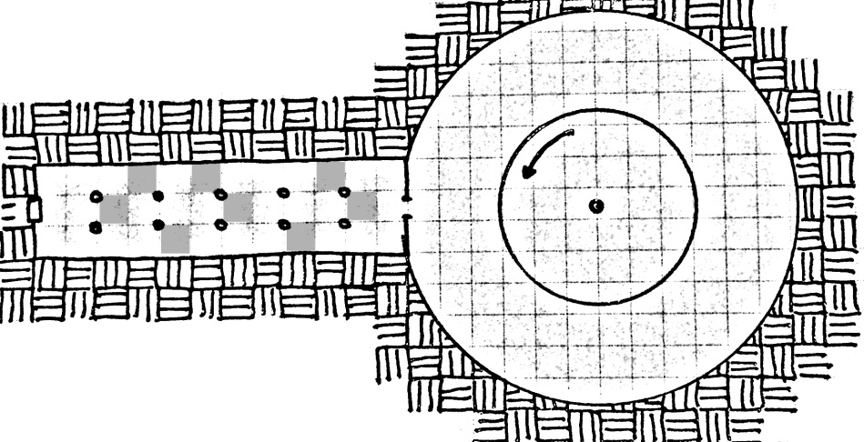
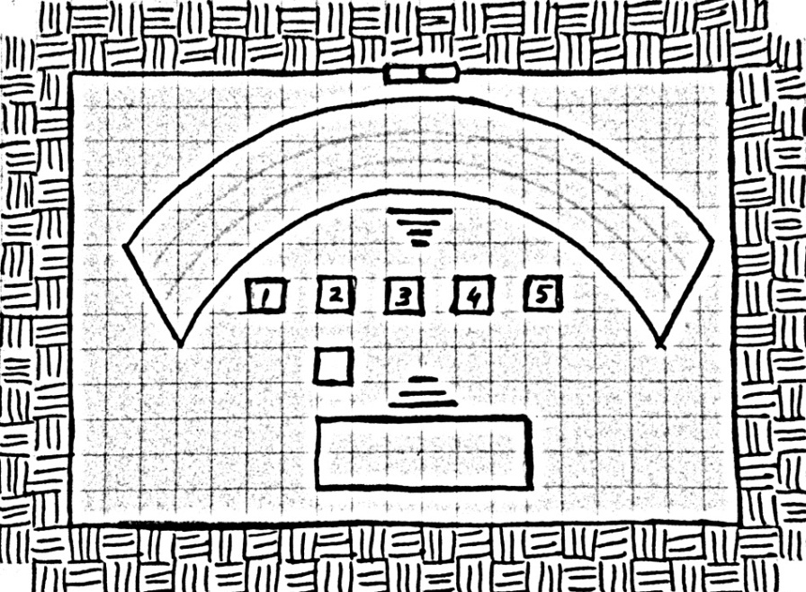
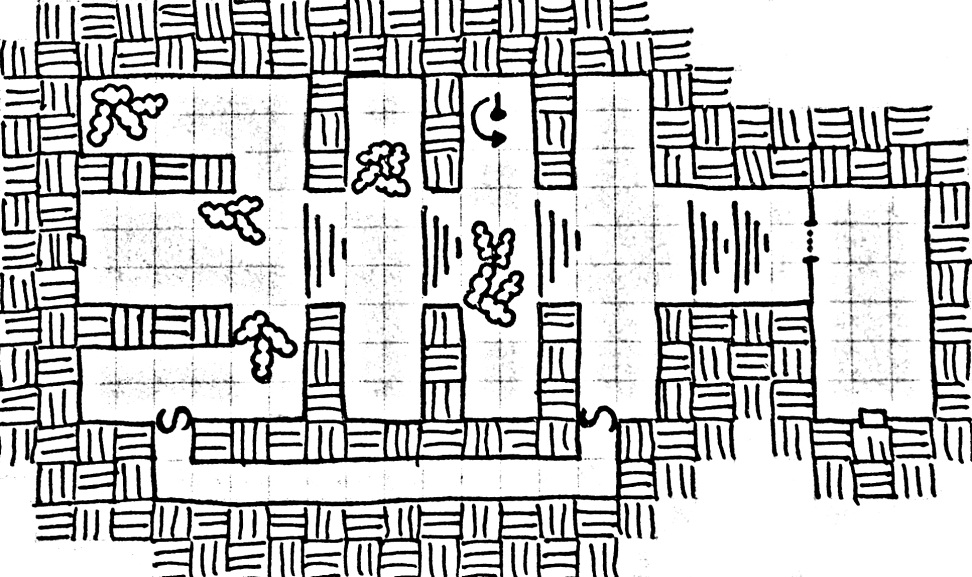
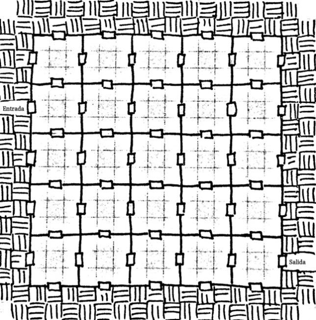
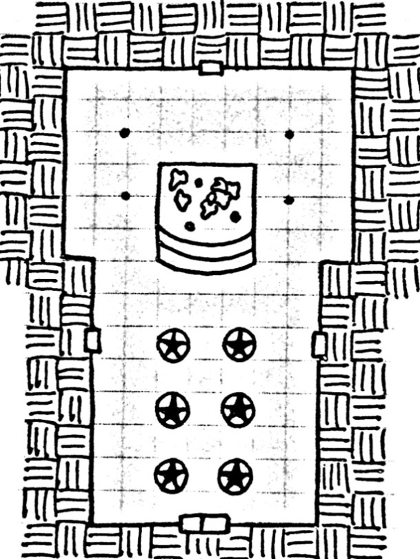
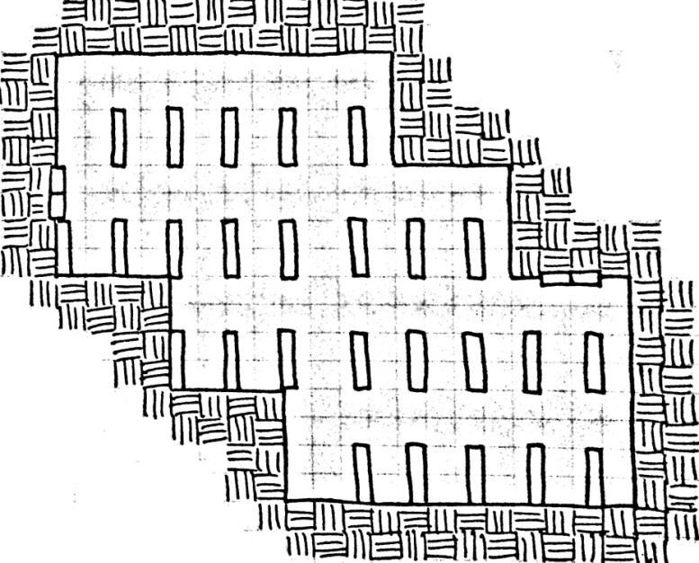
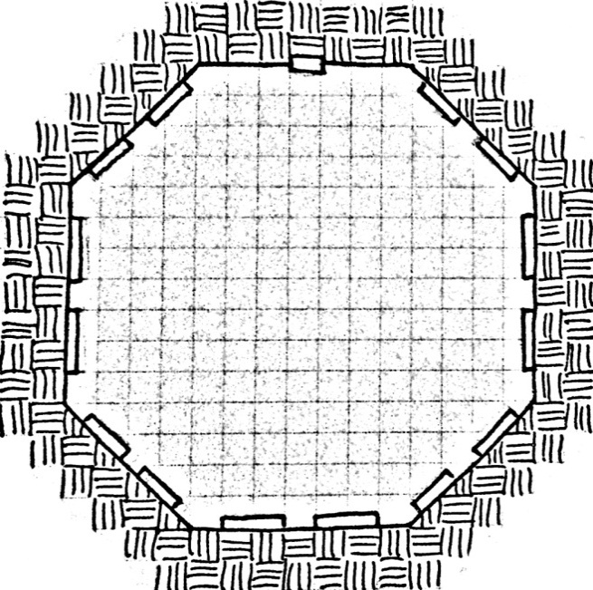

# Nivel 7: El laberinto de Kramaghar, por Héctor Prieto de la calle  

## Introducción

Hace muchos, muchos años, un mago solitario se adentró en los peligros de la montaña para hacerse con el poder de la cima. Avanzó por los distintos niveles, superando los retos que se le imponían; su sabiduría y poder mágico eran los pilares de su éxito, pero también supusieron el origen de su GRAN fracaso.

Kramaghar, que así es como se llamaba aquel mago, se confió demasiado. Supuso que tras superar diversos obstáculos con gran facilidad, el resto del camino sería igual; pero la montaña escondía peligros venidos del exterior: aventureros que intentaron en el pasado hacerse con el poder de la cima. Y un grupo de ellos persiguió a Kramaghar, se convirtieron en la pesadilla del mago pues allá donde iba, era seguido por ellos. Durante días, el mago no pudo conciliar el sueño, era incapaz de descansar pues el grupo de aventureros le perseguía, sabedores que él podría conducirles hacia la cima. Y así, Kramaghar, en un último intento de escapar de ellos, realizó un hechizo de desorientación, uno que consiguiera perderles para siempre en los pasillos en los que se encontraba; pero la falta de sueño, el agotamiento físico y mental, propició que el mago fracasase al realizar un hechizo tan sencillo, y Kramaghar quedó perdido para siempre en la trampa que él mismo había dispuesto.

Han pasado, como os contaba, muchos años y por los pasillos de este nivel, todavía deambula el espíritu del mago Kramaghar. Desquiciado, perdido, solitario… la locura se ha apoderado de él y durante este tiempo ha seguido (en su imaginación) siendo perseguido sin descanso; ahora su magia se ha vuelto salvaje y los hechizos de desorientación, las trampas de traslocación, y los portales entre distintos puntos del lugar, están dispuestos de manera caótica. Pasillos sin fin, puertas que dan al mismo punto del que has accedido, salas que giran en torno a ti sin dejarte avanzar, lugares donde el arriba y el abajo están alterados… y monstruos, criaturas peligrosas que han quedado atrapadas con el mago, y están ansiosas por escapar de allí.

_¿Y tú, serás capaz de abandonar este laberinto?_

## Conexiones con otros niveles

* La sala 1 conecta la [zona 5 del nivel 3 del Dragón](./nivel-03.md). 
* En la misma sala, una vez que se ha conseguido encontrar la Vara de Lapislázuli y la piedra, aparece una escalera que les lleva hasta el nivel superior, [el nivel 8](./nivel-08.md). 

## Notas para el DJ

La locura de Kramaghar se ha extendido a todo el nivel, su magia ha afectado a la forma en la que funcionan las leyes de la física. El DJ tendrá que tener en cuenta esta lista mientras los Pj’s permanezcan en este nivel, pero no avises a los jugadores de los cambios, deja que los descubran ellos mismos y sean partícipes de la locura del mago:

* La madera conduce la electricidad y el metal aísla.
* Beber agua, hace que el Pj adquiera 1 Kg de carga por litro bebido.
* Los hechizos de los magos curan PdG en lugar de causar heridas.
* Los hechizos de sanación causan heridas en lugar de curar PdG.
* Cualquier arma, al impactar sobre un enemigo, provocará un sonido melódico.
* El hechizo “Expulsar Muertos Vivientes” invoca 1D6 de estos seres.
* El hechizo “Identificar Magia”, permitirá que el lanzador identifique de manera normal si el objeto es mágico o no; pero a la vez hará que el propio lanzador cacaree como una gallina durante 1D10 turnos.
* Correr hace que aumente la distancia al doble, por lo que compensa más caminar.
* Comer carne, hace que el sexo del personaje cambie.
* Los venenos recuperan PdG en lugar de causar heridas.
* El ácido da brillo y esplendor a los objetos pero no consume el tejido vivo.
* Las pociones de salud no curan PdG, en su lugar sirven de nutritivo alimento, por lo que funcionan como raciones de viaje.
* Todas las puertas se abren hacia adentro, da igual del lado en el que se esté, por lo que nunca podrán quedar atrancadas desde el otro lado. A lo sumo se podrá tirar de ambos lados a la vez y realizar una prueba de Fuerza para comprobar quién controla la situación.
* Cuando una flecha sale del arco, al impactar se convierte en una flor (el impacto ha causado daño normal).
* Al atravesar una puerta, el DJ lanza 1D10 que determinará a qué sala comunica esa puerta, pudiéndose repetir la misma sala de la que se sale.

Aunque en el mapa del nivel, éste cuenta con 10 salas, en la realidad hay una sala adicional que supone la salida del mismo y que resultará conocida a los aventureros pues es la propia sala por la que acceden al nivel pero ligeramente cambiada por los poderes del mago. Solo cuando Kramaghar quede libre de su hechizo, la sala será visible. Para conseguirlo, los Pj’s deberán encontrar la Vara de Lapislázuli y la piedra que debería ir engarzada en ella; de esta vara se dice que es capaz de devolver a una persona la cordura perdida, pero esa leyenda la leerás más adelante.

Durante la estancia en este nivel, los Pj’s se cruzarán con criaturas que, ya sea por invocación del propio Kramaghar, de otros aventureros, o despistadas al moverse por el resto del complejo, han quedado encerradas aquí. Su agresividad será muy alta, y no actuarán de la manera tradicional que haría una criatura de su especie (esto se detallará en la descripción de cada sala).

Hemos añadido los mapas de las salas más importantes, quedan excluidos los de la sala 6 puesto que es un pasillo que tiene dispuestas trampas de manera aleatoria, la sala 10 pues ésta cambia constantemente (ver su descripción más adelante) y el de la sala 11 puesto que es el mismo de la sala 1.

## Leyenda de salas del nivel

### Sala 1: La sala de los brillos

  

Las escaleras que proceden del nivel anterior acaban en una amplia sala con las paredes bellamente decoradas con imágenes de héroes míticos. Las teselas que crean los hermosos mosaicos, reflejan la luz de las antorchas y dan la impresión que las imágenes se mueven al compás de las llamas.

Estos reflejos despistarán a los Pj’s, que deberán superar una prueba de concentración. Si no lo logran, reciben un penalizador de -1 a sus tiradas durante 5 turnos y no serán capaces de escoger, de manera autónoma, una salida de esta sala. En su lugar, el DM escoge una puerta por la que saldrán (en términos de juego, en lugar de lanzar el dado, el DM escoge directamente la sala a la que irán los Pj’s). Si además, los Pj’s fallan la tirada por más de la mitad de su concentración, creerán ver en sus compañeros a un enemigo, por lo que les atacarán durante tantos turnos como la puntuación por la que hayan fallado la tirada.

Las teselas que se encuentran en esta sala son:

* Tesela 1 (sala 1). Aventureros peleando entre sí, con imágenes en las paredes de ellos peleando entre sí, con imágenes en las imágenes de ellos peleando entre sí… y así infinitas veces.
* Tesela 2 (sala 2). La imagen muestra a un adulto cogiendo una vara del centro de una plataforma y saliendo por el otro lado convertido en un niño.
* Tesela 3 (sala 3). Un enorme minotauro protege una gema que los aventureros intentan tomar.
* Tesela 4 (sala 4). Aventureros con mordazas combatiendo contra avispas gigantes.
* Tesela 5 (sala 5). Una vista en alzado de una gran sala dividida en pequeñas salas.
* Tesela 6 (sala 6). Varios aventureros muertos, cuchillas colgando del techo, bolas de fuego sobrevolándoles, flechas disparadas desde las paredes.
* Tesela 7 (sala 7). Un trono con varios criaturas de pequeño tamaño danzando a su alrededor.
* Tesela 8 (sala 8). Una montaña de libros y en la cúspide un aventurero con sus armas envainadas, recitando algo escrito en un pergamino mientras criaturas monstruosas se apartan de él.
* Tesela 9 (sala 9). Un aventurero mirando un espejo y su reflejo sacando una daga para apuñalarlo.
* Tesela 10 (sala 10). Cada vez que la luz incide sobre él, éste cambia. Se ve un dragón, se ve un pueblo, se ve una mesa de comedor… pero las imágenes siempre cambian.

### Sala 2: El pasillo infinito

  

Esta sala es un largo pasillo con columnas a lo largo de él, para cruzarlo deberán moverse entre las columnas siguiendo un camino específico. Salirse del camino resultará en ser teleportados al comienzo de la sala (tienes indicadas en el mapa las casillas que teleportarán a los personajes al comienzo de la sala). 
 
Tras cruzar el pasillo se abrirá una gran cámara circular con una gran plataforma en el centro que gira en el sentido contrario a las agujas del reloj. En el centro de la plataforma se encuentra, suspendida en el aire, una vara de piedra teñida de un color azulado. Cuando uno de los Pj’s suba a la plataforma, ésta girará cada vez más deprisa; alcanzar la vara supondrá 3 turnos en llegar hasta ella, y otros 3 para abandonar la plataforma, pero por cada giro que de ésta, el Pj rejuvenecerá 1 año de vida (ten en cuenta esto en el momento de ajustar las características, pues un Pj muy joven, que pase mucho tiempo en la plataforma, verá disminuidas sus puntuaciones por la edad). La plataforma realiza un giro cada 2 turnos, y mantener el equilibrio requerirá tiradas de Destreza (CD 10 con un +1 acumulativo en cada turno).

[Recuerda la ley física de la carrera: correr duplica la distancia a recorrer]

La única salida de esta sala es por la misma puerta por la que accedieron.

### Sala 3: El precio exacto

  

Kramaghar era muy dado a los juegos, y uno que disfrutaba cuando estudiaba en la Escuela de Magia era adivinar el precio de las cosas. Esta sala es el afán del mago por ese juego, alterado por su propia locura.
 
El acceso a esta sala comunica con un gran anfiteatro. Sombras de criaturas humanoides parecen estar sentadas en las gradas, y en la parte central, a la vista de todos, hay tantos atriles como Pj’s haya. Un hechizo de ilusión graba los nombres de cada Pj en cada uno de los atriles. Al cerrarse la puerta, ésta desaparecerá en la oscuridad.

Todo estará en silencio, y si los Pj’s tocan alguna de las sombras, o tratan de dirigirse a ellas, no obtendrán respuesta y su tacto será similar a intentar agarrar la niebla. Pero cuando tomen lugar tras el atril que muestra cada uno, las luces de la estancia se encenderán y las sombras se convertirán en personas que comienzan a aplaudir y vitorear a los Pj’s.

Frente a ellos, en ese momento aparecerá un hombre que aparenta cincuenta años, vestido con una impecable túnica con lentejuelas y que saluda a los Pj’s explicándoles las reglas de esa sala. Frente a ellos aparecerán [tantos objetos como Pj’s más uno] objetos a los que los Pj’s deberán adivinar su precio justo. Aquellos que no acierten, o se aproximen con una diferencia de un 25% del valor real, recibirán un justo castigo: un rayo que les producirá 2d6 + 5 PdG. Los Pj’s pueden abandonar el atril cuando quieran, pero no así la sala.

[Los objetos quedan a la elección del DJ, pero recomiendo incluir objetos comunes: como un saco de harina, una daga… y otros más especiales: como anillos mágicos, materiales de alquimia… Del mismo modo, los Pj’s pueden utilizar el hechizo “Identificar magia” para averiguar la auténtica naturaleza del objeto, recordando siempre la ley física que penaliza al lanzador del hechizo.]

El último de los objetos que muestren en el juego, será la piedra que debe engarzarse en la vara de lapislázuli. Los objetos permanecerán a la vista de los Pj’s hasta el final del juego, y si alguno de ellos quiere coger cualquier objeto, deberá enfrentarse al “presentador”, que se convertirá en un Minotauro que protege los mismos, no dudando en atacar a los Pj’s.

Tras terminar el concurso, y hayan cogido o no la piedra, la puerta volverá a aparecer de las sombras, permitiendo la salida de esta sala. Tras coger la piedra, esta sala queda bloqueada; pero si los Pj’s no se hicieron con ella, deberán volver a pasar por el concurso.

### Sala 4: La sala del silencio obligado

  

En esta sala los sonidos se incrementan diez veces, por lo que un simple tosido puede convertirse en un estruendo. Durante la estancia en esta sala, los hechizos que requieran de palabras, fallarán automáticamente; del mismo modo, los Pj’s sufrirán una penalización de -2 a todas las tiradas por la intensidad de los ruidos (pasos, tosidos, conversaciones, chocar de espadas…). La salida de esta sala se encuentra al otro extremo de la misma pero para llegar a ella deberán abrir la verja que separa las dos secciones, y para ello tendrán que girar la palanca que hay en una de las aberturas.
 
De esta sala, ha hecho su hogar un enjambre de avispas gigantes que permanecerán dormidas hasta que oigan algún ruido que las despierte. En ese momento, el zumbido de sus alas provocará el penalizador a los Pj’s y se lanzarán a atacarlos.

El aguijón de las avispas perfora el cuero, no así el metal. El pasillo oculto que hay permitiría a los Pj’s cruzar la sala de un lado al otro causando el menor ruido posible.

### Sala 5: Pequeñas salas dentro de otra sala

  

Esta sala es una sucesión de pequeñas salas (de 3x3 metros) con puertas que se activan y desactivan al antojo: puedes abrir una puerta un segundo y al momento siguiente estará cerrada sin posibilidad de ser forzada. Cualquier intento por forzar la cerradura, o abrirla mediante algún hechizo, fallará automáticamente.
 
Queda a discreción del DJ escoger las puertas que permanecen abiertas o cerradas pero debe recordar que las puertas se abren siempre hacia dentro.
Rondando por esta sala, hay varias criaturas y Pnj’s que llevan tiempo vagando por ella, intentando encontrar una salida. El tiempo que han pasado vagando sin rumbo les ha desquiciado, por lo que agredirán automáticamente a cualquier Pj con el que se crucen (o a cualquier otra criatura o Pnj).

La salida de esta sala se encuentra marcada en el mapa.

### Sala 6: La alternante sala de las trampas mortales

Entrar en esta sala supone dejar atrás las convencionalidades de adelante y detrás, pues para avanzar, los Pj’s deberán caminar hacia atrás (avanzando de espaldas). La estructura de la sala consiste en un alargado pasillo de 5 metros de ancho y más de 50 de largo; esto podría no ser más que un inconveniente, pero Kramaghar colocó aquí trampas mágicas. Así, bolas de fuego, flechas envenenadas y caídas de piedra, están repartidas al azar por todo el pasillo; a eso, sumado un hechizo de alteración, hace que las trampas varíen de posición de una vez a otra que se entra en la sala.

Muchos han sido los aventureros que han muerto en esta sala, y sus pertenencias están diseminadas por la estancia; pudiendo encontrarse ropas, armas, cuerdas, antorchas… pero todas en pésimas condiciones. Lo que sí podrán encontrar en un estado “decente”, son varios pergaminos con hechizos [de nivel 1 y 2, queda a discreción del Narrador disponer los conjuros que encuentran] y un dibujo de la Vara de Lapislázuli y la piedra que lleva engarzada.

### Sala 7: El trono de las 100 piedras

  

Cuando Kramaghar perdió la cabeza, durante una temporada pensó que era el rey de un reino de hombres diminutos. Esta sala fue su salón del trono, y Kramaghar la decoró como tal; el lujo llena las paredes con preciosos tapices que muestran las bondades del mago para con su pueblo, dispuestas creando un pasillo hay armaduras de tamaño diminuto (un mediano es alto comparado con la altura de esas criaturas), y en el fondo de la sala hay un enorme montón de piedras diseminadas por las escalinatas del lugar donde debería erigirse un trono.
 
Si los pj’s se percatan de ello, las piedras encajan entre sí formando un trono. Esta sala dispone a su vez de 3 puertas más, una situada a cada dirección (habiendo entrado los pj’s por la entrada sur), pero cuando atraviesen una puerta darán de nuevo a esta sala por la puerta opuesta por la que accedieron. Cada vez que los pj’s atraviesen una puerta (sin contar la primera vez que accedan a la sala), el trono irá recomponiéndose; tras 4 accesos, el trono estará recompuesto. En ese momento de los tapices comenzarán a salir (a razón de 1d4 por turno) pequeñas criaturas humanoides (los siervos de Kramaghar) que atacarán a los intrusos; sobre el trono descansa un anciano vestido con una túnica azul, ya raída por el paso del tiempo. Es Kramaghar, pero parece estar en coma y no responde a ningún hechizo, poción o intento de reanimarlo, parece como si su espíritu hubiera desaparecido.

Con el trono ya recompuesto, los Pj’s pueden abandonar la sala de manera normal. Pero cuando vuelvan a acceder a ella, deberán repetir el proceso.

### Sala 8: La pluma es más poderosa que la espada

  

Durante el tiempo que Kramaghar ha pasado en este laberinto, le ha dado tiempo a invocar cientos de objetos para su entretenimiento. Cada vez que pensaba que había despistado a sus perseguidores, se sentaba junto a una pared y de su bolsa sacaba un libro que traía de una biblioteca desconocida. Pero cuando volvía a sentir la urgencia de escapar de sus perseguidores, Kramaghar desvanecía el libro... con tan mala suerte que aquellos tomos iban a parar a una sala del complejo, una que Kramaghar nunca llegó a visitar.
  
Cuando los Pj's abran la puerta, decenas de libros caerán sobre ellos. Todos están tirados por el suelo creando montañas; algunos abiertos, otros cerrados, pero todos ocultando el suelo y el auténtico peligro que mora allí: pues la magia caótica del mago ha alcanzado los libros y ha liberado a varias de las criaturas que se detallan en sus páginas. 

Las armas, o los hechizos, no harán daño alguno a estas criaturas literarias. En su lugar, para combatirlas, los Pj's deberán emplear las palabras, y ejecutar rimas para afectarlas. Por cada rima que consigan, la criatura sufrirá 1 PdG; así, si un Pj consigue encadenar un cuarteto (rima de 4 estrofas), la criatura sufriría 4 PdG. Las criaturas, sin embargo, atacarán de manera normal... [queda a discreción del Narrador decidir qué criaturas habitan esta sala, pero recomendamos muchas criaturas de pocos PdG antes que pocas de muchos PdG].

Sobre la puerta de entrada hay una placa que dice: Si vencer quieres / pelear no debes / pues si aquello hicieres / y el acero usares / ni dañarías, ni vencerías y muerto terminarías. Habla pues, amigo héroe, que la palabra escrita es fuerte, la dicha es potente y tu victoria, así, será inminente.

Esta sala es la única en la que el espíritu de Kramaghar no puede materializarse (ver sala 9).

Si deciden coger y ojear los libros, uno de ellos muestra la leyenda de la vara (ver epígrafe “La Vara y el Loco” más adelante).

### Sala 9: Los espejos vivientes.

  

Al entrar en esta sala octogonal, lo primero que llama la atención es ver las paredes recubiertas por grandes espejos con marcos dorados. En los espejos se muestran los reflejos de los Pj’s y en el orden en el que éstos han accedido a la sala, los reflejos comenzarán a surgir de los espejos (no pudiendo encontrarse más de 1 copia de cada Pj). Para detener esto, pues los reflejos seguirán saliendo al vencer a uno, los aventureros deberán romper los espejos pero si rompieran alguno en el que se viera reflejado un Pj, éste sufriría daño equivalente al ataque del Pj que rompiera el espejo (esto no sería así rompiendo un espejo en el que no se reflejase nadie, por lo que tendrán que tener cuidado). Además, cuando un Pj impacte en su propio doble, él mismo recibirá también el daño causado; solo si los Pj’s atacan a los dobles que no sean el suyo, podrán evitar este daño directo.
 
Cuando la mitad de los espejos esté rota, el resto se oscurecerán por completo y un grumo negro comenzará a fluir desde ellos y convergerá en el centro de la sala. De aquí surgirá el espíritu de Kramaghar, que atacará a los Pj’s y los acusará de perseguirle; el espíritu no entrará en razón, de ninguna forma entablará una conversación y solo podrá ser herido por armas mágicas, hechizos, o armas de plata.

Considera a Kramaghar como un mago de alto nivel que no está sujeto a las condiciones especiales del laberinto, por lo que sus conjuros sí causan daño. El único problema, es que tiene una probabilidad del 30% de lanzar correctamente el hechizo, si falla en lugar de lanzar el hechizo que quería usar utiliza una Teleportación y se desplaza automáticamente a otra sala del laberinto (lanza 1D10 de la misma forma que haces con los Pj’s, excepto en la sala 8 donde si el resultado del dado es un 8, el mago permanece en esta misma sala aturdido durante un turno). Esto, obviamente, consume uno de sus hechizos diarios. Kramaghar no debe preparar hechizos nuevos, automáticamente cuando se cumpla un día, el espíritu “regenera” los hechizos.

Cuando los Pj’s consigan vencer al espíritu de Kramaghar, éste se desvanecerá y se desplazará automáticamente a la sala 7; así, cuando los Pj’s recompongan el Trono el espíritu ocupará su cuerpo y el mago despertará de su sopor. Cuando esto suceda, pasa al epígrafe “El mago despierta” más adelante.

### Sala 10: La sala del eco molesto

Esta sala posee una ilusión que simula ser una sala distinta en cada ocasión que se entre, pero siempre comparte una referencia común: la existencia de un extraño eco que repite las últimas palabras de cada Pj (y que al otro extremo de la misma hay una puerta de madera). Así, los Pj’s podrán encontrarse salas tan dispares como:

* Un salón de banquete con comida dispuesta en los platos, y preparado para unos 50 comensales.
* Una cueva de un dragón rojo, con el susodicho dragón durmiendo sobre un montón de oro.
* Un bello patio interior con una fuente en el centro y ninfas danzando en torno a ella.
* Una sala de juegos para niños, con objetos de tamaño gigante (caballitos, espadas de madera, soldados de plomo).
* Una aldea con las casas cerradas y las calles decoradas para una fiesta.

Los Pj’s podrán interactuar con los objetos, pero al abandonar la sala todo lo que hayan cogido de ella, desaparecerá. Del mismo modo, pueden hablar con las ninfas, que no dudarán en contarles que ellas llevan toda la vida viviendo en torno a la fuente y no pueden abandonarla bajo ninguna circunstancia [de intentar forzar a una ninfa a que abandone la fuente, todas ellas se convertirían automáticamente en Arpías que atacarían a los Pj’s]. El dragón permanecerá dormido siempre que los Pj’s no traten de robar el tesoro que custodia, si no éste despertará y tratará de devorar a los aventureros [trata al dragón como uno de edad adulta que tardará 2 turnos en atacar].

El eco será escuchado por todos los Pj’s, pero aquel que haya expresado las últimas palabras oirá, a un nivel inferior al del eco, cómo alguien susurra a su oído intentando convencerle para que acabe con la vida de sus compañeros. El Pj deberá superar una prueba de SAB a una CD 15 para obviar este eco, si no… atacará al compañero que tenga más cerca de él.

La Vara de Lapislázuli, si tiene la piedra engarzada, permitirá recuperar la cordura a aquel Pj que haya sido embaucado por los ecos.

## El mago despierta

Tras vencer al espíritu del mago, éste desaparecerá e irá en busca de su cuerpo que está en la sala 7. Si los jugadores ya habían accedido a esa sala, entonces el trono estará recompuesto pero con la diferencia que la persona sentada en el trono sí responderá esta vez a sus cuestiones, aunque dirá incoherencias y no se mostrará especialmente lúcido. Solo si usan la vara, el mago recuperará su cordura y les conducirá a la salida del laberinto: la misma sala del inicio pero con la diferencia de que hay dos escaleras ( una conduce al nivel superior, el 8) en lugar de una y que en el centro hay, en ese momento, un cofre que los Pj’s podrán abrir y tomar de su interior un único objeto cada uno. Los objetos que se encuentran en su interior son:

* Un brazalete de cuero. Este brazalete lleva incorporado un hechizo de Protección contra Proyectiles, que protege al portador contra pequeños proyectiles No Mágicos; los proyectiles mágicos siguen causando daño normal.
* Una esclava de plata. Esta pulsera otorga al portador la capacidad de lanzar, 3 veces al día, el conjuro Rayo Eléctrico que causa 5D6 puntos de daño.
* Un martillo de guerra con un glifo grabado en la empuñadura. Daño 1D8. Cada vez que el Pj acabe con la vida de un enemigo, armado con el martillo, el PJ recupera tantos PdG como haya resultado el último impacto.
* Un cristal engarzado en un colgante. Este colgante permite al portador encontrar puertas ocultas una vez al día, de manera automática.
* Una llave negra que no refleja la luz. Esta llave, que parece encajar perfectamente en cualquier cerradura, comunica cualquier puerta con una pequeña habitación de 12 m2. Esa sala solo posee una única salida, y cuando la puerta se vuelve a abrir, ésta comunica con una posada en la capital del reino.
* Una espada bastarda con una gema roja engarzada en el pomo. Esta espada hace daño normal, pero cuando el jugador saca un crítico, la gema brilla y provoca una explosión de fuego a lo largo del filo, causando 1D8 PdG adicionales. Tras 5 ataques, la gema mantiene el brillo y el siguiente ataque causa una deflagración de 3 metros de radio de 3D8 PdG.
* Una copa de oro. Esta copa elimina cualquier veneno del líquido que se vierta en su interior, o purifica ese mismo líquido para hacerlo potable.
* Una rodela de madera. Cuando el lanzador recibe el impacto de un Proyectil Mágico, la rodela absorbe automáticamente el impacto. No funciona con proyectiles normales.

Dependiendo de la cantidad de jugadores, escoge qué objetos podrán encontrar.

El mago les deseará suerte en su aventura y una vez se despida, se convertirá en ceniza y un viento que parece salir de todos lados se lleva los restos del mago. Al desaparecer, se escucha un “Gracias” que no parece provenir de ningún sitio en particular. 

## La vara y el loco

Hace tiempo, las tierras del norte estaban regentadas por Loreth II, un rey magnánimo, del que su pueblo estaba tremendamente orgulloso. Aquel hombre se esforzaba a diario para que sus súbditos estuvieran felices y libres de todo problema y aquello le suponía el amor de todos ellos.

Un buen día, Loreth conoció a una bella joven que no dudó en cortejar y desposar. La boda se celebró en la intimidad pero las festividades por el matrimonio de su rey se extendieron por todo el reino; con el paso del tiempo, Loreth y su reina engendraron a dos pequeños que recibieron el amor de sus padres. Pero la felicidad desapareció de la vida del rey cuando la reina comenzó a actuar de manera errática y terminó perdiendo la cordura.

Encerrada en el castillo, la reina permanecía atendida en todo momento por su marido y sus sirvientes más cercanos; éste buscó ayuda en todos los rincones de su reino, pidiendo que alguien le devolviera la razón a su amada. Sanadores, boticarios, hechiceros… todos pasaron por palacio, pero ninguno fue capaz de encontrar la manera de devolverle la cordura a su reina.

Los años pasaron y el mayor de los hijos partió en busca de una cura para su madre pero quiso el destino que encontrase la muerte cuando descubrió una manera de sanar a la reina. Así, el hijo menor partió para completar la labor de su hermano y volvió a palacio portando una vara que el cadáver de su hermano custodiaba; éste había fallecido a manos de un poderoso mago, al que le había arrebatado la vara. Aquella vara por la que había perdido la vida poseía un cristal engarzado que contenía un espíritu benigno, la leyenda que había rastreado el hermano mayor decía que aquella vara podía devolver lo perdido a una persona y éste pensó que su madre podría recuperar la cordura perdida.

El rey Loreth alzó la vara frente a su mujer y un brillo envolvió a ambos, tras esto la reina demostró que la vara funcionaba pero al descubrir que su hijo había perdido la vida por devolverle a ella la cordura, decidió quitarse la vida por la tristeza. El rey perdió las ganas de vivir tras aquello y murió días después de pena, dejando el reino en manos de su hijo menor: Loreth III.
