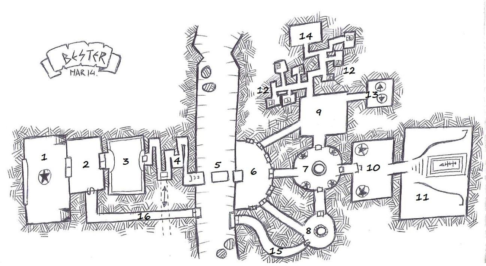

# Nivel 8: La cripta del rey Ludovico, por Bester

## Introducción

Un loco rey enano llamado Ludovico construyó en éste nivel su cripta. Décadas reinando en la Montaña habían acabado con su cordura y se embarcó en la construcción de un sepulcro que hiciese honor a su nombre por los siglos venideros. Allí albergaría sus tesoros protegidos por trampas y magia, lejos del alcance de las manos de los codiciosos aventureros.

Con la ayuda de muy diversos consejeros llegados de todo el mundo diseñaron una pequeña tumba. Durante su construcción murieron muchos trabajadores  y muchos otros intentaron guardarse algunos de los secretos para poder acceder a la cripta en el futuro. Pero Ludovico se aseguró de acabar con todos los ingenieros y esclavos implicados en la construcción despeñándolos por la montaña en el famoso día conocido como “el día en que llovían personas”.

Desafortunadamente para el loco Ludovico nada es eterno y la magia pierde su energía, los mecanismos se atascan, los muertos vivientes se terminan de pudrir, los  suelos y techos se derrumban. El tiempo no es un buen aliado para estas cosas si no hay un servicio de mantenimiento. Es decir, lo había, pero el tiempo y los aventureros acabaron con la mayor parte de él. Los que se quedaron decidieron mantener el legado de Ludovico pero con un costo que seguro se le antojaría excesivo al orgulloso rey. Ese cuerpo de mantenimiento son ahora quienes guardan lo que queda del tesoro de Ludovico: los relojeros

Algunos de los que se despeñaron en aquel infame día consiguieron hacer llegar algo de información sobre los peligros de la cripta a amigos y familiares y así distorsionada la información y la perseverancia hicieron que algunos de los tesoros y salas de la cripta hayan sido ya esquilmados por codiciosos aventureros.

## Mapa del nivel

  

## Conexiones con otros niveles

* La sala 1 tiene dos escaleras, una desciende hasta la [sala 1 del nivel 7](./nivel-07.md) en caso de que se haya conseguido salir del laberinto. En caso contrario es una escalera cegada. La otra lleva hasta la [salida del nivel 5](./nivel-05.md) que está entre las salas 53 y 54.
* En la sala 13, los ascensores pueden llevar a los aventureros hasta [la cima](./nivel-09.md).

## Leyenda de salas del nivel

### 1. Sala de la estatua

Junto a la gran vidriera desde la que se puede ver (pero no ser visto) gran parte de los territorios sobre los que reina la Montaña Soberana. La vidriera es extraordinariamente dura y solo se puede romper con armas mágicas o conjuros y causándole, al menos, 100 puntos de daño. 

En el centro hay una estatua de Ludovico desnudo, con corona, cetro y un gran reloj solar colgando de una cadena en el cuello. Así le gustaba verse, exhibiendo con orgullo su cuerpo (nada destacable, por cierto, pero ya se sabe cómo es la megalomanía). La estatua es una estatua viviente. Cuando los pjs aparezcan, su rostro cobrará vida y empezará hablar interrogándoles por su origen e  intenciones, desanimándoles en su tarea y aconsejándoles con ironía que se dediquen a otra cosa y se marchen. Conversar con la estatua de Ludovico es peligroso y cualquiera que escuche sus palabras y conteste deberá superar una prueba de voluntad de dificultad media para resistir su influjo y de dificultad baja en caso de solo haberle escuchado. Un fallo en la tirada hará que el desánimo invada al pj y tenga que marcharse del nivel no viéndose capáz de internarse en la tumba y no pudiendo volver a intentar el asalto a la tumba hasta que haya pasado un día entero al menos.

La estatua puede ser silenciada derribándola de su pedestal. Caerá y se hará pedazos con una prueba de Fuerza de dificultad alta. El corazón de la estatua es una gema valiosa imbuida que puede servir para animar otras estatuas o constructos a discreción del DM.

Las puertas de oro de esta estancia conducen a la sala anexa.  Unas escaleras conducen a la salida del nivel 6 (en caso de que el misterio del Laberinto de Khagramar no haya sido descubierto, ésta escalera está cegada y acaba en un muro infranqueable de naturaleza mágica que solo desaparece en caso de encontrar la vara y la piedra del nivel 6) y las otras al nivel 4.

### 2. Harén ilusorio

Los límites de la estancia no se pueden contemplar a simple vista. Toda la sala es una ilusión provocada por el Generador. La sala aparenta ser un oasis con mesas repletas de manjares y divanes con bellas mujeres/hombres llamando a los pjs.  Hay varios viejos aventureros atrapados allí por toda la eternidad y algunos esqueletos en el suelo. Hay que superar una tirada de voluntad de dificultad alta para no dejarse embrujar y caer por siempre en el conjuro que tiene la sala. Entre los objetos que han ido dejando allí los desafortunados aventureros hay dinero, pociones curativas, pergaminos y armas (ninguna mágica)

El pj que quede atrapado en la sala puede intentar hasta 3 veces liberarse del embrujo durante 3 días, pasados los cuales quedará atrapado para siempre. La única otra opción de liberar a quien quede atrapado es destruir el Generador en la sala 7

La sala tiene una fuente mágica de alimentos y agua de la que los aventureros pueden surtirse y de la que se alimentan los que caen en el embrujo hasta  que muere.

Las mujeres son muertos vivientes y su apariencia real es la de viejas. Si son atacadas responderán con uñas y dientes. No responden a la expulsión del clérigo.

La puerta secreta es indestructible desde el interior y sirve para el mantenimiento de las salas de éste lado de la sima por parte de los relojeros.

### 3. Sala del lago y el camino móvil e invisible

Como su nombre indica esta estancia es un lago artificial creado por los ingenieros de Ludovico. La magia del generador no funciona del todo bien y por momentos se observan 3 plataformas móviles invisibles que sirven para cruzar el lago. Adivinar el camino que seguirán las plataformas requiere una tirada de inteligencia o percepción de dificultad media. Saltar entre las plataformas tiradas de Agilidad o destreza de dificultad fácil.

Un ingenio en el techo hace imposible el vuelo por la sala. Un mecanismo de succión mágico hace que cualquier objeto que intente nadar o surcar el lago sea absorbido y desaguado hasta el nivel de las cloacas de la Montaña soberana.

A discreción del DM unas trampas que disparan flechas pueden darle más emoción al asunto cuando los pjs se monten en las plataformas o el mecanismo de succión puede ser sustituido por algún gran pez carnívoro. En el fondo del lago hay infinidad de cuerpos y restos para aquellos que quieran aventurarse o tengan los medios para hacerlo.

### 4. Gran pasillo

Un largo (200 metros) y estrecho pasaje de techo bajo se interna en las profundidades de la montaña. El agua se filtra mojando a los personajes que deben ir en silencio y hacer una prueba de Destreza o sigilo de dificultad baja para evitar que el deteriorado túnel se pueda derrumbar en parte.  En caso de fallo permite que hagan una tirada de salvación de agilidad o destreza para evitar el desprendimiento situándose a ambos lados del mismo.

En la mitad del largo pasillo hay un desagüe protegido por una rejilla. Es difícil de ver en el suelo. Si retiran la reja metálica ven un largo tubo metálico que desciende. Por el caen restos líquidos e inmundicias hasta la [sala 1 del nivel 2](./nivel-02.md)

### 5. La sima

Esta grieta era salvada por un gigantesco puente de piedra, pero el tiempo lo ha derrumbado aunque lo que queda de él sigue siendo invisible a la vista (tirada de salvación dificultad moderada). Un mecanismo conectado al generador activa la ilusión del puente e impide el vuelo mágico. Premia la inventiva de los jugadores para superar el obstáculo.

Para saltar entre las plataformas de lo que queda del puente hay que superar tiradas de atletismo o destreza fáciles.

Desde el fondo de la sima surgen infinidad de criaturas peligrosas (arañas gigantescas principalmente) que los relojeros han aprendido a temer y combatir. Un precepto entre su raza es el no matarse entre ellos. Ese inconveniente ha hecho que los que son “expulsados” de su tribu sean llevados hasta aquí para que las criaturas hagan el trabajo sucio.

A unos 30 metros más abajo de la plataforma desde la que llegan los personajes  y en diagonal hay una plataforma de servicio que conecta una red de túneles con las estancias anteriores (la estatua o el harén). Hay una piedra con los símbolos de un reloj de sol sobre la cual, si se pone uno de los colgantes en forma de reloj que portan los relojeros al cuello, se activa un mecanismo que hace aparecer una escalerilla para descender desde la plataforma hasta la entrada a los túneles de servicio.

En el otro lado hay otra entrada igual que conecta con unos túneles de servicio que llevan a una puerta secreta en la estancia del pozo. Con otra piedra y poniendo el colgante del reloj de arena sobre otra piedra similar a la anteriormente descrita aparece una escalerilla que conecta con esa entrada a los túneles de servicio.

En el momento de aparición de los pjs hay 3 relojeros: dos hombres y una mujer encadenados en la cornisa más alejada y multitud de esqueletos de víctimas pasadas. Un grupo de arañas precedidas por una muy grande se aproxima a por sus presas a no ser que los pjs hagan algo. Los relojeros son Thomas, Elnar y Sara. Son calvos, llevan tatuajes de números indescifrables, sus pieles son blanquecinas y sus ojos negros por completo.. Se ve que son humanos, pero el tiempo y las generaciones les han alterado un tanto. Hablan un común arcaico y pretendían fugarse de la Montaña con lo que resta del tesoro de Ludovico cuando sus congéneres les descubrieron. Implorarán la ayuda de los pjs. Si estos no actúan rápido las arañas los atraparán para llevarlos a su cercana guarida y los perderán de vista. Si son ayudados y salvados mentirán diciendo que han sido puestos allí por el capricho del líder de los relojeros, el loco Gunter. La mentira puede ser detectada con una tirada de habilidad de dificultad media.

Los relojeros son los esclavos que quedaron a cargo del mantenimiento y protección de la cripta. Para ello se les dejó unas herramientas mágicas (que ellos no tienen) que pueden reparar los mecanismos y trampas de todo el nivel. Las trampas en algunos lugares no se activan en su presencia y son inmunes a las ilusiones. En otros puntos utilizan los colgantes en forma de reloj de arena para desactivar una trampa o que se active una sala. Los relojeros y sus descendientes llevan siglos protegiendo la cripta pero el tiempo ha diezmado sus efectivos. Son diestros monjes y conocen artes marciales, por lo que aún sin armas son muy peligrosos. Los que quedan empezaron a coger parte del tesoro de Ludovico para subsistir y seguir viviendo allí. El resto se lo llevaron los aventureros que acceden de cuando en cuando. Gunter es el relojero más anciano y si está algo loco, pero toda su locura la vuelca en evitar que se descubra que ya apenas queda nada del tesoro de Ludovico (que ellos sepan) y en acabar con los aventureros que diezman su número. Odia profundamente a los caza tesoros y hará lo posible para eliminarlos. Sus hombres y mujeres también lucharán con fiereza contra cualquier aventurero con el que se encuentren.

La intención de los tres relojeros cautivos si son liberados es servirse de los personajes y luego acabar con ellos. Les mentirán diciendo que el tesoro de Ludovico sigue en la cripta (detectar mentira: dificultad alta). No les contarán que hay una salida desde la cripta hasta la base de la montaña, el acceso que ellos usan para salir a abastecerse.
 
### 6. Cámara de las puertas

En esta cámara abovedada hay siete puertas de metal o madera coloreada. En el suelo hay esqueletos y restos de aventureros. (entre los restos se puede encontrar una poción de invisibilidad, una poción de disminución y otra de heroísmo. Algunas monedas de oro y un boceto del plano del nivel que revela todos los pasajes anteriores a ésta sala. También hay un arco mágico.

* **Puerta de bronce**: al abrirla revelando un acceso ciego, una luz verde invade la estancia y todos los restos de muertos cobran vida atacando a los pjs.
* **Puerta de oro**: al abrirse y girar aparece un pasaje oscuro. Es una ilusión con una trampa de foso en cuyo fondo hay estacas. Al caer un pj se revela la trampa. Permite una tirada de salvación contra ilusión.
* **Puerta plateada**: conduce a la zona donde habitan los relojeros
* **Puerta negra**: conduce a la cripta de Ludovico y está cerrada con llave. Una copia la tienen los relojeros, la otra se perdió y está en un cadáver del cementerio en la entrada de la Montaña.
* **Puerta blanca**: al abrirla se produce una explosión (puede ser detectado por un ladrón o similar con una dificultad media-alta)
* **Puerta de madera**: conduce a un almacén lleno de armas viejas y armaduras. Buscando en él se puede encontrar una poción curativa y un par de espadas de gran calidad mágicas enrolladas en una tela y semiocultas. Una serpiente también tiene su nido allí y atacará nada más abrirse la puerta.
* **Puerta roja**: conduce a la zona del pozo

### 7. Sala del generador

Una cámara de ladrillos circular con tres salidas. En el centro está el generador (una gran bola de bronce montada sobre unos soportes de metal) que activa todas las ilusiones de las estancias anteriores. Hay cuatro estatuas de cuatro luchadores enanos fuertemente armados y acorazados. Si se intenta destruir los relojeros acudirán a combatir contra los pjs. Los relojeros tienen la apariencia con sus túnicas y armas arcaicas de ser religiosos de alguna secta. Pero son hábiles combatientes con las  artes marciales y combaten desarmados con pericia

Cada poco tiempo uno de los relojeros pasa a revisar la sala, para desactivar a las estatuas vivientes utiliza alguna de las piedras que hay en las entradas de la sala superponiendo su colgante de reloj de arena.

Si los pjs intentan atravesar la sala las estatuas no se animan, sino que los espectros de esos ancestrales guerreros enanos, la guardia personal de Ludovico sale de las estatuas y armaduras para atacar  a todo aquel que no pertenezca a la cripta.

Si los espectros son eliminados se pueden recuperar sus armas y armaduras que son de gran valor. Al cabo de unos meses se regeneran si el generador sigue intacto y los relojeros vivos.

### 8. Sala del pozo

Esta sala siempre parece estar vacía (tirada de salvación difícil si no se ha destruido el generador) pero contiene un pozo que abastece de agua subterránea a los habitantes del nivel. Según se entra en la sala se desaparece a los ojos de un observador externo.

En la sala hay cuatro aventureros heridos que accedieron al nivel por el interior del pozo que lleva a unos conductos que conducen al exterior de la montaña (escalar difícil). Fueron atacados al intentar llegar a las estancias de los relojeros donde perdieron parte de su equipo. Lo que les impide iniciar el descenso.

Son unos rufianes llamados: Torrin, Jester (el líder), Manfred y Helga (la novia de Manfred). Están cansados y heridos y no atacarán a no ser atacados. Pueden ser convencidos de ayudar a los pjs por una parte del botín.

Consiguieron un mapa que les indicó el acceso a través del pozo y al intentar evitar la sala del generador y usar la puerta plateada llegaron a la zona habitada por los relojeros. Solo darán esa información a cambio de dinero o algo ventajoso para ellos.

En caso de que los pjs les ayuden, son unos traicioneros, no dudarán en atacarles cuando hayan saqueado el nivel.

### 9. Almacén de maquinaria

El túnel que accede a esta estancia tiene unas baldosas que al ser pisadas advierten a los relojeros mediante una luz que se activa en sus colgantes reloj de que alguien está atravesando el pasaje

Toda esta zona de la cripta son las estancias de los relojeros, el mantenimiento de  la cripta. Hay numerosos aparatos mecánicos inservibles y restos de piezas por el suelo. Parece una chatarrería.

Es donde suelen estar los relojeros que quedan (10) y su líder Gunter. Si los pjs no han avanzado manifestando explícitamente su sigilo, los relojeros estarán ocultos para tenderles una emboscada. Gunter se quedará a descubierto para enfrentarse a ellos y distraerlos.

Odia profundamente a los aventureros que han diezmado a su “tribu” durante siglos por lo que luchará hasta la muerte pero no perseguirán a los personajes más allá de la sima, si se retiran.

En el suelo hay un par de trampas de foso(sin estacas) para estos casos. Se pueden ver con una tirada de percepción de dificultad moderada. Sirven para apartar a los pjs de la lucha y atraparles.

**¡Atrapados!**: si los pjs son derrotados no les matarán, aparecerán atados en la sima donde las arañas irán a comerles y tendrán una oportunidad de derrotarlas o escapar de sus cadenas (tirada de Fuerza difícil)

### 10. Cripta de los Wyrm

Los relojeros saben que ya no queda nada en la cripta que no hayan robado ya antes o que esté en sus manos pero mantienen todo funcionando para atraer aventureros(pese al odio que les tiene Gunter, para robarles y mantener su oficio, al fin y al cabo es lo único que saben hacer.

En la estancia hay un par de estatuas de dracos (las mascotas de Ludovico) en la pared más cercana a la entrada. Los dragones (sus cabezas se mueven) escupen fuego y ácido a todo el que entra atacando a distancia. Se les puede atacar para destruirlas y su armadura es alta por la dureza del material. Los relojeros saben si las estatuas están siendo atacadas.

Si se destruyen las dos la puerta de la cripta se abre.

La única manera de evitar el ataque es recitar unas palabras mágicas que pueden estar en algún otro nivel del megadúngeon, en un lugar difícil o portar algún atuendo.

### 11. Cripta de Ludovico

Hay un gran  sepulcro con la efigie y figura de Ludovico. Ya ha sido vaciado y tan solo queda los huesos del rey enano loco y un hechizo de  maleficio que hará que persiga la mala suerte al que abra la tapa. En sus siguientes 10 tiradas deberá tirar un dado adicional y elegir el resultado menor a no ser que supere una tirada de salvación contra encantamientos muy difícil.

### 12. Estancias de los relojeros

Son los habitáculos con camastros donde habitan los relojeros desde hace siglos.  En la última estancia, la habitación donde Gunter duerme está lo que queda del tesoro de Ludovico.

El contenido exacto del tesoro deberás decidirlo tu en función de la importancia y nivel de los pjs al llegar a la estancia. Incluye una maza pesada mágica maldita que conserva parte de la esencia de Ludovico y convierte al portador en un asesino despiadado que atacará a quien tenga cerca hasta que se le desarme si no supera una tirada de salvación de voluntad de dificultad moderada.

### 13. Ascensores

Un ascensor que se activa con una palanca desciende durante interminables minutos hasta la base de la montaña, llegando hasta el exterior. Hay otro que asciende hasta la cima. Ambos se activan con el colgante reloj de arena.

### 14. Sala de control 

Una extraña consola informa de si hay algún dispositivo roto y donde. Hay un mapa del nivel en la pared con unas luces que parpadean indicando un fallo.

Una mesa y unas sillas. Suele haber un par de operarios comiendo bollos azucarados de forma redondeadas (¿donuts?) y tomando café mientras vigilan “los monitores”. El café da un bono de  +3 a las tiradas de salvación de fortaleza durante un día, tras el produce un penalizador de -2 durante otro día.

### 15 y 16 Pasajes de servicio

Estos túneles sirven para que los relojeros efectúen el mantenimiento en las salas del nivel. Las puertas secretas solo se pueden abrir  poniendo el colgante en forma de reloj en los orificios a tal efecto que hay sobre las mismas en la cara que da a los túneles.
