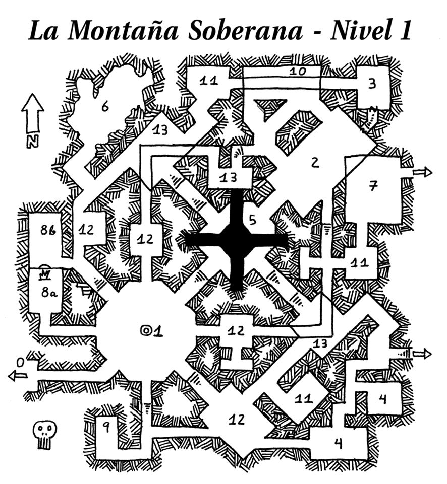
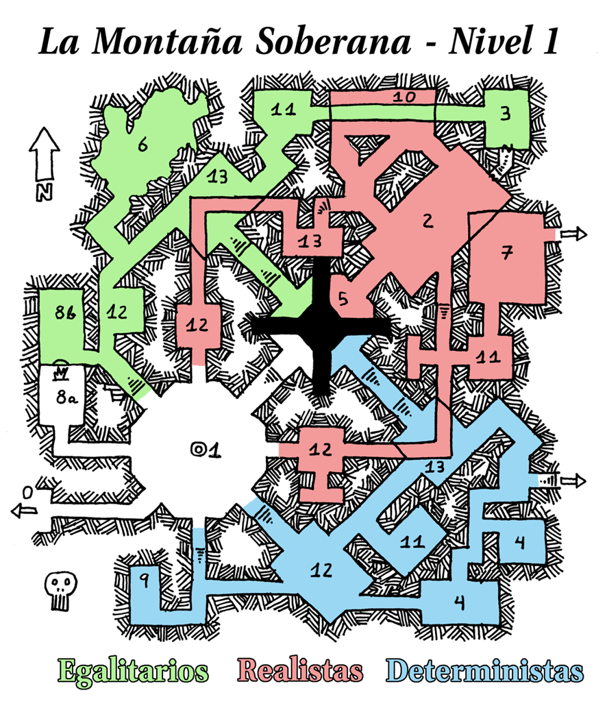

# Nivel 1: Filosofías enfrentadas, por Rodrigo García Carmona

## Mapa del nivel

  

## Conexiones con otros niveles

* Sala 0: lleva al [exterior de la Montaña](./05-exterior.md).
* Sala 5: Conecta con la [sala 5 del nivel 2](./nivel-02.md).
* Sala 7: conecta con la [sala 1 del nivel 3](./nivel-03.md): La boca del Dragón.
* Salida al Sureste (entre las salas 4 y 13): desemboca en el [Gran pasaje del nivel 4](./nivel-04.md).
* Sala 11: tiene una trampilla oculta a la [sala 9 del nivel inferior: el nivel 2](./nivel-02.md).

## Las tres facciones de Goblins

Este nivel de la Montaña Soberana está caracterizado por una constante pugna entre tres facciones de Goblins, que se enfrentan entre sí por el control de la Piedra Filosofal, un fragmento de roca muy especial. Las fuerzas de las tres facciones están muy equilibradas, por lo que ninguna logra mantener el control de la Piedra Filosofal más allá de un día o, a lo sumo, dos.
Las tres facciones de Goblins son los Realistas, los Egalitarios y los Deterministas.

Los Goblins están bastante abiertos a negociar y hacer tratos con los personajes, y no atacarán a un grupo de aventureros sin preguntar antes. Al fin y al cabo, este tipo de personas suelen ser útiles para conseguir cierta ventaja (aunque sea temporal) sobre las facciones enemigas.

### Los Realistas

Los Goblins Realistas obedecen a su rey, Hermenegildo XXXIII, con fe y sumisión inquebrantables. Están convencidos de que sin él literalmente no existirían y que su dominio es el orden natural de las cosas. De hecho, si se les pregunta, dirán que la Montaña Soberana recibe dicho nombre porque en ella habita el clemente pero a la vez implacable Hermenegildo XXXIII.

Que el valiente, pero a la vez precavido, Hermenegildo XXXIII sea cojo, tuerto, retrasado y tartamudo no es algo que importe mucho a sus seguidores, que interpretan este hecho como reflejo de las pruebas a las que tienen que enfrentarse para someter a sus odiados enemigos, los Egalitarios. Además, no cabe duda de que Hermenegildo XXXIV, el joven hijo del actual rey y su hermana la reina (es tradición en la familia real casarse entre hermanos) será un magnífico gobernante.

#### _Las Vestiduras del Rey_

Hermenegildo XXXIII lleva siempre puestas sus famosas vestiduras. Los Goblins Realistas identificarán a quién las porte como el auténtico rey, y obedecerán sus órdenes al pie de la letra. Tanto el portador como sus súbditos percibirán estas prendas como un rico y lujoso ropaje, de una majestuosidad indescriptible, como corresponde a un noble gobernante. Sin embargo, nadie más será capaz de ver las Vestiduras del Rey, por lo que desde su punto de vista parecerá que quién las porte va desnudo.

Sólo haciendo el gesto de quitarle las vestiduras (en apariencia inexistentes) al actual rey y poniéndoselas uno mismo podrá un personaje percibirlas, ya que lo que habrá hecho es convertirse él mismo en monarca al ponérselas. A partir de ese momento estará convencido de que lleva unos ricos ropajes, aunque quienes no le obedezcan le vean desnudo.

Los Goblins de la facción Realista obedecerán a quién lleve las Vestiduras del Rey sin dudarlo ni un instante. 

### Los Egalitarios

Los Goblins Egalitarios viven convencidos de que todos somos iguales, o que deberíamos serlo. Tanto es así que llevan esta máxima hasta sus últimas consecuencias. Por ejemplo, todos los Egalitarios se llaman Bob (independientemente de su sexo), visten igual, llevan idénticos pendientes en la oreja izquierda, y tienen la misma cicatriz en la mejilla derecha.

Los Egalitarios piensan que todo el mundo es libre para elegir su destino, así que "liberarán" a cualquier prisionero, lo desee éste o no, de sus cadenas: bautizándole como Bob, vistiéndole apropiadamente, poniéndole un pendiente en la oreja izquierda, haciéndole una cicatriz en la mejilla derecha y, por encima de todo, obligándole a pensar por sí mismo. Es decir, igual que todos los demás Egalitarios.

Como cabría esperar, el líder de los Egalitarios es Bob (todos los Bob), y odian por encima de todo a los Deterministas. Si se les pregunta dirán que la Montaña Soberana recibe éste nombre porque todos los que habitan en ella son dueños de su propio destino.

#### _Únete a nosotros_

Aunque parezca increíble, el proceso de "liberación" de los Egalitarios funciona. Si un personaje es sometido a él (le bautizan como Bob, le ponen el pendiente, etc...), se convertirá en un Egalitario convencido, abandonará su antiguo nombre y se pondrá como meta hacer que todos seamos iguales. Aunque, eso sí, conservará su libre albedrío. Faltaría más. Lo que pasa es que sus opiniones tienden a coincidir con las de todos los demás Bobs.

La "liberación" tarda 2 días en realizarse, y es irreversible. Es mejor no describir aquí los detalles más cruentos del proceso, pero baste decir que un observador imparcial la describiría como "horripilante". 

### Los Deterministas

Los Goblins Deterministas saben que no son más que máquinas biológicas, programados por algo o alguien (probablemente la propia montaña) para llevar a cabo una misión. Por tanto, el libre albedrío es una ilusión, y no sienten ninguna responsabilidad ante sus propias acciones, pues saben que sólo ejecutan las órdenes programadas por su "creador": La Gran Máquina.

Pero, si están en lo cierto, este creador debió de ser alguien con mucho sentido del humor o un plan muy complejo, ya que el comportamiento de los Deterministas es, como poco, errático. Pero, ¿quiénes son unos humildes Goblins para dudar de la programación que La Gran Máquina, en su suma sabiduría, ha creado?

Un grupo de representantes de los Deterministas se encarga de mantener La Gran Máquina perpetuamente en funcionamiento: echando aceite en sus engranajes, sustituyendo piezas rotas, ofreciendo la sangre de Goblins de otras tribus en sacrificio, etc.

Los Deterministas odian a los Realistas por encima de todo, puesto que se atreven a seguir las órdenes de alguien que, claramente, no es su creador. Creen que la Montaña Soberana recibe este nombre porque es precisamente eso... su soberana. Están convencidos de que los mecanismos de la Gran Máquina se extienden por los niveles y corredores de la montaña.

#### _El Plan_

En alguna parte de la Montaña Soberana (en concreto entre [las posesiones de Ulk-Uktar en la sala común del nivel 3](./nivel-03.md)) , escrito en piedra ancestral, se encuentra El Plan, que determina las acciones de los Deterministas. Si alguien pudiera hacerse con El Plan podría predecir las acciones de los Deterministas... quizá incluso sobrescribirlas.

### Los sapos sagrados

A pesar de todas sus diferencias, hay algo que las tres facciones de Goblins tienen en común: su respeto por los sapos. Todos los Goblins consideran a los sapos, en todas sus formas y colores, animales sagrados, y no les dañarán bajo ningún concepto. Tampoco tolerarán que nadie los moleste. Como consecuencia de esto, es habitual ver sapos pululando por todos los recovecos del nivel, campando a sus anchas a sabiendas de que nadie (salvo algún aventurero) les hará daño.

### Mapa de las facciones goblin

  

## Leyenda de las salas del nivel

0. **La Entrada**

   La entrada a este nivel es la entrada principal a la Montaña Soberana propiamente dicha. Es un enorme arco apuntado, excavado en la propia piedra, y cubierto de extraños símbolos en un lenguaje antiguo, que ninguno de los Goblins que habitan en el primer nivel conoce.

   La puerta está compuesta de dos enormes hojas de un metal plateado que no se oxida ni estropea. Lleva abierta desde que los Goblins recuerdan, y no se atreven a cerrarla, pues una antigua leyenda dice que si esta puerta se cierra nunca más se podrá abrir. Leyenda que, por cierto, comparten las tres facciones de Goblins. Además, es cierta.

1. **Piedra Filosofal**

   En el centro de esta sala de bóveda alta y arqueada se encuentra la Piedra Filosofal, una pequeña piedra negra de un peso tal que es imposible levantarla y sacarla de la habitación. La Piedra Filosofal es mágica, y se dice que puede convertir el plomo en oro, curar todas las dolencias y maldiciones, y devolver la juventud. Que alguna o todas estas capacidades sean reales o no depende del DJ. Dado que las tres facciones de Goblins pelean por controlar esta sala, en un momento dado la sala estará ocupada por (tirar 1d6):

	1. Realistas
	2. Egalitarios
	3. Deterministas
	4. Realistas vs. Egalitarios
	5. Realistas vs. Deterministas
	6. Egalitarios vs. Deterministas

   Cada bando que esté presente contará con 1d12+6 guerreros Goblin, que se concentrarán en las otras tribus de Goblins (si están presentes) e ignorarán a los aventureros, salvo que estos intenten acercarse a la Piedra Filosofal.

2. **Sala del trono**

   Aquí se encuentra el centro de poder de los Realistas. En esta sala vive la familia real (Hermenegildo XXXIII, su esposa Leovigilda, y sus hijos Hermenegildo, Leovigilda y Teodosio). Los aposentos reales están en el lado noreste de la habitación, y son todo lo lujosos que un Goblin podría esperar: 3 camastros en el suelo (uno de ellos de matrimonio), un perchero, una cómoda, y un sifonier. Todo ello cubierto por un dosel que proporciona cierta intimidad.

   En el extremo norte de la sala del trono, justo debajo del camastro de matrimonio de Hermenegildo XXXIII, se encuentra una trampilla que lleva a unas estrechas escaleras que conducen a la sala de conversiones (3). Esta trampilla no está oculta ni tiene cierre alguno, pero los Goblins no saben de su existencia. Es simplemente que a nadie se le ha ocurrido mirar debajo del camastro ancestral del Rey. Además, cada vez que los siervos Goblin barren echan más y más polvo y suciedad debajo del camastro, para ocultarlo, por lo que incluso levantándolo será difícil percibir que hay una trampilla en el suelo. Salvo que se limpie, claro está. 

   El rey imparte justicia y gobierna desde su trono, construido con los huesos de sus enemigos derrotados y, la verdad, bastante inestable.

   En esta sale habrá en todo momento 1d10+4 guardias Goblin. Hermenegildo y su familia se encontrarán aquí con un 90% de probabilidades, ya que rara vez salen de sus aposentos. También es habitual (70%) encontrar a 1d6+5 ciudadanos Goblin que buscan las atenciones de su monarca.

3. **Sala de conversiones**

   La sala de conversiones es el secreto mejor guardado de los Egalitarios: la fuente de su poder. En el interior de esta sala, construida con una extraña piedra de un negro brillante, se encuentra un altar sin adorno alguno lo bastante grande para que un orco pueda yacer tumbado sobre él.

   Es en este altar dónde los Egalitarios llevan a cabo sus conversiones, y en todo momento habrá en esta habitación 1d6+2 guardias Goblin y el maestro de torturas que, como cabría esperar, se llama Bob. Si se está llevando a cabo una conversión (30% de posibilidades) habrá además 1d12+10 espectadores Goblin.

   En la pared sur de esta estancia se encuentra una puerta secreta que lleva a la sala del trono (2). La forma de revelarla es presionando una de las losas de la pared, que cederá ante el peso y mostrará un pequeño conducto. Los Goblins no saben de la existencia de esta losa debido a que está situada a 6 pies de altura, bastante más arriba de lo que alcanza un Goblin, por lo que nunca han tenido la oportunidad de presionarla por accidente. 

4. **La Gran Máquina**

   Estas dos salas están llenas de engranajes, palancas, pistones y mecanismos varios. El fuerte ruido de partes metálicas entrechocando y girando hace que sea imposible comunicarse si no es a gritos, y el aire tiene un olor a óxido, aceite y humo. La razón de esto es que en estas habitaciones se encuentra la Gran Máquina, o al menos la parte que los Goblins pueden manipular, ya que parece que la maquinaria se extiende más allá de las paredes este y sur de ambas salas, a pesar de que es imposible proceder en estas direcciones, debido a la presencia de los mecanismos.

   Continuamente habrá un grupo de 1d4+2 "técnicos" Goblin que se encargan de mantener en perfecto estado de funcionamiento a la Gran Máquina (a pesar de que no la comprenden), así como 1d10+8 guardias Goblin que vigilan que ningún intruso intente dañarla.

   Si alguien se acerca a la Gran Máquina sin saber bien lo que está haciendo o dónde pisar es altamente probable (80%) que acabe golpeado por algún engranaje suelto y atrapado por la maquinaria. Si no consigue escapar (salvación contra petrificación, o la más apropiada a tu juego) acabará convertido en una pulpa sanguinolenta (1d6hp automáticos por asalto atrapado en la máquina).

   En el hipotético (e improbable) caso de que alguien consiguiera destruir o detener a la Gran Máquina todos los Goblins Deterministas caerían al suelo, paralizados. Además, es posible que  otros niveles de la Montaña Soberana, o incluso la propia montaña, se vieran afectados por esta circunstancia, a discreción del DJ.

   Un poco al norte de la Gran Máquina se encuentra la salida sureste del nivel, representada en el mapa con una flecha.

5. **El jardín**

   Los Goblins precisan de alimento y agua para vivir, y las tres facciones obtienen ambos de esta sala. El jardín recibe su nombre porque de su techo cuelga una inmensa maraña de extrañas plantas de color rosáceo que ofrecen sustento en forma de frutos, raíces, ramas, y los hongos que crecen a su alrededor.

   Más desconfiados que el resto de las tribus, los Realistas han instalado una trampa de foso en su balcón, que todos ellos saben evitar. Esta trampa hace caer al personaje por un túnel de gran inclinación y muy resbaladizo que acabará en la [sala 5 del nivel 2](./nivel-02.md).

   Esta misma vegetación baja hasta niveles inferiores, a través del abismo central de la sala. Dicho abismo está flanqueado por cuatro balcones, desde los que se puede acceder con facilidad a las plantas del jardín. Muy convenientemente, las tres facciones de Goblins se han repartido estos balcones, de tal forma que todas ellas tienen acceso a los preciados recursos que la vida vegetal proporciona.

   Además, una fuente de agua sorprendentemente cristalina también surge del techo, cayendo en parte sobre los balcones. Así es como los Goblins obtienen el líquido necesario para beber y mantener su (escasa) higiene.

   Hay un 40% de probabilidades para cada balcón de que en él se encuentren 4 obreros Goblin y 2 guardias Goblin recogiendo comida y agua. 

6. **La Sapa Madre**

   En esta caverna de piedra natural (a diferencia del resto del nivel) vive un sapo hembra de enorme tamaño, bautizada como la "Sapa Madre" por los Goblins, que la veneran como una diosa. A su alrededor saltan y corretean una multitud de sapos de todos los colores y tamaños imaginables.

   Ninguna de estas criaturas es hostil, y sólo recurrirán a la violencia si son atacadas primero o se sienten amenazadas. Saben que los Goblins las dejan hacer lo que quieren (pues veneran a los sapos como animales sagrados) y viven tranquilas.

   De hecho, si un Goblin viera a alguien hacer daño a un sapo, o sospechara de ello, las tres facciones se aliarían para acabar con la vida del hereje. De la forma más horrible posible.

   Hay un 20% de posibilidades de que en esta sala se encuentre 1 sacerdote Goblin y 1 guardia Goblin, haciendo una ofrenda, y un 10% de posibilidades de que 2d10+10 ciudadanos Goblin estén adorando a su diosa. 

7. **El Bugbear que siempre miente y el Bugbear que siempre dice la verdad**

   Pegada a la pared este de esta sala, se encuentra una masa palpitante completamente opaca de color negro del tamaño de un hombre, que de ser atravesada llevará a la salida noreste del nivel (está marcada con una flecha en el mapa), pero que no puede ser atravesada en sentido contrario. Ni la luz ni el sonido pueden traspasarla, en ningún sentido. Por tanto, los personajes no sabrán si lleva a alguna parte o simplemente es una trampa.

   A ambos lados de la masa se encuentran dos Bugbears, en apariencia idénticos, pero uno ataviado con una armadura roja y otro una armadura azul. Aunque están equipados con una alabarda cada uno, ninguno hará ademán de atacar a los personajes y, de hecho, ni siquiera se defenderán si son atacados.

   Encima de los dos Bugbears, y de la masa negra, los personajes podrán leer el siguiente texto, inscrito en la pared:

   _Somos los poseedores de la verdad y la mentira, de lo auténtico y lo falso._

   _Podrás hacernos una única pregunta, y deberemos responderla._

   Es más, no importa de dónde sea cada personaje, todos verán el texto en su idioma natal.
Cada personaje podrá hacer una única pregunta a ambos Bugbears, que poseen el conocimiento universal y podrán responder con certeza sin importar la cuestión. Uno de ellos (el de la armadura azul) siempre responderá con la verdad, mientras que el otro (el de la armadura roja) siempre responderá con una mentira. 

8. **La caverna de la llama**

   La caverna de la llama está dividida en dos partes;  a y b.

   En la **sala a** se encuentra una tribu entera (40 individuos) de grandes orcos ataviados para la guerra. Todos estos orcos están sentados en el suelo con las piernas cruzadas, el cuerpo relajado, y el rostro en paz. Miran obnubilados a unas sombras que aparecen proyectadas en la pared norte de la caverna, y nada puede distraerlos.

   De hecho, cualquier personaje que se queden mirando estas sombras durante dos asaltos o más deberá superar una salvación frente a ilusiones (o la que sea apropiada al sistema de juego que uses) o quedará igualmente obnubilado, permaneciendo así hasta que el fuego que proyecta las sombras se apague. Mientras esté en este estado el tiempo no pasará para él, y no necesitará comer ni ningún otro sustento.

   En la **sala b** se encuentra la llama mágica que proyecta estas sombras. Está atendida permanentemente por 4 fogoneros Goblins y 6 guardias Goblin, que se encargan de que no se apague nunca, pase lo que pase. Si se ven envueltos en un combate y llevan las de perder harán sonar un potente cuerno, que atraerá una ingente (2d20+10 soldados) cantidad de Goblins en 1d6 minutos, de todas las facciones (unidas por una vez).

   Los orcos que se encuentras ensimismados son miembros de la tribu del Ojo Roto, que intentó conquistar este nivel de la Montaña Soberana, pero se vieron atrapados por la belleza y comodidad de las sombras proyectadas por la llama.

9. **La sala de la marmota**

   En el centro de esta pequeña habitación, ligeramente aislada de todas las demás, se encuentra una estatua a tamaño real de una marmota, sin ningún adorno. Si al menos uno de los personajes pasa más de 1 minuto en esta sala, el grupo entero entrará en un bucle temporal, aunque no recibirán ninguna pista de que así ha sido.

   A partir de ahora, cada vez que despierten tras una noche de descanso volverán a amanecer al comienzo del día en que el personaje tocó la estatua de la marmota. Los personajes seguirán en el estado en el que se encontraban cuando se fueron a dormir (puntos de vida, etc.), pero todo el resto del universo de juego volverá a la situación en la que estaba al principio de aquel día.

   Este ciclo sólo podrá romperse si los personajes hacen añicos la estatua de la marmota.

10. **La biblioteca de la Uberratte**

    Las paredes de esta sala están cubiertas de estanterías llenas a rebosar de libros, que tratan casi cualquier tema concebible, desde el más místico al más mundano, escritos en una gran variedad de idiomas. El responsable de esta biblioteca es Uberratte, un hombre-rata con monóculo y sombrero de copa que camina apoyado sobre un bastón coronado por una calavera plateada. Uberratte no se mostrará hostil ante los personajes, pero si alguno de ellos tiene una característica a 17 o 18, Uberratte se obsesionará con él, siguiéndole a todas partes con una pluma y un manojo de papeles en la mano. Su objetivo es escribir para la posteridad las crónicas del "individuo excepcional" que ha elegido. 

    Uberratte no molestará en ningún caso a su víctima, pero puede dar problemas al grupo, ya que no se le da bien moverse sigilosamente, no es muy rápido, y chillará con grititos de rata al enfrentarse al peligro. Por otra parte, es taaan adorable.

    Si un personaje pasa 2d6 horas buscando en la biblioteca encontrará 1d4 pergaminos que contienen conjuros de nivel 1, elegidos al azar entre los de aquellas clases que existan en la campaña del DJ.

11. **Almacenes**

    En estas tres habitaciones los Goblins guardan las provisiones y demás material necesario para la vida diaria. Hay un 40% de posibilidades de que los personajes se encuentren aquí a 2d3 obreros Goblin. Hay una trampilla bajo los productos almacenados que lleva al nivel inferior.

12. **Puestos de guardia**

    Estas salas son los puntos de entrada a los territorios de las diferentes facciones, y por ella están permanentemente protegidas por un grupo de 1d6+6 guardias Goblin, que no dudarán en dar la voz de alarma ante cualquier intruso peligroso. 

13. **Nidos**

    En estas habitaciones es dónde las facciones de Goblins crían a sus pequeños. En su interior habrá 1d20+15 mujeres Goblin y 1d100 niños Goblin, hacinados. Ni que decir tiene que atacar las mujeres e hijos de los Goblins suele ser algo que éstos no se toman nada bien.

## Nota sobre las tiradas de salvación

En un par de puntos el texto hace referencia a dos salvaciones (ilusiones y petrificación), que se pueden (y deben) cambiar por las del reglamento que se utilice al final, obedeciendo al sentido común.
