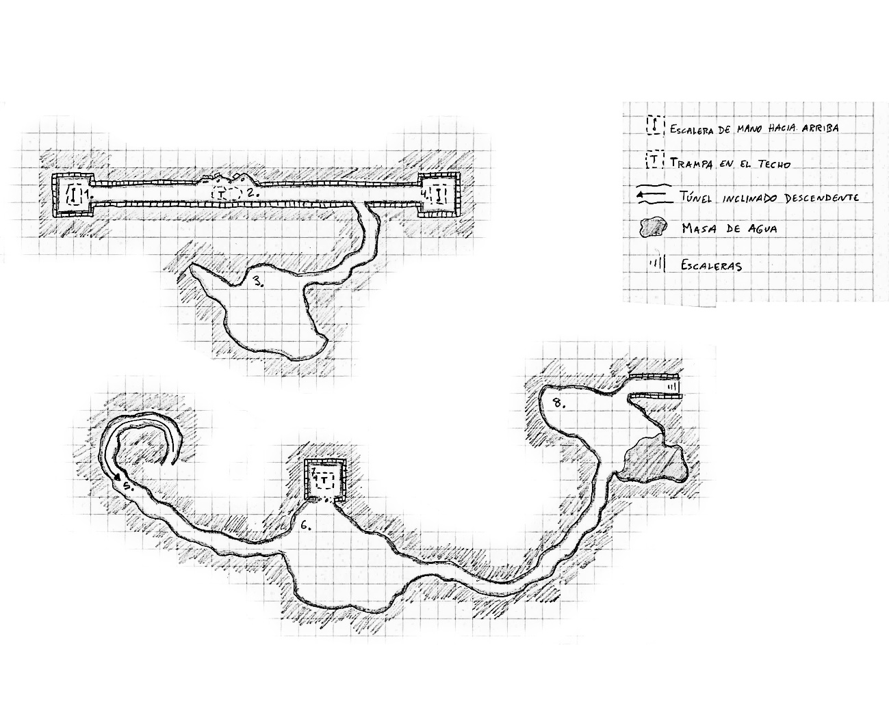
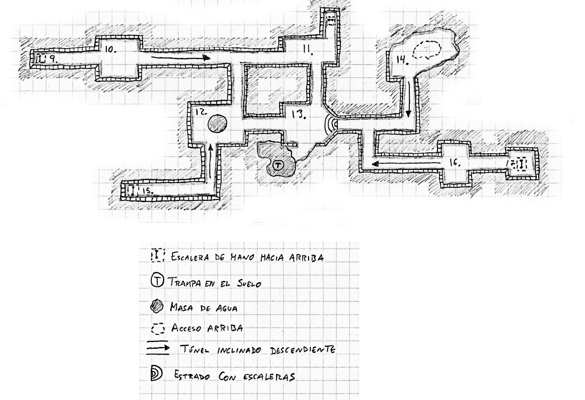

# Nivel 2: Sucios, sucios, sucios, por Jacobo Peña

## Mapas del nivel





## Conexiones con otros niveles

* Sala 1: conecta con la [sala 4 del nivel 8](./nivel-08.md): la Cripta del rey Ludovico.
* Sala 2: conecta con la [zona 4 del nivel 3](./nivel-03.md): el Dragón.
* Sala 4: conecta con la [sección 1 del nivel 5](./nivel-05.md): el Pozo.
* Sala 5: conecta con la [sala 5 del nivel 1](./nivel-01.md): Filosofías enfrentadas.
* Sala 7: conecta con la [sala 12 del nivel 6](./nivel-06.md): El deposito del Hechicero.
* Sala 9: conecta con los Almacenes, [Sala 11 del nivel 1](./nivel-01.md): Filosofías enfrentadas.
* Sala 11: conecta con el [exterior de la Montaña](./05-exterior.md).
* Sala 15: conecta con la [zona 2 del nivel 4](./nivel-04.md): Aire Irisado.
* Sala 17: conecta con la [zona 4 del nivel 3](./nivel-03.md): el Dragón.

## Descripción general

Las estancias descritas en este nivel nacieron de la buena voluntad de los habitantes del interior de la Montaña Soberana, aunque en la mayoría de los casos han derivado a lugares siniestros, peligrosos e insalubres; son, en realidad, un reflejo húmedo y podre de lo que ocurre en los niveles superiores. Algunas de estas salas suponen un intento por parte de algunos de los habitantes de la montaña de construir un alcantarillado a través del que canalizar las basuras, fluidos insanos y desechos biológicos que producían, de una forma ordenada. Pero la falta de uso, lo peligroso de algunos de esos desechos y el miedo a la presencia del terrible Limo Insidioso que se va extendiendo por la zona, han convertido las alcantarillas en lugares abandonados a su suerte. Muchas salas han sido destruidas o modificadas por la acción de los elementos y otras nuevas se han creado en accidentes derivados de la propia actividad de los habitantes de la montaña o por la abrasión las sustancias desechadas. 

Dado que este es un nivel no unificado, al que se puede acceder desde muy distintos niveles de la Montaña Soberana, si bien no es el más peligroso, sí que contiene algunas sorpresas importantes que pueden suponer un duro reto para personajes de bajo nivel. Quizá hasta protesten un poco. Pero claro, protestar porque te has metido en una red de alcantarillado y te has manchado de mierda hasta las rodillas es para que te quiten el carné de aventurero. 

## Leyenda de salas del nivel

### Sala 1: Un mal paso

Esta pequeña sala es el fondo de un acceso al alcantarillado y siguiendo un tubo por el que descienden restos de muchos niveles y una  muy larga escalerilla de mano metálica hacia arriba se conecta con la [sala 4 del nivel 8](./nivel-08.md). Toda esta zona (Salas 1 a 4) del alcantarillado en particular apenas se utiliza y nadie se ha ocupado de reparar las escaleras. Están oxidadas y lo bastante endebles como para romperse un escalón al paso de un personaje. Si se observan con cuidado se verá que además se les ha aplicado tanto a ella como a las paredes de esta sala, una cantidad importante de fuego; hay rastros de abrasión en varios puntos. La probabilidad de que un escalón se rompa al paso de un personaje es igual a la Fuerza del mismo en una tirada de 1d100. Esta probabilidad aumenta en 2% por cada miembro del grupo que haya pasado por esa escalerilla antes. En caso de caer, el personaje lo hará desde 1d6+2 metros de altura. Cuando lleguen al piso de esta alcantarilla (Salas 1 a 4) lo encontrarán húmedo y pringoso pero sin que se formen charcos más profundos que la altura de los tobillos. El aire tendrá un olor agrio, como a vómito o descomposición y puedes disfrutar de recordárselo a los jugadores cada vez que sus personajes se detengan a charlar. El pasillo que conecta esta sala con la número 4 tiene cada poco tiempo desagües en el suelo, cerrados por barrotes también oxidados (y que también podrían romperse al pisar sobre ellos si no se tiene cuidado). Estos desagües son demasiado estrechos para permitir el paso de una persona y tan solo sirven para filtrar el agua que rezuma a una red de grietas que la acabarán llevando a algún riachuelo del exterior. 

### Sala 2: Humor ácido

En este punto los muros de refuerzo que cubren el túnel han caído en uno de los laterales, dejando al descubierto el muro de roca, que también se ha ido desprendiendo, dejando la superficie del muro cóncava. Es fácil darse cuenta de que la piedra del túnel es demasiado caliza y es la humedad la que ha desprendido los bloques del recubrimiento de sillería, que ahora yacen en el suelo. Sin embargo, si no miran al techo y pasan una tirada de alguna habilidad relativa al conocimiento de las rocas, no se darán cuenta de que el techo está un poco abombado y agrietado hacia el interior del corredor, como si hubiera un peso importante en el nivel superior. Por cada personaje que pase bajo esa zona (y por cada vez que pase) hay una probabilidad de 1 en 1d6 de que el techo ceda, dejando caer sobre el pobre desgraciado en cuestión a la criatura que está situada bajo la [zona 4 del nivel 3](./nivel-03.md). Se trata de un Vejigazo Biliar Gigante, en realidad una glándula del dragón muerto, esférica, amarillenta y bulbosa, de unos cinco pies de diámetro. Al caer estallará, causando 2d6 puntos de daño por ácido al personaje sobre el que cae y 1d6 a todos los personajes contiguos a este. Una tirada de salvación adecuada permitirá reducir el daño recibido a la mitad.

Si de alguna manera los personajes logran hacer descender al Vejigazo sin que estalle, este es inofensivo salvo que se le provoquen más de 4 puntos de golpe de daño en un solo ataque o más de 8 en total. En ese caso aparece una grieta en su dura piel, de la que sale un chorro de ácido dirigido al patán atacante, causándole 1d6 puntos de daño, que de nuevo pueden reducirse a la mitad con un tiro de salvación. Una vez roto, el Vejigazo soltará el resto de su ácido, ya de forma suave, al suelo. Bastará con evitar pisarlo para no ser dañado por él, e incluso podría ser recogido en viales de cristal. El dungeon máster debe recordar hacer tiros de salvación para los objetos del equipo del personaje si cree que alguno de ellos puede haber sido afectado por el ácido. ¡Pero no le digas nada! Si un tipo bañado en ácido no tiene el sentido común de pararse a mirar si su equipo está bien, se merece descubrir que su cuerda es especialmente frágil justo cuando penda de una altura de cien metros. Si los personajes tienen la paciencia de rebuscar en el interior del Vejigazo con cuidado o si, tras reventarles encima, echan un vistazo, verán que en el interior de este órgano se había formado una roca del tamaño de un puño por acumulación de sales y minerales ingeridos por el dragón. Si la piedra es triturada, aparecerán pepitas de plata y oro en su interior por un valor total de 19 monedas de oro. 

**VEJIGAZO BILIAR GIGANTE**

> Criatura mediana  
> Puntos de golpe: 15  
> Iniciativa: NA  
> Velocidad: NA  
> CA: 10  
> Ataques: Caerse encima (2d6 + 1d6 a adyacentes). Escupir por la herida (1d6)  
> Ataques especiales: No  
> Defensas especiales: No  
> Características: CON (+2)  
> Inteligencia: No  
> Alineamiento: Neutral  
> Puntos de Fortuna: 0  
> Organización: Solitario  
> Ciclo de actividad: Siempre  
> PX: 120  
> Alias: Granudo  
> Disponibilidad recomendada: Criatura  

### Sala 3: Te entra el gusanillo

Un nuevo derrumbe en el muro de refuerzo ha abierto el acceso a una caverna y es el motivo de que apenas haya agua en este pasillo, ya que el túnel desciende ligeramente, llevándose el fluido y los desechos arrojados con ella en un manso discurrir de porquería hacia la caverna. En efecto, si aceden a ella, notarán cómo el olor a putrefacción es aquí mucho más punzante. El suelo de la sala tiene una capa, de casi un pie de profundidad, de légamo negruzco. Este légamo ha sido creado por la simpática mezcla de materia en descomposición y agua. Un simple paseo por aquí hará que los personajes deban hacer una tirada de salvación para no enfermar y perder 1d4 puntos temporales de Fuerza y Constitución. Estos efectos pasarán tres días después del contacto con este aire malsano. La sala es irregular y hay alguna oquedad que no se puede ver desde la entrada, invitando a explorar (jijijiji). Si los personajes entran llevando alguna luz, verán de inmediato que varios objetos sobresalen del légamo, sin duda basuras aún no descompuestas. Entre ellas, en una zona alejada de la entrada, cómo no, asoma una calavera con los huesos a medio descomponer. ¿Podría haber cuerpos de otros aventureros aquí, quién sabe si llevando encima objetos interesantes? En efecto, un registro del légamo, seguido de una tirada exitosa de Detectar puertas secretas u ocultas o similar, permitirá encontrar una piedra cúbica de tres pulgadas de arista, con grabados mágicos. Se trata de una Piedra de alarma, que puede fijarse a un objeto. Si alguien toca ese objeto sin pronunciar la palabra mágica adecuada, emitirá un hiriente chillido de alarma que se podrá escuchar en 400 metros a la redonda. Qué dentera. Andar rebuscando en este mejunje vomitivo sin precaución no va a salir barato: el légamo está habitado por 11 Larvas de la putrefacción. Una de ellas intentará trepar por el calzado de un personaje y bucear hasta su pie. El elegido quien tiene una posibilidad entre seis de darse cuenta y evitar que entre en contacto con su piel. Si no lo logra, la larva comenzará a horadar la carne el turno siguiente, momento en el que el personaje notará de inmediato el dolor. Si aún están en esta sala cuando ocurra, el movimiento frenético de los personajes huyendo o intentando ayudar a su compañero hará que 1d4 más de estas Larvas ataquen, con la misma estrategia que la anterior. Personajes descalzos o que toquen el agua negra con sus manos desnudas notarán directamente el ataque, sin posibilidad de verlo venir. 

**LARVA DE LA PUTREFACCIÓN** 
```
Criatura pequeña
Puntos de golpe: 1 
Iniciativa: +1
Velocidad: 3 metros
CA: 11
Ataques: No 
Ataques especiales: Ver texto de la sala
Defensas especiales: No 
Características: FUE(-4), DES(+1), CON (-2) 
Inteligencia: No
Alineamiento: Neutral 
Puntos de Fortuna: 0 
Organización: grupos de 5d4
Ciclo de actividad: Nocturno
PX: 6
Alias: Esa cosa que se comió mi brazo.
Disponibilidad recomendada: Escasa.
```

### Sala 4: Otro mal paso

Esta sala tiene las mismas características que la número 1, solo que en este caso las escaleras conducen a la [sección 1 del Nivel 5](./nivel-05.md) y los escalones están en mejor estado; solo tienen una posibilidad entre 20 de romperse al paso de un personaje y esa posibilidad no varía por el paso de otros personajes antes. 

### Sala 5: Jugar como niños 

Este corredor nace en el fondo de una trampa en la [sala 5 del Nivel 1](./nivel-01.md) y tiene la particularidad de que el flujo del agua a lo largo de los siglos ha creado una pendiente muy acusada y resbaladiza. Una vez los personajes caigan en la trampa, se deslizarán por este túnel casi sin remedio. Si algún personaje logra realizar una tirada de Destreza para sacar algún objeto de su mochila que le sirva para frenar su caída, podrá hacerlo, aunque hay una probabilidad entre diez de que el objeto se rompa si es de metal y una entre seis de que se rompa si es de cualquier otro material, debido a la fuerza de la caída. Antes que de comiencen a gritar “¡Yuhuuuuu!” como si estuvieran en un parque acuático, los personajes que sufran la caída completa sin frenarse terminarán perdiendo 2d4 puntos de vida a causa del rozamiento con las paredes, que no son de plástico, sino de piedra granítica, llena de salientes afilados.

### Sala 6: ¿Sueñan los golems? 

Tiempo atrás, uno de los Gólem del [nivel 6](./nivel-06.md) cayó a este por accidente, debido a un error en el funcionamiento del constructo y del debilitamiento del suelo de aquel nivel. La caída en sí terminó de estropear su programación mística, haciéndole moverse de forma brusca y errática. Yendo de un lado a otro del fondo de la trampa, acabó rompiendo el muro sur, más débil que los demás por ser contiguo a una caverna. Así es como el Gólem accedió a la sala a la que acaban de llegar los personajes. La criatura ha sido incapaz de salir de ella al no reconocer como salidas validas ninguno de los agujeros irregulares que le rodean. Así, con el tiempo ha quedado de pie, mirando al vacío, inmóvil. Solo la presencia de los personajes le reactivará. Por desgracia, los golpes, el tiempo y la humedad han trastornado aún más su funcionamiento: en este momento cree que su cometido es recoger y llevar a alguna otra parte las cabezas de los personajes. La cosa no pasaría de graciosa si este trasto no tuviera la fuerza de un oso, claro. Recuerda que el Gólem no considera los agujeros este y oeste salidas válidas, así que no perseguirá a nadie más allá de ellas.

**GOLEM ESTRAPALLADO**
```
Constructo mediano 
Puntos de golpe: 16
Iniciativa: +1 (+1 extra si se aplica la regla opcional a la iniciativa de las armas) 
Velocidad: 14m 
CA: 13 (10 +1 DES +2 natural) 
Ataques: Puños (x2) +6 (1d4+3/1d4+3) (+3 DG +3 FUE) 
Ataques especiales: Abrazo 
Defensas especiales: No 
Características: FUE(+3), DES(+1), CON (+2), INT(-4), SAB(0), CAR(-2) 
Inteligencia: Inteligencia animal 
Alineamiento: Neutral 
Puntos de Fortuna: 0 
Organización: Solitario/ grupo (1d3+1) 
Ciclo de actividad: Siempre 
PX: 175 
Alias: Trasto. 
Disponibilidad recomendada: Criatura. 
```

### Sala 7: El fondo de las cosas

Esta sala es el fondo de la entrada a este nivel que hay en la [sala 12 del Nivel 6](./nivel-06.md), por la que cayó accidentalmente el Gólem. Se trata de una sala estrecha, reforzadas las paredes y el suelo con sillería de piedra, y con el suelo cubierto de estacas de metal oxidado de las que cuelgan los andrajos correosos de antiguas víctimas. Muchas de estas puntas están melladas allí donde el Gólem cayó tiempo atrás, por lo que si los pjs llegan aquí desde arriba, cayendo, deberás reducir un poco el daño de la trampa. 

### Sala 8: De profundis te muerdo 

Esta caverna natural tiene dos áreas bien diferenciadas, la mitad seca (bueno, todo está muy húmedo en estas cavernas, pero ya me entiendes) y la poza de agua. El techo de la caverna está cubierto de estalactitas y hay un número menor pero no pequeño de estalagmitas en el suelo, debido todas ellas a la humedad de esta zona; esto hace que el movimiento por la sala se vea reducido a la mitad. La zona inundada es una acumulación de agua cuyo fondo es difícil de calcular, pero sin duda parece oscuro. De hecho, es un fondo irregular, lleno de hoyos y grietas de gran tamaño. Una de ellas es utilizada como guarida de un Necromútido. La criatura no-muerta gusta de descansar en el suave balanceo de la falsa ingravidez del fondo de la poza, pero no le va a hacer ascos a una cena más jugosa que la ocasional rata despistada. Si un personaje se acerca lo suficiente a la poza, el Necromútido surgirá con la intención de arrastrarle consigo al agua y combatir allí. Si el no-muerto logra sorprender al personaje, lo arrastra automáticamente. El Necromútido está acostumbrado a este medio acuático y sabe dónde pisar para no hundirse, por lo que no sufre penalización alguna; los personajes jugadores sumergidos en la poza sufrirán las penalizaciones establecidas en el sistema que estés usando o, de no existir estas, un penalizador de -2 a todas sus acciones. Además, al ser el fondo muy irregular, cada vez que un personaje en la poza cambie de posición, deberá hacer una tirada de salvación adecuada o se hundirá durante un asalto. 

La salida norte de esta sala son unas escaleras bastas, irregulares, hechas con prisa, que ascienden durante un buen rato en una pendiente bastante inclinada. Nadie sabe ya quién estaba intentando crear por aquí un acceso a uno de los niveles superiores ni por qué (aunque en una pared es posible ver que alguien grabó con un cuchillo o daga la frase “Mikeranker estuvo aquí”). El caso es que el corredor ascendió hasta dar con el muro exterior de la montaña, por lo que ahora estas escaleras solo llevan hasta una terraza estrecha que se asoma sobre una gran altura al valle bajo la ladera. En este punto la pared de la montaña es demasiado vertical para moverse a otras zonas del dungeon. Si los personajes no llegan a interesarse por la poza, este ser seguirá sintiéndose atraído por el olor de sus carnes prietas y podría decidir seguirles sigilosamente para atacar al más rezagado después. Si tras vencer a este monstruo tienen el valor de sumergirse a registrar el fondo de la poza, necesitarán una tirada adecuada (y penalizada por el buceo y el agua sucia) para encontrar un alfiler de oro con filigranas de plata de una víctima anterior que podría valer 600 monedas de oro.

**NECROMÚTIDO** 
```
No-muerto mediano 
Puntos de golpe: 4d8 (17)
Iniciativa: 0 
Velocidad: 40m 
CA: 14 (10 +2 DES +2 natural) 
Ataques: Garras (x2) +4 (1d6+1/1d6+1) Mordisco +3 (1d8+1) 
Ataques especiales: Parálisis.
Defensas especiales: Inmunidades normales de no-muerto.
Características: FUE(+1), DES(+0), CON (+2), INT(+2), SAB(0), CAR(-2) 
Inteligencia: Mucha
Alineamiento: Caótico malvado 
Puntos de Fortuna: 1
Organización: Solitario/grupo (1d6) 
Ciclo de actividad: Siempre 
PX: 175 
Alias: Trasto. 
Disponibilidad recomendada: Raro.
```
_Un Necromútido es una criatura no-muerta, originalmente un necrófago o similar, que ha estado expuesto durante mucho tiempo a los agentes mutágenos vertidos en esta alcantarilla; restos de pociones, ácidos, mezclas de fluidos de otras criaturas, radiación residual mágica... No es muy especial, solo más fuerte y paciente._

### Sala 9: Espaldas mojadas. 

Por estas escalerillas hacia arriba se accede a la [sala 11 del nivel 1](./nivel-01.md) y viceversa. Si se sube por ella hasta el nivel 1, se descubre una trampilla cerrada por un peso sobre ella. Del otro lado esta trampilla se oculta bajo un cesto con madera, trapos viejos y otros utensilios que no se usan que hay en el almacén (Sala 11) de los goblins egalitarios. Ese cesto se dejó allí hace tiempo y no se ha movido, por lo que los goblins no saben que está allí la entrada. Esta parte del alcantarillado es la mejor conservada de toda la montaña, pero abundan hongos, limo, raicillas y vegetales amigos de la humedad en general a través de las grietas entre sillares. Personajes que observen con atención las escalerillas o los muros de la sala descubrirán las mismas marcas de quemadura dispersas que hay en la sala 1. 

Estos túneles están inundados en todo momento: salvo que se indique lo contrario, la profundidad del agua es de tan solo 30 centímetros, aunque suficiente para no ver bien dónde se está pisando incluso llevando antorchas. El agua está bastante sucia y toda el área tiene un olor a veces herboso y a veces herrumbroso. Pero, ¿de dónde sale tanta agua? No nos llovía mientras bajábamos por esas escalerillas. El líquido se filtra a este nivel desde los superiores a través de desagües conectados con letrinas, agujeros, cisternas de desagüe, etc., que aparecen cada muy poco tiempo en las paredes y a veces en el techo del complejo de túneles, haciendo manar el agua directamente al suelo o sobre los cuellos de los jubones de nuestros héroes. Si no parece impresionarles, diles que la sensación es similar a la de que un troll te vomite en el pescuezo las gachas que acababa de empezar a digerir. Un troll zombi. Gachas frías. Si te fijas en la dirección de las pendientes en el mapa, podrás informar a los personajes de qué dirección sigue la corriente del agua, siempre en movimiento. Todo el fluido acaba desembocando en el pozo del área 12 o estancándose en la poza del área 13.

### Sala 10: ¿Es grave, curandero? 

El monstruo que hay en esta sala es el principal motivo por el que las criaturas de los niveles superiores empezaron a dejar de bajar a las alcantarillas más que para hacer ocasionales limpiezas a fuego de las zonas de descenso para asegurarse de que el Limo insidioso no asciende hasta sus territorios. Dado que estas sala, como todas está cubierta por líquenes, hongos y limos de todo tipo, inofensivos, un Limo insidioso como el que hay en esta sala pasa desapercibido con facilidad: solo es posible distinguirlo con una tirada equivalente a la de detectar puertas secretas. Se encuentra en el techo, cerca de la salida este de la estancia. 

**LIMO INSIDIOSO**
```
Monstruo pequeño 
Puntos de golpe: 9 
Iniciativa: -2 
Velocidad: No 
CA: 8 (-2 DES) 
Ataques: Ninguno 
Ataques especiales: Ver debajo 
Defensas especiales: Ver debajo 
Características: FUE(-3), DES(-2), CON (+2) 
Inteligencia: Ninguna 
Alineamiento: Neutral 
Puntos de Fortuna: 0 
Probabilidad: Común 
Organización: Solitario/ grupo (1d3) 
Ciclo de actividad: Diurna 
Dieta: Omnívoro 
PX: 38 
Alias: Moco, baba de troll. 
Disponibilidad recomendada: Criatura.
```
_El limo insidioso se acumula en el techo de subterráneos húmedos y la vibración del paso de seres andando debajo puede hacerlo caer. Si al caer golpea la carne al descubierto, la convierte rápidamente en limo verdoso. También puede atravesar la madera devorándola despacio, e incluso el metal, que puede atravesar en solo 1d6 asaltos; solo la roca es inmune a su contacto. No puede ser herido por la mayoría de armas o hechizos, pero el fuego y el frío pueden dañarlo. Un hechizo de Curar enfermedad lo destruye. Si no es destruido de inmediato por ninguno de estos métodos, la criatura afectada ha de cortar el trozo de carne o el miembro afectado o morirá en 1d4 asaltos víctima de la pérdida de sangre y se convertirá en un Limo insidioso. En este estado, no se le puede resucitar o levantar de la muerte._

### Sala 11: Si, definitivamente es grave.

¡Más Limo insidioso! ¿No habíamos dicho que es una infestación? En este caso se encuentra acumulado en el interior de uno de los desagües por los que supura el agua sucia de arriba, a un metro del suelo. Si los personajes examinan específicamente estos sin acercarse a ellos, verán que hay uno bloqueado desde el interior por un limo de un verde repulsivo. Si pasaron ya por el área 10 y vieron al anterior, lo identificarán de inmediato. Pero si lo que hacen es acercarse a la pared norte por cualquier motivo (incluyendo buscar puertas secretas), la vibración dará el empujón final a la rejilla presionada por el Limo y se abrirá, dejando caer a la criatura sobre las piernas de la víctima. Este Limo es igual que el de la sala 10, solo que con 7 puntos de golpe. Las escalerillas más cercanas suben hacia el [exterior de la Montaña](./05-exterior.md) y no suponen ningún peligro, aunque de nuevo hay marcas de quemadura.

### Sala 12: Agujero al infierno.

El espacio de esta sala está dominado por el pozo, que, cual boca sedienta, traga la corriente de agua que llega a esta sala desde todo el complejo del alcantarillado. La corriente no es tan fuerte como para arrastrar a ningún personaje, pero sí puede provocar un resbalón si por algún motivo se inicia un combate aquí. El borde del pozo tiene un pretil de medio pie de altura, del todo cubierto por el agua que fluye constantemente hacia el interior. El agua resbala y cae de forma constante por el borde, pero el resto del área de la boca del pozo está abierto, por lo que se puede mirar en su interior. Si alguien se asoma, hay tres posibilidades entre seis de que descubran que por debajo de los seis metros de profundidad las piedras que recubren las paredes del pozo desaparecen y el agujero desciende de una forma más irregular, dejando agujeros y cornisas en la pared. 

En una de ellas, observa quien pase la tirada, hay alguien. Parece el cuerpo de un mediano, un trasgo o algo similar, tumbado boca a abajo, inmóvil. Está a unos veinte metros de profundidad y por más que se le grite o moleste o incluso se le dañe con armas a distancia o magia (si esto ocurre, plantéate si no estarás jugando con unos psicópatas), ni se moverá ni hará ruido alguno. La única forma de comprobar si el cuerpo guarda algo valioso sería bajar. En la sala no hay ningún sitio donde atar una cuerda, pues esta es la única a la que no llegan rejillas de desagüe. Se podría atar una cuerda bien larga o más de una en una de las rejillas del pasillo, pero el peso de un personaje hará que el barrote se suelte de la argamasa vieja con 1-2 en 1d6. Es posible que un personaje sujete la cuerda apoyando los pies en el pretil y sentándose en el suelo empapado. La persona que descienda deberá enfrentarse no solo al reto de la bajada, que requiere las tiradas habituales a las que se suma la dificultad de la humedad (ponle un buen penalizador), sino a que de los agujeros en el muro del pozo, pasados los seis primeros metros, surgirán las criaturas que los habitan. Y es que este pozo es la madriguera de varios (10) Gusanos de Almas en estado embrionario, aún sin madurar, que al detectar un ser vivo intentarán hacerlo caer por el pozo. Así es como el trasgo que yace en la cornisa de abajo acabó allí, rompiéndose el cuello en la caída. Y es que este pozo es una entrada al mismísimo infierno, cosa que los constructores de la alcantarilla no llegaron a descubrir. Ellos solo vieron que el pozo tragaba y tragaba agua y nunca parecía llenarse y tan contentos. 

En fin, el caso es que cada asalto de combate sin colgar de una cuerda el personaje deberá hacer una tirada de salvación para evitar caer por el agujero. La gran cantidad de saledizos existentes hacer previsible que caiga en uno, a 2d6 metros de profundidad por debajo del punto desde el que fallase el tiro de salvación, pero hay una probabilidad entre diez de que no caiga en ningún saledizo, yendo de cabeza al fondo, a varios kilómetros espirituales de profundidad, al interior de una gran caverna. A pesar de que caerá sobre una laguna de agua negra, el golpe es demasiado fuerte y solo logrará sobrevivir si el dungeon máster tiene interés en hacer una aventura en el Inframundo. Si el personaje está atado a una cuerda, el movimiento del combate hace que esta se roce contra la roca, creando una probabilidad acumulativa de un 5%, cada asalto, de que la cuerda se rompa. Después del segundo asalto los personajes que observen la escena pueden darse cuenta de que la cuerda se está deteriorando. Oye, ¿y si después de tanta penuria acceden al cadáver de la cornisa? Tras registrarlo encontrarán poca cosa. En un bolsillo, un par de perlas engarzadas que valen 60 monedas de oro juntas, 25 cada una por separado, que le debían servir de amuleto (ups) y un cuchillo de resorte, capaz de esconder su hoja en la vaina de madera, pudiendo pasar así por una armónica (¡y suena!) y esconderse con más facilidad.

**GUSANO DE ALMAS EMBRIONARIO**
```
Demonio pequeño 
Puntos de golpe: 2
Iniciativa: 0
Velocidad: 20 metros 
CA: 11 (+1 DES) 
Ataques: Mordisco (1d4-1)
Ataques especiales: No 
Defensas especiales: No 
Características: FUE(-1), DES(+1), CON (+0), INT (-1), SAB (-2), CAR (-3) 
Inteligencia: Baja
Alineamiento: Cualquiera malvado 
Puntos de Fortuna: 0 
Probabilidad: Común 
Organización: Grupo (2d8) 
Ciclo de actividad: Siempre 
Dieta: Omnívoro 
PX: 12
Alias: Sanguijuelas muertas. 
Disponibilidad recomendada: Demonio.
```
_¿Sabes esos malvados simplones, esa masa regular que solo sirve para seguir a un malvado de verdad, que no llegaron a ser malignos por vocación sino por tener unos padres demasiado permisivos? Pues sus almas quedan atrapadas en este estado hasta que crecen lo suficiente para caer hasta el Infierno y servir de materia prima para crear seres superiores. Poseen el rostro de quienes fueron en vida pero su cuerpo es el de un gusano anillado y pegajoso._

### Sala 13: Luces de bacteria.

Esta sala tiene tres detalles interesantes. Por un lado las escaleras semicirculares que ascienden hacia el oeste, señal de que en algún momento alguien construyó este sitio con una cierta idea de la estética. Por otro, todos los desagües de esta sala y los de los corredores cercanos carecen de barrotes de metal que los protejan, aunque hay huecos que delatan que los hubo. Los personajes no lo saben, pero esto es fruto del deambular del Monstruo Corrosivo. Por último, la rotura producida en la pared sur, dando acceso a una caverna. El agua entra en ella, pero no hay corriente, señal de que la cueva al otro lado o no tiene salida o la salida va hacia arriba. Los bloques de piedra y restos de roca en el interior de la sala indican que el muro fue derribado hacia dentro. Un enano u otro experto en estos menesteres que pase una tirada adecuada concluirá que la rotura tuvo un origen natural: quizá un corrimiento de tierras, quizá un cambio de presión, puede que la acción debilitadora del agua. Tan pronto los personajes atisben un poco de la oscuridad al otro lado del agujero, verán un par de luces en el interior, hacia el fondo de la caverna, como si un par de criaturas no muy grandes la estuvieran explorando portando sendas antorchas. No es tal cosa, sin embargo, sino que se trata de Lucernillas. Las criaturas, una vez los personajes las hayan visto, se moverán hacia el fondo de la cueva durante un asalto y desaparecerán, hundiéndose en el agua. Darán así la impresión de que los porta antorchas han apagado sus luces para permanecer ocultos. Si, atraídos por las Lucernillas, los personajes entran en la sala, no podrán distinguir la zona de la poza sumergida de la que solo tiene un pie de profundidad, salvo aquellos con infravisión que obtengan un 1 en una tirada de 1d6. Cualquier personaje que pise en la zona de la poza se hundirá de inmediato, con brusquedad. 

La poza tiene cuatro metros de profundidad, por lo que cualquiera con armadura metálica o que cargue objetos pesados se irá para el fondo muy rápido. Deberán aplicarse las reglas de ahogamiento y quizá de daño por frío, ya que el agua aquí está a una temperatura especialmente baja.

**LUCERNILLAS**
```
Puntos de golpe: 2d8 (8, 7)
Iniciativa: +4
Velocidad: 60 metros volando 
CA: 18 (+3 DES, +1 tamaño, +4 natural) 
Ataques: Descarga eléctrica (1d4)
Ataques especiales: Electricidad
Defensas especiales: Inmunidad a hechizos que solo afecten a seres corpóreos 
Características: DES(+4), CON (+0), INT (+0), SAB (+0), CAR (+0) 
Inteligencia: Normal
Alineamiento: Caótica malvada 
Puntos de Fortuna: 0 
Probabilidad: Infrecuente
Organización: Grupo (1d3) 
Ciclo de actividad: Siempre 
Dieta: NA
PX: 50
Alias: Santelmillos. 
Disponibilidad recomendada: Criatura.
```
_Las Lucernillas son criaturas generadas por la acumulación de productos mágicos y restos orgánicos de seres inteligentes. El resultado son estos seres de muy malas intenciones que solo desean crecer en energía espiritual haciendo morir a más seres en sus dominios. Son lo bastante listas para atraer a las criaturas a situaciones peligrosas de tal manera que eludan el combate, pero si se ven abocados a ello, pueden lanzar descargas eléctricas a una distancia máxima de 3 metros. Es posible confundirlas con los mucho más peligrosos Fuegos Fatuos._

### Sala 14: La envidia nos corroe.

Esta habitación, que en tiempos fue una sala de alcantarilla normal pero ahora ha crecido por acción de la erosión y se ha convertido en gruta irregular, está llena de porquería, acumulada de forma irregular a partir de una montaña central que se ha ido apilando según los habitantes del Nivel 5 han ido arrojando sus deshechos por el agujero en el techo. Desde abajo es posible ver que el agujero irregular está tapado con tablones de madera sobre los que han crecido hongos y líquenes cuyas protuberancias inferiores asoman a través de los espacios entre tablones. Es fácil ver también que los tablones están húmedos y corruptos, corriendo riesgo de romperse si alguien desde arriba los pisa.

Esta sala es la guarida de un Monstruo Corrosivo, que se alimenta de pieles de tubérculo, raicillas, restos animales y demás porquerías que caen de arriba, además de sentirse atraído por el ocasional trozo de metal que cae, como una hebilla, una herramienta o un arma sin posibilidad de reparación... Al monstruo le gusta mucho moverse por el alcantarillado y es el motivo de que falten tantos barrotes en los desagües y que varios escalones de las escaleras de mano hayan desaparecido o sido sustituidos por madera. Es posible, por tanto (1 posibilidad entre cuatro), que cuando los personajes lleguen el monstruo no esté en su guarida. En caso de estar, se encontrará casi seguro (1-5 en 1d6) descansando junto a un montón de basura. Está tan sucio y le ha crecido tan cantidad de vegetación fungosa en la piel que solo se le distinguirá del resto de la basura con un resultado de 1 en 1d6, incluso para los personajes con infravisión, debido al calor que genera la descomposición de la basura. El Monstruo, viejo y un poco sordo, no se moverá hasta tener muy cerca a un personaje y será necesario hacer una tirada por ambos para ver si son sorprendidos. Si no es sorprendido o una vez que pase su sorpresa, el Monstruo Corrosivo se lanzará a por las interesantes golosinas férricas que porten los personajes. Entre las basuras acumuladas aquí los personajes podrían encontrar, con la tirada adecuada, dos topacios bien grandes, arrojados sin duda por error desde arriba, con un valor conjunto de 600 monedas de oro.

**MONSTRUO CORROSIVO**
```
Criatura mediana
Puntos de golpe: 5d8 (17)
Iniciativa: 0
Velocidad: 60 metros 
CA: 16 (Natural) 
Ataques: 2 antenas (sin daño)
Ataques especiales: Ver debajo
Defensas especiales: No 
Características: FUE(+2), DES(+0), CON (+3), INT (-2)
Inteligencia: Animal
Alineamiento: Neutral 
Puntos de Fortuna: 0 
Probabilidad: 10%
Organización: Solitario o pareja (1d2) 
Ciclo de actividad: Diurno
Dieta: Especial
PX: 202
Alias: Viejo oxidado. 
Disponibilidad recomendada: Criatura
```
_Los monstruos corrosivos son criaturas extrañas, parecidas a un armadillo gigante más alargado, de unos dos metros de largo. Su color es en general rojizo, con diversas tonalidades y de su cabeza nacen dos antenas de consistencia gomosa, terminadas en pequeños apéndices similares a pseudópodos. Estas antenas le sirven para oler el metal, su golosina favorita. Un ataque con éxito sobre un objeto de metal transformará de inmediato 30 centímetros cúbicos de dicha materia en óxido. Cada vez que se ataca con éxito a un Monstruo Corrosivo, el arma, si es metálica, recibe un ataque extra de los tentáculos. El Monstruo Corrosivo puede digerir el metal descompuesto (en este caso, sorberla del fondo del agua) y de hecho intentará devorar lo que haya transformado de inmediato durante un turno, sin realizar posteriores ataques, salvo que sea provocado. Los objetos metálicos mágicos tienen un 10% de probabilidades de no ser convertidos en óxido por cada +1 que tengan de bono (así, una daga +2 tiene un 20%)._

### Sala 15: No hay dos sin tres. 

Estas escalerillas ascienden a [zona 2 del nivel 4](./nivel-04.md) y hasta ellas ha llegado el Monstruo Corrosivo, por lo que están en bastante mal estado, faltando algunos escalones y siendo los demás susceptibles de romperse con mucha facilidad. Hay una probabilidad de 1-8 en 1d20, invariable, de que alguno de los escalones se rompa al paso de un personaje. 

### Sala 16: Son gusanos, no castores.

En esta sala el flujo del agua es peor, debido a que la acumulación de paja, ramitas y heces en la salida oeste de la misma ha formado una represa. El agua es más sucia y maloliente que en otras partes. Pasar por encima de la represa de porquería no es mucho problema en un principio: no es tan alta que un mediano incluso no pueda pasarla. Pero, está habitada por otra colonia de Larvas de la Putrefacción, en este caso 9 de ellas, que actuarán de manera similar a la de sus compañeras de la sala 3. 

### Sala 17: El último mal paso.

Esta pequeña salita solo sirve para que descienda una escalera de mano desde el sistema digestivo del Dragón [zona 4 del nivel 3](./nivel-03.md). Más bien, descendía, ya que ha sido devorada por completo hasta un metro y medio de altura por el Monstruo corrosivo de la sala 14, con todas las complicaciones menores que supone para los personajes, de cara a bajar desde ella o intentar subir hasta ella.
