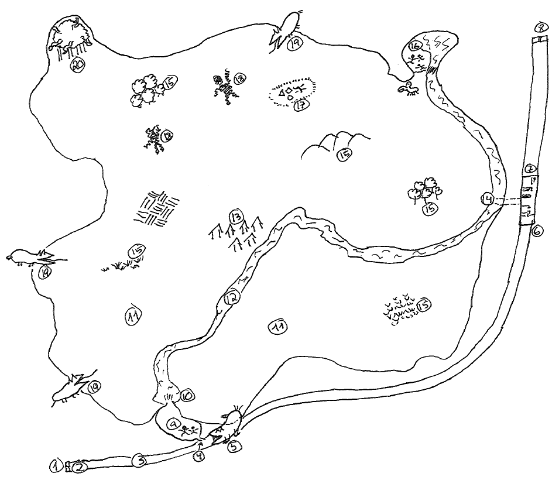
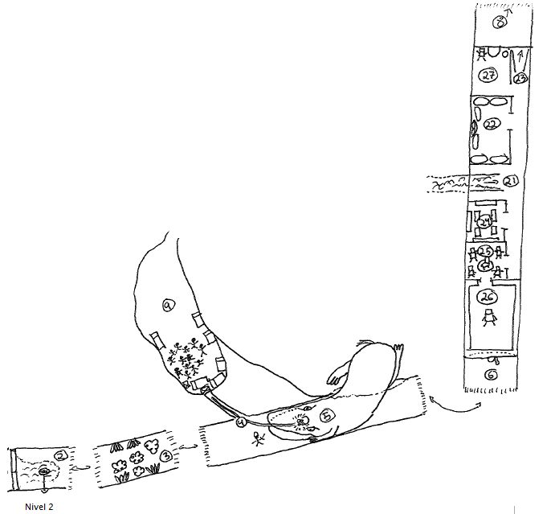

# Nivel 4: Aire Irisado, por Erekíbeon

## Mapas del nivel





## Conexiones con otros niveles

* Zona 1: conecta con la salida suroeste del [nivel 1](./nivel-01.md), entre la sala 4 y la sala 13.
* Zona 2: una alcantarilla conecta con la [sala 15 del nivel 2](./nivel-02.md).
* Zona 8: conecta con la [sección 1 del nivel 5](./nivel-05.md): el pozo.
* Zona 23: conecta con la [sala 1 del nivel 6](./nivel-06.md).

## Un poco de historia

Este nivel fue hasta hace poco una especie de campo de experimentación sociológica. Decidido a encontrar la verdadera naturaleza de los seres inteligentes, el Hechicero del nivel 7 decidió crear un ambiente aislado y autosuficiente, poblarlo con seres inteligentes y observar qué pasaba. Su teoría era que el mal y la crueldad eran consecuencia ,en un primer momento, de la lucha diaria para cubrir las necesidades básicas y, posteriormente, de la educación que las sociedades, progenitores y dioses imprimían en los seres. Pero ¿qué pasaría si se quitaran todos esos factores externos? ¿Seguiría habiendo buenos y malos, crueldad y nobleza?

Para ello acondicionó las cuevas de este nivel y las encantó con ilusiones, de tal forma que parecieran una campiña bucólica con sus bosques, sus praderas y su río (aunque éste es real). También aprovechó el Gran Pasaje que comunicaba el nivel 1 con el 5 para crear allí la zona de mantenimiento, llena de objetos encantados y sirvientes golems que proveerían todas las necesidades básicas de los sujetos del experimento. No faltarían la comida, la bebida, la ropa y el sitio donde resguardarse. El paraíso terrenal, vamos. 

Luego empezó a secuestrar a criminales y marginados de todas las razas inteligentes que encontró en el continente. Los traía al complejo y les borraba todos los recuerdos de sus vidas antes de soltarlos en su paraíso. Trajo especímenes masculinos y femeninos de enanos, elfos, humanos, gnomos, orcos, trasgos y grantrasgos.

Y sorprendentemente el experimento funcionó bastante bien, al menos al principio. Al no haber competencia por la comida ni el refugio, ni tener experiencia previa negativa sobre los demás, las relaciones eran amistosas y fluidas incluso entre individuos de distintas especies. Se fueron formando grupos simplemente por afinidad, y al no haber nada que envidiar ni que pudiera producir conflictos (ni siquiera había celos), la comunidad vivía en perfecta armonía. 

Así que la teoría era cierta, pero... ¿se podría prolongar este estado primordial? La cosa no era tan sencilla por un factor muy importante: el aburrimiento. Con nada que hacer para garantizar la subsistencia, los especímenes se aburrían. Descubrieron el sexo y se dedicaron a él con entusiasmo, pero al poco empezaron los embarazos y el problema de una súbita multiplicación de la población, que el Hechicero solucionó esterilizando mágicamente a todos los individuos. Pero también quiso ofrecerles otras distracciones, y les introdujo materiales para que desarrollaran por sí solos las artes o las competiciones deportivas. Y todo iba más o menos estable... hasta que llegó el Aire Irisado y sus horrores.

¿Qué pasó con los especímenes, gentes que no sabían lo que era la violencia o el miedo? ¿Qué pasó con las instalaciones del experimento, tanto la propia utopía como todo lo que la mantenía?

## El Aire Irisado

Se trata de la atmósfera del otro plano. Es un aire menos transparente que el normal, y cualquier movimiento rápido provoca una estela de colores irisados, como si se estuviera moviendo en una balsa de aceite. No impide el movimiento ni lo dificulta, pero desde luego hace que cualquier movimiento sea más evidente. En términos de juego, supone un +2 a la tirada de sorpresa y a la de esconderse de los halflings, así como un +10% a la tirada de esconderse de los ladrones, al menos las tres primeras ocasiones que se hagan estas tiradas. Después se supone que todos los personajes han aprendido a minimizar la estela que provocan y se pueden esconder y sorprender al enemigo con normalidad.

Esta atmósfera es la que permite que exista toda la extraña ecología que ha colonizado el nivel. La genera un gigantesco monstruo que vive en la zona 20, con lo que matarlo haría que se asfixiaran todos los demás bichos en cuestión de horas. 

Otra de las debilidades de esta fauna es el agua, que es como un ácido para todos ellos. Rociarlos con agua hace que se quemen como si estuvieran ardiendo. Salpicarlos les provoca 1d4, un chorro desde un odre 2d6, acertarles vertiendo un caldero les haría 3d12. Esta debilidad es común a todos los bichos extraños.

## Zona transitable del gran pasaje

1. **La gran puerta oxidada**

   El túnel, procedente del nivel 1, acaba en una inmensa puerta de metal de doble batiente. La superficie está marrón de orín y brillante de la humedad, y el suelo cercano a la puerta está cubierto por un charco de agua, no muy extenso, de menos de un dedo de profundidad.En el relieve de la puerta, bajo dos gigantescas argollas oxidadas que cuelgan de las narices de dos rostros barbudos, aún se pueden distinguir en Enano las palabras “El gran pasaje”. Las bocas de los rostros son ranuras por las que se pueden echar monedas.

   Hace muchísimo tiempo los enanos excavaron y construyeron este túnel para comunicar el nivel 1 con el 5, donde está la granja subterránea, y facilitar el trasiego de carretas para comerciar con el exterior... a cambio de una moneda de plata.. Sin embargo, varias pintadas en las paredes en goblin avisan: “Derrumbado, no entrar, bichos derriten.”

   La puerta pesa mucho pero no está atrancada. Se abrirán solas si alguien introduce una moneda de plata en la boca de un enano. También se puede utilizar la magia, aunque las hojas pueden abrirse hacia el nivel 1 tirando de las argollas... eso sí, superando una tirada de Fuerza superior a 35 para conseguir moverlas. Pueden tirar juntos hasta dos personajes.

   Al abrirse se revelará una fina cortinilla de agua que tendrán que atravesar si quieren pasar al otro lado. Pero tranquilos, que es agua normal y no cae tanta como para apagar las antorchas. 

2. **El umbral del Gran Pasaje**

   Tras la puerta se abre un pasillo de piedra muy ancho, por el que cabrían sin problemas cuatro carretas puestas lado a lado. El suelo está completamente mojado por la cortina de agua que se derrama sobre la puerta, la cual mana de una grieta en el techo de medio cañón del pasillo. Sin embargo, el agua no llega a hacer charco porque se vierte por una tapa de alcantarilla, que llevará a la [sala 15 del nivel 2](./nivel-02.md) si se abre.De este lado de la puerta, a la altura de donde estarían las bocas de los enanos, hay dos cajas donde se recogían las monedas que servían para abrir las puertas. Hoy día están reventadas y saqueadas, nada más que estarán las monedas que hayan introducido los propios aventureros.

   En cuanto los PJs se muevan notarán que aquí dejan una especie de estela de colores en el aire, como si estuvieran sumergidos en un aceite invisible. Cuanto más rápido el movimiento, más intensos los colores irisados de la estela que se formará. Esta estela es la señal de que acaban de entrar en la atmósfera que hace posible la existencia de las extrañas criaturas que han invadido este nivel. Es perfectamente respirable, pero es un poco más densa y contiene algunos gases mezclados que se hacen visibles cuando se alteran súbitamente. Sin embargo no resiste el contacto con humedad o con agua, con lo que cualquier nube o cortinilla de agua puede servir para que no se propague más allá.

   Estaría bien que el máster incida sobre esta estela que produce cualquier movimiento siempre que pueda, ya que es una característica de todo el nivel. Además, la estela hace muy difícil pasar desapercibido, a menos que los movimientos sean exageradamente lentos. Esto funciona en contra y a favor de los PJs, ya que también hará muy sencillo avistar cualquier movimiento a lo lejos... siempre que haya luz para ver los colores, claro.

3. **Las flores ácidas**

   Tras unos metros las paredes del pasaje dejan de estar acabadas pulcramente, al estilo enano, y empiezan a parecer que están derretidas de forma irregular. Un poco más adelante verán unas grandes flores, similares a nenúfares de color pastel, en ambas paredes, suelo y techo. En cuanto pasen cerca habrá una súbita explosión irisada procedente de las flores. ¡Se mueven todas en dirección a ellos, hinchándose y deshinchándose como medusas!

   Hay el doble de flores que de PJs.

   **Flor ácida**
   ```
   Estadísticas: las de una Avispa Gigante, con el ataque especial que vemos en la descripción.
   Descripción: A primera vista parecen flores, pero en realidad son unas criaturas bulbosas, con seis alas semejantes a pétalos que rodean un cuerpo alargado y palpitante. Aletean como si fueran medusas, y se desplazan por el aire como tales. La boca la tienen en la base, donde estaría el tallo en una flor normal, y se alimentan de la piedra y los metales férricos (pero no metales preciosos), disolviéndolos con ácido y sorbiendo los jugos. En este plano han probado la sangre y les ha gustado su sabor metálico, por lo que atacarán sin dudarlo a cualquier ser vivo. 
   Si impactan en un ataque, las flores se enganchan a su presa y comienzan a disolver la armadura, si existe. El daño del ataque se aplica sobre la armadura (añadiendo a la CA o reduciendo el bonificador, en función del sistema que se utilice), y luego sobre la carne. Una Flor enganchada pasa a tener CA 9 para golpearla. Sólo se desengancharán si mueren. 
   Como el resto de la fauna extraña, son vulnerables al agua, como vimos al principio.
   No tienen tesoro.
   ```

4. **El túnel chuperreteado**

   Hacia la izquierda, si se viene desde la zona 3, se abre de pronto una oquedad profunda, de forma irregular, también como si se hubiera producido derritiendo la roca. Parece un túnel que retrocediera ligeramente, suficientemente alto como para que quepa perfectamente un humano desplazándose a cuatro patas. Por el suelo discurre lo que parece una formación rocosa, del grosor de un cabo marinero, que viene de más adelante del Pasaje y se introduce en la oquedad.

   Pero lo que más llama la atención es que se puede escuchar claramente música y voces masculinas y femeninas cantando una canción que nadie reconocerá, sobre el rumor de una corriente de agua. El sonido parece que proviene de lo profundo del túnel...y si prestan atención (tirada de escuchar con éxito) escucharán también un leve sonido rasposo, como si algo blando rozara contra la piedra una y otra vez.

   La oquedad mide unos seis metros de longitud, y al final se distinguen unos pequeños agujeros en la roca derretida, que se ven perfectamente porque parece haber luz al otro lado. La música, las voces y el rumor del agua se escuchan más cercanos... y el sonido rasposo también. Desde la mitad del túnel podrán ver que en el extremo de la nervadura hay una pequeña nube irisada: hay movimiento. Si se acercan más, verán que el extremo de la nervadura rocosa se mueve como un gusano lento y gordo, empapando de líquido verdoso toda la pared final y raspándola incansablemente... 

   En realidad la nervadura rocosa no es tal, sino la larguísima lengua de saliva ácida del habitante de la zona 5. En su espera incansable detectó las vibraciones que producía la actividad de la zona 7 a través de la roca, y con su lengua ha ido lamiendo la pared en dirección a esas vibraciones, disolviendo la roca y haciendo un túnel suficientemente ancho como para poder sacar después cualquier presa que atrape. Los aventureros han llegado cuando queda ya muy poco para que consiga atravesar la pared del todo.

   Si la atacan, la lengua se revolverá e intentará atrapar a cualquier personaje que esté sobre ella. Empezará el combate contra la cosa de la zona 5.  

   Si se las apañan, podrían echar un vistazo por alguno de los agujeros, con cuidado. Lo que se ve es... ¿un tablón de madera? (Se trata del bastidor de una cama)

   La pared de roca es tan fina que es posible romperla con una maza o algún arma contundente. Bastará con provocar unos 20 puntos de daño para lograr abrir un hueco suficientemente ancho como para pasar a la zona 7.

   Lo malo es que el estruendo sobresaltará a los habitantes de la zona 7... y, si no lo ha hecho ya, provocará el ataque del habitante de la zona 5.

5. **Los zafiros refulgentes**

   El Pasaje sigue adelante y la nervadura rocosa procedente del túnel 4 también. Desde aquí se puede divisar un tenue brillo de color azul proveniente de más adelante, en mitad del suelo del pasadizo. Parecen cuatro zafiros que emiten luz sobre un pequeño altillo, y más allá el túnel parece acabarse en una hornacina que parece excavada en la roca pero para acercarse a las gemas hay que subirse a un tosco escalón curvo de forma bastante irregular...

   En cuanto alguien suba el escalón y se acerque a coger los zafiros, la nervadura de roca cobra vida en una explosión de colores oleaginosos por el aire irisado. Y no sólo eso, ¡el techo y el suelo comienzan a cerrarse sobre el atrevido!.

   Y es que el aventurero se ha metido en la boca abierta de un bicharraco gigantesco, tan grande que ocupa todo el ancho y alto del Pasaje. Los supuestos zafiros son unas glándulas luminiscentes que atraen a las presas. No tiene dientes, sino que toda la boca actúa como una muela, triturando lo que haya dentro... y lo que intenta escapar lo captura con su lengua prensil, que exuda ácido a voluntad, para volver a arrastrarlo dentro.

   **Lengua rocosa**
   ```
   Estadísticas: las mismas que una Pitón de las Rocas, más un ataque de ácido de 1d8 por asalto si impacta (ver la descripción)
   Descripción: la principal misión de la lengua es atrapar a alguien (lo cual consigue si impacta sobre un objetivo) y llevarlo a la boca del bicho mientras ya lo va predigiriendo, de ahí la constricción y el extra de ácido. Este daño de ácido se aplica primero al valor de armadura y la dejará inservible cuando su valor llegue al de un hombre sin armadura. Mientras tanto la víctima se ve arrastrada hacia la boca a la velocidad de movimiento... a menos que se consiga "matar" la lengua. 
   Si hay varios atacantes la lengua puede tratar de barrerlos, atacando a todos los que estén a su alcance como si fuera un látigo. Quienes sean impactados sufrirán el daño de barrido y deberán superar una Tirada de Salvación contra Aliento de Dragón para no ser derribados.
   ```

   **Hipodrilo de roca**
   ```
   Estadísticas: Las mismas de un Elefante. 
   Descripción: La criatura de esta zona, que recuerda vagamente a un hipopótamo pétreo con un morro muy largo, no puede avanzar hacia los aventureros porque está encajada en un hueco en el muro del Pasaje... y porque se le derritieron las patas en el río (ver zona 12), así que confía en su lengua para cazar a las presas y meterlas en su inmensa bocaza. Una víctima que haya cazado la lengua sufre el daño de Trituramiento automáticamente cuando se introduzca en la boca. Alguien que no esté preso por la lengua sólo sufrirá daño si el Hipodrilo consigue la tirada de éxito, de lo contrario habrá podido salir antes de que se cierre la boca. Es vulnerable al agua, como hemos visto al principio.
   Tesoro: Si realizan la hazaña de matarlo podrán hacerse con los zafiros. La sorpresa es que sí que son gemas de verdad, y encima seguirán emitiendo luz 3d6 semanas después de cortadas: valen tres veces lo que un zafiro normal en monedas de oro.
   ```

   Tras matar a la criatura, queda suficiente hueco entre ella y el suelo como para poder proseguir por el Pasaje, hacia la zona 6. También pueden seguir el cadáver y atravesar el muro por el gran agujero que hizo la inmensa bestia para meterse aquí. En ese caso resbalarán sobre la corta cola del monstruo y accederán directamente a los prados (zona 11).

6. **El primer teleportador**

   El Gran Pasaje termina abruptamente aquí, en esta ocasión en una pared de bloques de piedra sólida y excelentemente acabada. 

   Lo que primero llama la atención es que de la pared asoma la parte trasera de un cuerpo elfo, ricamente vestido:  la parte posterior de la cabeza, el tronco, la mano derecha y la bota izquierda. Como si se hubiera incrustado en la pared cuando caminaba hacia ella. Hay signos de golpes de pico alrededor del cadáver: alguien intentó sacarlo pero desistió. 

   Lo siguiente que resalta es un reborde de runas que enmarca todo el muro, por las paredes, el techo y el suelo. Un Mago o Elfo que saquen una tirada de Inteligencia ( o de alguna habilidad de conocimiento de magia relacionada) podrán dilucidar que se trata de un encantamiento bastante complicado y poderoso. Parte teleportador, parte hechizo de ilusión... y con posibilidad de ser apagado a voluntad desde otro lugar. 

   Pero de momento no hay ninguna salida por aquí. Los aventureros tendrán que volver a la zona 5, siguiendo de vuelta el Gran Pasaje, o podrán salir a los Prados de la zona 11. A menos que consigan volver a hacer funcionar el teleportador...

   Lo que pasó en realidad es que hace varias décadas el Hechicero decidió utilizar el Gran Pasaje para sus propios fines. Después de ampliar con magia la gran Caverna de la zona 11, tapió los dos lados del Pasaje e instaló este teleportador y el de la zona 7. Pero los encantó con una ilusión que hacía que los viajeros vieran que el Pasaje continuaba. De esta manera no notaban que estaban entrando y saliendo de un teleportador. Los viajeros antiguos sí se daban cuenta de que el viaje tardaba bastante menos que antes, pero nunca averiguaron el motivo.

   Sin embargo, dos años después de la invasión la nueva fauna consiguió penetrar la roca por la zona 27, y en la refriega se cayó de su sitio la llave del teleportador... justo cuando estaba atravesándolo un Elfo. La magia se disipó y la mitad de su cuerpo quedó atrapada en esta parte, mientras que la otra mitad quedó en la otra. Una muerte horripilante. 

7. **El segundo teleportador**

   Al igual que la zona 6, aquí el Gran Pasaje acaba en un gran muro bien labrado con un reborde de runas, en cuyo centro está incrustada la parte delantera del infortunado elfo que quedó atrapado en el teleportador cuando se apagó. También hay muescas en la roca, como si hubieran intentado sacarlo de la piedra a golpe de pico.

   Curiosamente la mano que se ve en este lado está cubriendo la boca. No tanto es un gesto de dolor, sino que parece más bien que el pobre elfo estaba bostezando cuando se interrumpió la magia del teleportador.

   Si se quedan en silencio suficiente tiempo, o si ponen la mano en la pared, sentirán y escucharán unos golpes lentos y rítmicos que provienen del otro lado del muro. Se trata del golem de la zona 27.

   No hay nada de valor. De hecho el cadáver ni siquiera tiene bota en el pie que se ve desde aquí.

   Aparentemente no hay otra salida de este callejón que la zona 8. 

8. **La gran puerta de hierro**

   La gemela idéntica de las puertas de la zona 1, pero en mejor estado de conservación porque no corre el agua sobre ellas. Eso sí, al igual que allí las cajas de recaudación de las bocas de los enanos hace tiempo que fueron saqueadas. Esta puerta sale del nivel y conduce a la [sección 1 del nivel 5](./nivel-05.md); el pozo.

## Zona del experimento

9. **El refugio de los Conformistas**

   **La sala**

   Se trata de una gran sala cavernosa, iluminada de forma desigual con dos puntos de luz brillante, además de por la luz ¿del sol? que se cuela desde detrás de la cascada que ocupa la entrada del norte. Apilados ordenadamente por las paredes de la caverna hay alguna que otra cama que ha visto mejores tiempos, pero sobre todo jergones hechos en el suelo con ropa. Las paredes están cubiertas de pinturas que parecen representar escenas al aire libre de distintas figuras humanoides.

   **Los habitantes**

   De lejos lo más interesante son los propios habitantes de la caverna, 21 individuos de todas las razas y de ambos sexos. Hay 2 humanos, 1 humana, 1 elfa, 2 enanos, 1 goblin, 3 goblins hembra, 1 kobold macho, 2 kobolds hembra, 1 gnoll macho, 2 orcos macho, 1 orco hembra y 3 bugbears macho. Los humanos, orcos, gnolls, bugbears y medianos parecen cincuentones, mientras los goblins y kobolds tienen pinta de ser viejunos. Los enanos y elfos siguen pareciendo jóvenes.

   Si los observan con cuidado, todos los habitantes están participando en una extraña danza ritual, salvando el gnoll y un bugbear, que están como de guardia en la entrada de la cascada sosteniendo dos palos largos. La cristalina voz de una Elfa se entreteje con las agudas notas de un flautín, tocado con extraordinaria habilidad por un Orco al ritmo de la percusión de un anciano kobold. Todos los demás bailan formando un círculo en el centro de la caverna, alrededor de un Enano que danza ágilmente y una goblin que le sigue a duras penas, entrelazando sus pasos con rapidez y agitando en círculos sus brazos. Con la estela irisada que dejan, el espectáculo de colores y formas es verdaderamente impresionante.  Pero al poco son sustituidos por un bugbear y una humana, que también bailan de la misma forma.

   **Hablando con ellos**

   Por supuesto, si los PJs han irrumpido con estrépito, dejarán la danza y la música y correrán a la parte más alejada, temerosos y muy sorprendidos. Incluso el gnoll y el bugbear de guardia están realmente asustados a pesar de enarbolar los palos en su dirección. 

   Si se tranquilizan, un humano maduro se adelantará y se dirigirá a ellos en un común ceceante, presentándose como Ojoz Azulez y preguntándoles por sus intenciones. 

   Si los aventureros han entrado por la zona 4, atravesando la pared, además les preguntará “¿por qué noz habéiz condenado abriendo eze agujero a laz beztiaz?” Los habitantes de la caverna segurían asustados, gimoteando y lamentándose constantemente: “Laz beztiaz vendrán y noz matarán también, ¿por qué?, oh, ¿por qué?” Pero no harán absolutamente nada para remediarlo. Algunos hasta se golpearán con la cabeza contra la pared de pura desesperación.

   Se tranquilizarán bastante si consiguen cubrir el agujero de una forma que parezca más o menos resistente. Apilando un par de camas o algo, por ejemplo. Pero aun así rogarán que hagan algo para taparlo definitivamente.

   Si se ganan su confianza, lo cual es realmente sencillo, les relatarán su historia:

   _“Hace tiempo vivíamoz todoz en la inmenza explanada que hay al otro lado de la cazcada, bajo la luz del zol, felicez y en armonía. Loz Doradoz noz proveían de todo lo que necezitábamoz, y dedicábamoz nueztraz vidaz a laz artez y loz placerez._

   _Zin embargo, hace varioz mezez apareció ezta eztela en el aire - hace un rápido gesto que deja la estela irisada - y con ella llegaron laz florez y laz beztiaz que queman y comen. Perdimoz a muchoz mientraz buzcábamoz un zitio zeguro... y por fin encontramoz ézte, detráz de la cazcada._

   _Pero dezde hace zemanaz loz Doradoz ya no vienen tanto como antez. A vecez pazan díaz zin venir, y cuando vienen no hay comida para todoz. Tenemoz hambre, pero zabemoz que moriríamoz ahí fuera._

   _Por zi fuera poco, hace unaz nochez dezaparecieron doz de nozotroz, Cabello de oro y Culo bonito. Encontramoz unaz huellaz mojadaz en la entrada, pero nada maz..._

   _Vozotroz habéiz zobrevivido a laz beztiaz. ¿Noz ayudaréiz?”_

   Por supuesto, no se lo están contando todo. En la zona 13 está el resto de “la verdad”.

   **Rasgos de los Conformistas**

   Todos, sin importar la raza, se muestran amistosos y muy curiosos, sobre todo con las armas, armaduras y vestimentas, que no han visto antes jamás. Pese a cecear en común, como Ojoz Azulez, utilizan palabras muy cultivadas y desconocen los tacos. “Albriciaz” o “cázpita” son lo más soez para ellos. Al igual que Ojoz Azulez, todos hablan el común ceceando. No saben que son de razas distintas, así que no saben que son “humanos” “orcos” o “gnolls”, y sus nombres hacen referencia a alguna característica física que les distinga de los demás. Morro Ancho (una orca), Pequeño Rojizo (un kobold), Pelo Amarillo (una elfa), Oreja Mellada (el gnoll), cosas así. El Máster debería enfatizar lo extraño que es ver un orco, un elfo y un humano departiendo tan amigablemente.

   Eso sí, un personaje con una Sabiduría muy alta descubrirá que tienen una sombra en la mirada. Casi como si se sintieran culpables por algo... (ver más adelante)

   No disponen de armas de ningún tipo, y la ropa que llevan no pasa de ser túnicas.

   Si se les pregunta pueden describir físicamente las Flores y los Langoescorpiones, pero no han visto ningún otro tipo de criatura. No tienen nombres para ellos, son colectivamente “laz beztiaz”. Ninguno sabe cómo acabaron llegando a estas cuevas en primer lugar. Si se les pregunta, todos creen que siempre han estado aquí...

   **La llegada de los Dorados**

   En cuanto el DM considere que ha pasado suficiente tiempo, entran por la cascada dos figuras metálicas y de color dorado, de 1,50 de altura, bellamente esculpidas como seres antropomorfos de raza indefinida. No hablan ni se comunican con nadie. Portan un cofre hermético enorme (similar al Arca de la Alianza de Indiana Jones), que colocarán en el centro de la sala, después de lo cual volverán junto a la cascada y esperarán. El cofre contiene 5 bandejas tapadas con comida recién hecha y humeante: carnes asadas, pescados, verduras... en general platos no muy elaborados pero sabrosos, suficientes para hacer una comida normal de 5 personas.

   Los habitantes cuchichean entre sí, quejándose de que tendrán que repartirse la comida y quedará muy poco para cada uno, insuficiente para calmar el hambre. Hay miradas de suspicacia hacia los PJs, por si ellos también quieren una parte, mientras se reparten pacíficamente las escasas raciones. Si los aventureros comparten su comida serán festejados por todo lo alto. 

   Las figuras doradas permanecen totalmente quietas durante la triste comida. Si se las examina de cerca, puede verse que están chapadas en oro, pero presentan varios arañazos a la altura de los antebrazos revelan que en realidad están hechas en piedra. Soportan sin inmutarse que les toquen o examinen de cerca, y tampoco se defienden si se les ataca. Pero en este último caso todos los habitantes se pondrán en pie y les preguntarán a los agresores "¿Por qué atacáiz a loz doradoz?"

   En el momento en que se vacíe de comida la última de las cinco bandejas, las figuras se vuelven a animar: Recogen las bandejas, las introducen de nuevo en el cofre y cargan con él por donde han venido, en dirección a la zona 15.

   Ojoz Azulez volverá a suplicar la ayuda de los PJs.

   **Tesoros**

   En realidad no tienen nada de valor. Ni oro, ni joyas ni vestimentas costosas. Pero la caverna está llena de pinturas (32) y pequeñas estatuas hechas de piedra (15) y barro (45) que tienen un estilo que no existe en ninguna otra parte. Sin influencias externas y con todo el tiempo dedicado al arte, han alcanzado un nivel de plasticidad y representatividad que volvería locos a los entendidos en tierras civilizadas. Cada pintura se vendería por 15 mo, las de piedra a 25 y las de barro a 10.

10. **El exterior de la cascada**

    Si vienen de la zona 9, en cuanto atraviesen la cascada no podrán creer lo que están viendo. Una inmensa extensión, con prados y árboles y ¡un sol en el cielo azul! ¿No estaban bajo tierra?

    De la cascada nace un río bastante ancho, pero no muy profundo, que va hacia el noreste... y a lo lejos se ven por allí y por allá estelas de color. Parece que hay mucho movimiento tanto en la tierra como en el cielo. 

    En cuanto salgan, llamarán la atención de 1d6 Flores Ácidas.

11. **Los prados**

    Cuando los aventureros entren en esta zona apenas les costará creer lo que ven. A todas luces parece que han salido al aire libre, a algún valle de paredes abruptas. El suelo está alfombrado de hierba verde y trufado aquí y allá con árboles y rocas, como en el exterior... salvo por el aire quieto y el ocasional brillo irisado de algún movimiento repentino por aquí y por allá. 

    En realidad siguen bajo tierra, en una inmensa caverna que está bajo un encantamiento permanente de ilusión, una obra maestra del arte arcano. Basándose en el principio de que "las mejores mentiras son las que contienen algo de verdad", la ilusión comienza a unos 3 metros de altura, como si toda la caverna fuera un valle al aire libre del que no se pudiera escapar, ya que las paredes de la cueva parecen laderas cortadas a pico. Por encima de los tres metros está el azul del cielo y un sol que realmente parece que calienta y se mueve por el cielo. Por si fuera poco, incluso la luz cambia entre iluminación de primavera y de verano cada tres meses.

    Por todas partes verán que la singular ecología ha invadido el nivel...y si no van con cuidado la experimentarán mucho más de cerca. Cada turno (10 minutos) que pasen en esta zona hay que hacer una tirada en la Tabla de Encuentros:

    **Tabla de encuentros (1d20)**
    ```
    0 - 2: No hay encuentro.
    3 - 4: Tirar dos veces en la tabla: Los aventureros están a punto de ser emboscados, pero entonces vienen otras criaturas y se zampan a las primeras. Los primeros bichos que salgan son comidos por los segundos delante del grupo. Sí, puede salir el mismo tipo de bestia las dos veces...
    5 – 8: Hay una bandada de 1d10 flores ácidas posadas justo en el camino del grupo. Las mismas estadísticas y descripciones que vimos en la zona 3.
    9 – 12: Entre la hierba asoman lo que parecen unas rocas de regular tamaño. En realidad son 1d6 erizos rodantes que esperan una presa para lanzarse sobre ella.
    13 – 14: 1d3 langoscorpiones están tanteando los matojos, delatándose desde lejos por la intensa estela irisada que dejan sus movimientos (vamos, que no sorprenden). Si perciben a los aventureros irán a por ellos. Saben más ricos que el resto de la fauna de por aquí.
    15 – 16: 1d4 discos translúcidos sobrevuelan la zona, moviéndose lentamente y permaneciendo semiocultos gracias a su transparencia. Tratarán de acechar sigilosamente a los aventureros. 
    17- 18: 1d6 gusanos miméticos. Como se verá en la zona 18, lo primero que harán es intentar comunicarse. 
    19: Encuentro con 1d3 Curiosos (ver más detalles en la zona 13) Van desde su campamento hacia la zona del Encuentro (zona 17). Se mueven tan lentamente que no provocan estela irisada en el aire, con lo que es más probable que sorprendan a los aventureros que al revés. 
    20:Una comitiva de 8 golems dorados avanza despreocupadamente, acarreando 4 cofres con comida y dejando una gran estela que se ve  bastante lejos. La nueva fauna, curiosamente, les deja en paz. 
    ```

    **Erizo Rodante**
    ```
    Estadísticas: las de un escarabajo tigre
    Descripción: exteriormente parecen piedras redondas, pero en cuanto detectan una presa ruedan hacia ella y saltan, abriendo una inmensa boca con dientes que despliega una lengua en forma de red. Normalmente cazan discos flotantes y flores ácidas, y son la presa natural de los langoescorpiones
    ```

    **Largoescorpión**
    ```
    Estadísticas: las de un escorpión gigante. 
    Descripción: Son como un cruce de langosta y escorpión, con pinzas diseñadas para trocear erizos rodantes, pero podrían partir en dos a un humano sin problemas. No tienen tesoro, pero también son vulnerables al agua.
    ```

    **Disco translúcido**
    ```
    Estadísticas: las de un cangrejo gigante. 
    Descripción: Son unas criaturas casi totalmente transparentes, con un cuerpo en forma de disco chato, que flotan a unos cuatro metros del suelo y se desplazan muy lentamente en el aire pesado aleteando imperceptiblemente unas vellosidades que tienen en la circunferencia, con lo que no provocan el revuelo irisado habitual. La combinación de ambos factores hace que sorprendan muy fácilmente (con 1-5 en 1d6), a menos que alguien esté mirando directamente arriba o los esté buscando activamente. 
    Para alimentarse simplemente sacan dos tubos translúcidos de hasta 6 metros de longitud, expulsan su ácido a presión (hasta unos 2 metros de alcance) y luego succionan el caldo resultante. Normalmente chupan la roca, pero al igual que las flores ácidas han descubierto el buen sabor de la sangre y también intentarán alimentarse de aventureros incautos, escupiendo su ácido sobre ellos desde arriba. Tienen la desventaja de que no se mueven con rapidez, con lo que son un blanco estático. 
    ```

    Dependiendo de dónde tenga lugar el encuentro, la comitiva irá hacia el campamento de los Curiosos (zona 16)  o a la cueva de los Conformistas (zona 9). En el primer caso no pasará gran cosa, pero en el segundo caso saldrán seis Curiosos de entre los matojos, se suben a tres de los cofres, los abren y desparraman la comida que contienen por todo el campo. Los golems no se defienden, sólo recogen la comida sucia para llevársela de nuevo a la zona de mantenimiento. Los dos golems que quedan con el cofre corren hacia la cascada, y antes de que los Curiosos puedan hacer alcanzarles les atacan tres langoscorpiones, atraídos por el jaleo. Los Curiosos empezarán a lanzarles agua con sus odres, y los langoescorpiones acabarán largándose. Todo esto si los aventureros se limitan a mirar, claro... 

    La Tabla de Encuentros asume que los aventureros van por ahí a la velocidad normal, lo que hace que dejen una estela de color bastante amplia. Una estela que las criaturas están adaptadas para atacar, porque suele ser comida. 

    Si toman alguna precaución y reducen la velocidad a la mitad, la tirada en la tabla se hace con un -2. Si se desplazan de puntillas y muy lentamente, la tirada se hace con un -4. Pero si corren entonces hay que añadir +4 al resultado.

12. **El río**

    Curiosamente, en los alrededores del río no merodean los nuevos animales. Hay restos de cuerpos de Langoescorpiones o de Flores, pero todos como si hubieran sido derretidos...

    Es una pista sobre el efecto del agua en la nueva fauna. Lo mismo le pasó al hipodrilo de la zona 5, pero al ser una criatura tan masiva consiguió cruzar arrastrándose sobre sus muñones y desintegrar la pared del túnel.

13. **Las antiguas viviendas de la comunidad**

    Unas sencillas casas de adobe de una sola habitación. En el pasado era aquí donde vivía toda la comunidad. Cuando llegaron las bestias mataron a un montón de individuos y se los comieron, y algunas siguen esperando aquí a que vengan más presas. 

    Antes de que los aventureros entren en una casa hay que hacer una tirada en la Tabla de Encuentros de la Zona 11. Si sale 20, tirar de nuevo (no hay golems dorados). Apoyados contra una de las casas alguien ha puesto unos palos como si fuera un tendedero. Sobre estos palos hay varias pieles de conejos, ciervos y cabras en distintos grados de secado. Se trata del secadero de pieles de los Curiosos (ver zona 16), ya que su campamento está al lado del río y no se secan con la humedad. 

14. **La entrada de los Dorados**

    Esta es la zona del río donde los Dorados entran y salen del río. Se meten en el curso de agua y siguen su lecho, hundiéndose progresivamente hasta que desaparecen de la vista. El truco está en que más adelante hay una entrada bajo el agua, por donde los golems acceden a la zona 21, dentro de la zona de mantenimiento 

    Esta es la razón por la que los golems están recubiertos de oro: para evitar que se oxiden, teniendo que pasar por el agua tres veces al día. Y esta característica también les ha protegido de la nueva fauna, capaz de disolver roca y metales férricos, pero no joyas o materiales preciosos.

    El pasillo subacuático se extiende varias decenas de metros, suficientes para que sea imposible recorrerlo a pulmón, y así disuadir a los sujetos del experimento para que los sigan. Pero podría hacerse con magia o con los odres que los Curiosos utilizan para llevar agua... o cualquier otro recurso que los aventureros se saquen de la manga.

15. **Teleportadores de pequeños hervíboros**

    En estas zonas el Hechicero ubicó las llegadas de unos teleportadores que esparció por todo el área circundante a la Montaña Solitaria. Su objetivo era traer cualquier pequeño hervíboro (conejos, cabras, ardillas, asnos, pájaros de cualquier clase) para dotar de una pequeña fauna inocua a la zona de experimentación. 

    Los teleportadores siguen funcionando, pero alrededor de cada uno hay ahora docenas de bocas acechantes (tirar en la Tabla de Encuentros y utilizar el primer monstruo que salga), listas para devorar al siguiente animalillo en cuanto aparezca. Lo cual ocurrirá en cuanto haya algún aventurero cerca.

16. **El campamento de los Curiosos**

    Cerca de la última cascada del río está el campamento de los habitantes que fueron expulsados del refugio de los Conformistas de la Zona 9. Las gotitas de agua que salpican la zona queman a las nuevas bestias, y los Curiosos lo saben y lo aprovechan. Por eso han elegido este lugar para establecerse.

    **Los alrededores**

    Fuera de la zona de humedad habrá dos Langoescorpiones rondando, buscando Erizos rodantes o Flores ácidas para alimentarse. Los Curiosos consiguieron domesticarlos a base de echarles agua cuando intentaban ir a comérselos, y ahora dejan en paz a cualquier cosa de dos patas. Pero sirven para mantener otras bestias a raya.

    Subido a una hendedura en la roca, a unos cuatro metros de altura, hay a todas horas un vigía con numerosos pellejos de agua, atento a lo que haya en la zona, incluyendo las posibles amenazas voladoras. Avisará con un "Eeehhh, viene gente" sin disimular a los que están más abajo.

    **El campamento**

    La zona central del asentamiento está al lado del río y está compuesto por unos siete lechos al lado del río, cubiertos con pieles crudas como las que encontraron secándose en la zona 13.

    Por los alrededores hay siempre diez personas, menos los que se hayan encontrado en la Tabla de Encuentros. Todas están ocupadas haciendo cosas con pieles: Unos están raspando los interiores con piedras, otros más allá están desollando una cabra, otros están uniendo dos pieles utilizando agujas de hueso y tripas, aquellos están terminando de rematar un odre... la actividad es constante.

    **Los habitantes**

    En total son 2 humanas cincuentonas (una de ellas es Cabello de oro), 2 elfos (uno de ellos es Culo Bonito), 1 elfa, 1 Bugbear hembra madurita, 2 viejos kobolds macho, 2 orcos hembra  de mediana edad y 1 venerable goblin macho. La Bugbear, Morro Moteado (por las pintitas negras sobre el morro), es quien hace de portavoz frente a los aventureros. 

    Todos llevan palos de distintos tamaños y cada uno lleva al menos tres odres de agua.  

    Al igual que a los Conformistas, les impresionará muchísimo ver gente nueva con armaduras, vestiduras y armas que no han visto jamás. De hecho comparten casi todos los rasgos de los Conformistas (hablar ceceante, curiosidad, vestiduras, etc) salvo que todos llevan los odres de agua siempre encima y que tienen la mirada mucho más limpia. Al fin y al cabo no tienen nada de lo que avergonzarse.

    Si son atacados se defenderán, pero si se ven muy superados huirán, en principio a las antiguas viviendas de la zona 13.

    **Hablando con ellos**

    Si vienen por encargo de Los Conformistas y preguntan por Culo Bonito y Cabello de oro, el elfo y una de las humanas se pondrán en pie y se acercarán a ellos. No parece que estén aquí contra su voluntad, todo lo contrario. 

    Morro Moteado se presentará como la “voz de todos” y estará deseosa de contarles a los aventureros toda la historia, desde su punto de vista. 

    _“La nochze que llegaron loz nuevoz animalez muchoz murieron antez de que llegaramoz a la cazcada. Todoz temíamoz que loz Doradoz no zupieran encontrarnoz, pero lo hicieron y noz trajeron la comida a la cueva. Allí noz quedamoz._

    _Unoz cuantoz zalíamoz de la cazcada todoz loz díaz para zaber máz zobre loz nuevoz animalez, para ver cómo podríamoz vivir con elloz o protegernoz de elloz. Pero Ojoz Azulez y loz demáz zeguían muy azuztadoz. Querían quedarze en la cueva para ziempre, y penzaban que íbamoz a atraer laz beztiaz a la cueva y que noz matarían a todo. También ez verdaz que ziempre perdíamoz a alguien en laz zalidaz. Aún azí..._

    _Aún azí lo que hicieron fue imperdonable. Ezperaron a que noz durmiéramoz y entoncez noz zacaron de la cazcada. No noz dejaban entrar, noz empujaban fuera... con el alboroto, al poco vinieron unoz Dizcoz y unaz Florez y empezaron a derretirnoz. Perdimoz a muchoz antez de que noz diéramoz cuenta de que no noz atacaban en el agua. Zeguimoz por el río abajo hazta que encontramoz ezte lugar y noz eztablecimoz aquí. Y loz Doradoz ziguen viniendo a nozotroz con comida..._

    _Dezde entoncez hemoz aprendido mucho zobre loz nuevoz animalez. Dezcubrimoz que ven laz eztelaz, que el agua lez hace daño. Cazamoz loz animalez normalez para quitarlez la piel y hacer bolzaz para llevar agua, que ziempre llevamoz con nozotroz. Hemoz domezticado doz beztiaz para que no ataquen gente, ahí fuera. Hemoz conocido a la gente guzano. Ya no tenemoz miedo._

    _Y ahora ya podemoz encargarnoz de loz de la cueva..._

    _Eztamoz quitándolez la comida que le llevan loz Doradoz, para que cuando tengan hambre zalgan y comprendan lo que nozotroz zufrimoz aquella nochze. Pero ziempre ze noz ezcapa alguno de loz cofrez. Ahora Nariz Grande (un elfo) tiene a zu Cabello de Oro y Orejaz Amarillaz (el anciano goblin macho) a zu Culo Bonito... azí que ya eztamoz liztoz para hacer todo lo pozible para que no ze noz ezcape ningún cofre._

    _¿Noz ayudaréiz? Zi lo hacéiz, oz enzeñaremoz a zobrevivir a laz criaturaz..."_

    Los Curiosos están cegados con la venganza que no tienen pensado nada más alla. No saben qué harían con los supervivientes, o qué pasaría si los Conformistas les pidieran perdón...

    **Consejos de los Curiosos sobre el entorno**

    Si cumplen su parte del trato o son obligados a ello, los Curiosos les darán las siguiente sindicaciones:

    * Siempre llevar un odre de agua, y emplearlo para salpicar a cualquier cosa que se acerque.
    * Tratar de no levantar la estela Irisada, atrae a todas las bestias.
    * Cada poco mirar hacia arriba, hay seres casi invisibles que te atacan desde allí. Afortunadamente no son muy rápidos.
    * Alejarse de las gemas brillantes azules, son bocas de monstruos. También tener cuidado por los alrededores, sus lenguas son prensiles.
    * Hay una gran criatura extraña en la zona del norte, con muchas patas y un corpachón inmenso, como si fuera un árbol con muchos troncos. Es la que produce el aire irisado por unos agujeros de su cuerpo.
    * Hay unos gusanos que son gente también. Vienen de un agujero en el techo, justo al lado de la gran criatura árbol, y tratan de imitar y comunicarse para aprender cosas nuevas. Nunca han hecho daño. 

    Aparte de todo esto, saben lo mismo que los Conformistas sobre su historia. Es decir, nada: tampoco podrán explicar desde cuándo están en este lugar ni quiénes son los Dorados. 

    Tesoro: aparte de las pieles, poca cosa hay. Los consejos son el principal tesoro del que disponen. 

17. **La zona de encuentro**

    En esta zona la hierba desaparece y da lugar a un gran claro de tierra suelta. En cuanto se acerquen se puede apreciar que la misma está llena de dibujos. 

    En este momento hay trazos representando a humanos, elfos, enanos y trasgos, y un dibujo bastante siniestro representando una especie de arbol gigantesco con doce troncos y debajo una representación más burda de humanoides, muy pequeños en comparación. Es la primera referencia que encontrarán al Árbol Zancudo.

    Este lugar sirve como lugar de encuentro para los gusanos miméticos y los Curiosos, entendiéndose a través de dibujos. 

18. **Avanzadilla de los gusanos**

    En este lugar, antes de llegar a donde está el Árbol Zancudo, los Gusanos Miméticos mantienen una pequeña avanzadilla. 

    Si detectan a los aventureros, 1d6 Gusanos reptarán hacia ellos formando un revuelo aceitoso. En cuanto estén a su lado se enroscarán unos con otros para formar con sus cuerpos un amasijo palpitante de forma vagamente humanoide, extenderán una especie de brazo y sacarán cinco protuberancias: una mano abierta en señal de saludo. Y esperarán a que los PJs hagan lo mismo.

    Los Gusanos son la única especie inteligente en el plano del que proviene toda esta fauna extraña. Al encontrar otros seres inteligentes en este plano se sienten completamente fascinados y entusiasmados, y tratan de aprender todo lo que puedan para comunicarse. Como han establecido contacto amistoso con los Curiosos piensan que todos los seres de dos patas son así, y por eso intentarán comunicarse con los aventureros.

    Contarán como sorprendidos si se les ataca. Sus estadísticas, las de los gusanos carroñeros, con el tema de la vulnerabilidad al agua y ácido en lugar de parálisis.

    Si intentan comunicarse, cogerán una ramita y se pondrán a dibujar en el suelo terroso. El Máster debería intentar comunicarse con los jugadores sólo a base de dibujos, en plan Pictionary, y obligar a los jugadores a hacer lo mismo cuando intenten comunicarse con los gusanos, ya que no entienden el idioma. Pero son bastante listos, así que entenderán lo que quieren decir los aventureros bastante rápido, independientemente de los monigotes que sean capaces de dibujar los jugadores.

    Las preguntas de los gusanos son difíciles de expresar en dibujos... pero así el máster conseguirá reflejar lo difícil que es la comunicación y los vericuetos de unas mentes alienígenas.

    Lo que quieren decir los gusanos:

    * ¿Qué es eso que lleváis encima? (Se refieren a las armaduras y las armas) ¿Para qué sirven?
    * ¿Podemos tocarlas y ponérnoslas?
    * ¿Dónde están los otros? (preguntan por los Curiosos)
    * ¿Qué estáis buscando por esta zona del valle?
    * ¿Venís de una zona sin agua?
    * ¿Podéis enseñarnos por dónde habéis venido?

    Recuerda, máster, nada de hablar :-P Hazlo lo mejor que puedas, pero recuerda que no es imprescindible para la aventura el que te entiendan. 

    No se opondrán a que vayan a la zona 20 y de hecho les seguirán con curiosidad. A menos que les hayan atacado, en cuyo caso sí intentarán detenerles.

19. **Guarida de Hipodrilos de roca**

    En la pared de esta zona refulgen seis montoncitos de zafiros azules, y el suelo está plagado de nervaduras rocosas que resultan difíciles de ver entre la hierba. 

    Seis hipodrilos de roca se han establecido aquí, abriendo sus bocazas y estirando sus lenguas para atrapar cualquier cosa que camine por aquí. Pueden detectarlas superando una tirada de Detectar Trampas, con un +3 si ya han pasado por la zona 5. 

20. **El Árbol Zancudo**

    Este punto de la caverna está envuelto en una nube multicolor, producto de la cantidad de movimiento que hay en esta zona. Tal revuelo de colores oculta lo que hay aquí desde una distancia de unos 20 metros.

    Si se llega a una distancia más cercana, se verá que hay 1d10 Flores Ácidas y 1d8 Discos Translúcidos flotando y nadando alrededor de doce inmensos troncos, muy distintos a los de cualquier árbol que hayan visto en su vida. Es más, uno de los troncos se alza lentamente y baja un poco más allá.

    Los troncos sostienen un inmenso corpachón lleno de agujeros por los que parece salir y entrar un gas. De él cuelgan unos tentáculos espinosos que, de vez en cuando, atrapan al vuelo alguno de los seres (en este caso un Langoescorpión) que van cayendo desde un agujero en la ilusión del cielo de la cueva. Y entre las dos patas más lejanas se puede ver una pila de piedrecitas brillantes de unos tres metros de altura.

    Este inmenso ser es el que produce la atmósfera que hace posible que exista aquí toda esta extraña fauna. Hace tiempo cayó por el agujero del techo, un portal dimensional que se abrió desde el nivel H. Desde entonces ha ido creciendo hasta su actual tamaño, y quién sabe qué dimensión puede adquirir si se le deja crecer más. 

    ```
    Estadísticas: Las de una Hidra de 12 cabezas. En lugar de mordiscos el daño es de constricción.
    Ah, y hay que recordar que el agua también le afecta como si fuera ácido.
    Tesoro: las piedrecitas brillantes son pepitas de un metal desconocido: aluminio. hay unas 20.000, y cada una valdría en torno a 1 m.o.
    ```

    Si consiguen derrotar al Árbol, los seres que revolotean a su alrededor caen al suelo y comienzan a asfixiarse. En el plazo de una hora toda la fauna extraña del nivel morirá, y los Gusanos Miméticos intentarán volver al agujero y a su plano antes de que se les acabe el aire.

    A menos que cierren el agujero del techo, periódicamente seguirán cayendo bichos por él, que morirán en pocos asaltos asfixiados. En ocho días volverá a caer un retoño de un Árbol y crecerá de nuevo, con lo que todo volverá a empezar.  

## La zona de mantenimiento

Toda esta zona está contenida en el Gran Pasaje, en el hueco entre los dos teleportadores. El estilo vuelve a ser Enano, con el suelo adoquinado y las paredes principales talladas en la roca. 

El mago aprovechó el pasaje para construir las estancias que dan soporte al experimento, y sirven de “base” para los Dorados. La entrada acuática, originalmente pensada para evitar que vinieran aquí los sujetos del experimento, resulta letal para la nueva fauna e impide la filtración del Aire Irisado, por lo que de momento todo está tal y como lo dejó el Hechicero. Y además, los movimientos ya no dejan estelas irisadas en el aire. 

Los “habitantes” de esta zona son golems de dos tipos: 

* Los Dorados no son otra cosa que Golems de Carga (descritos en el nivel 5) hechos para entrar en la zona del experimento. Se les cinceló con apariencia humanoide, para resultar más amigables a los sujetos, y (como hemos visto en la zona 14) se les recubrió de una fina lámina de oro para evitar la oxidación y el deterioro de sumergirse tres veces al día en el agua del riachuelo.
* También hay aquí Golems de Mantenimiento y de Archivo como los del nivel 6, dedicados a hacer pequeñas reparaciones y documentar el experimento sin supervisión. Siguen provocando las migrañas ante los seres inteligentes y conservan la posibilidad de comunicación por vía telepática.  

El complejo está iluminado también por los huesos de luz azulados descritos en el nivel 6, y no hay ni una sola puerta. Los golems no necesitan intimidad, después de todo... 

21. **La entrada subacuática**

    El pasillo subacuático descrito en la zona 15 asciende en rampa hasta que sale del agua en esta habitación, en lo que parece una piscina. No hay mucho más, es una simple zona de paso.

22. **La fuente de comida**

    Esta gran habitación con puertas dobles tiene seis grandes banastas rectangulares pegadas a las paredes. Cada banasta es tan grande como un ataúd, con asas a ambos lados, y están vacías. Parecen hechas de mimbre, aunque tienen unos adornos de plata engarzados con motivos de frutas, pollos asados, tenedores y demás motivos relacionados con la comida.

    Además, en una de las paredes hay una pintada de la cara de un muñecote-palo: Un círculo grande por cabeza, dos puntos como ojos y una femenina boca sonriente. Sin embargo, la boca está dibujada de forma muy realista, simulando incluso el volumen de los labios.

    Cada cesta es en realidad una [Cornucopia](http://www.enworld.org/forum/showthread.php?156986-In-the-spirit-of-thanksgiving-The-Cornucopia), un objeto mágico que crea comida y bebida para 10 personas cada vez que se pronuncia la palabra de mando. La comida es sencilla, muy nutritiva y bastante sabrosa. Nunca se produce el mismo tipo exacto de comida: hay asados, guisos, fruta, postres como arroz con leche o natillas... pero siempre está muy buena. La comida dura unas 48 horas antes de que se estropee. 

    La detallada boca del muñegote es en realidad una Boca Mágica hecha Permanente. Su única función es gritar cada ocho horas con voz femenina una sola letra: “A“. Es la palabra de mando de las Cornucopias, con lo que cada vez que se pronuncia la comida aparece en las cestas. Inmediatamente después aparecen los golems dorados con los cofres herméticos, los llenan con la comida de las cestas y abandonan la sala para dirigirse a los enclaves de los supervivientes. No vuelven aquí hasta que no pasen otras ocho horas.

    El Hechicero pensó que las Cornucopias iban a estar en un complejo donde sólo habría golems sin voz y por eso no se complicó la vida cuando decidió la palabra de mando. Pero... ¿qué pasará si alguien se pone a hablar al lado de las cestas? Pues que el máster tendrá que contar cuántas “aes” se pronuncian en la habitación. Con la segunda “a” las tapas de las cestas se abren, la tercera “a” hace que las raciones se desparramen por el suelo. Con 6 “aes” la comida llega por las rodillas de un humano normal, con 9 por el pecho y con 12 se llena la habitación y empieza a derramarse por los pasillos

    **Ejemplo:**

    “¿Qué hay aquí?” (las tapas de las cestas se abren, repletas)

    “No sé, parecen cestas llenas de comida (la comida se desparrama y llega hasta las rodillas) ... espera, ¿qué está pasando? (los aventureros sólo asoman la cabeza entre los pollos asados, y tienen la ropa mojada con de cocido y flan) ¡Salid de aquí, rápido! (tienen que empezar a nadar entre la comida)

    Más allá de 14 “aes” la comida se sale por los pasillos y empiezan a venir golems para llevarse la comida hacia la sala de limpieza (el cubo gelatinoso) del nivel 5. Si los aventureros siguen hablando, los golems tratarán de hacerles callar tapándoles la boca, y si ni aun así se callan tratarán todos de realizar en enlace telepático para comunicarse con los aventureros y explicarles el motivo. 

    Los golems no permitirán que se lleven las cestas.

23. **Hacia el nivel 6**

    Una rampa lleva desde este nivel a la [sala 1 del nivel 6](./nivel-06.md). Por aquí circulan los golems que necesitan reparación o recarga. 

24. **La habitación de recepción**

    La habitación contiene cuatro mesas con correas de cuero en tres de los lados, como si fueran sujecciones para las extremidades. También hay tres grandes armarios contra las paredes. Las camas no presentan signos de violencia ni de sangre.

    Ninguno de los armarios está cerrado. El primero contiene estanterías con una colección de figuritas de cristal, moldeadas para representar humanos, elfos, enanos, trasgos, orcos, etc. La cuarta parte de las figuritas contiene una neblina luminosa que fluctúa y que muestra imágenes si se mira de cerca. Los otros dos armarios están llenos de armas, armaduras y objetos que tienen pinta de mágicos. 

    Aquí es donde el mago traía a los especímenes después de secuestrarlos. Normalmente dormía al sujeto que quería, luego lo teleportaba a esta habitación y lo ataba a una de las mesas mientras estaba inconsciente. Después le extraía los recuerdos, transfiriéndolos a una de las figurillas de cristal, y cuando terminaba el proceso lo teleportaba hasta la zona de experimentación.

    Las figuras con niebla luminosa contienen los recuerdos de los especímenes que aún siguen vivos, y están modeladas para parecérseles. Si se acercan a mirar de cerca, se pueden ver en la niebla imágenes desvaídas de recuerdos: días de fiesta, jornadas de duro trabajo en el campo, un primer beso, amaneceres... y si pasan un cierto tiempo acabarán viendo uno o varios crímenes de sangre. Un asesinato, una violación con muerte, varios asesinatos simultáneos, etc etc. 

    Y es que todos los especímenes que el Hechicero se traía eran los peores criminales violentos de cada especie...

    Si en algún momento se rompe una de las figurillas, todos los recuerdos vuelven a la mente original. Los sujetos que recuperen sus recuerdos recuperarán también sus conocimientos y sus actitudes originales, pero lo que ocurra a partir de entonces se deja en manos del Máster.  Tal vez prefiera que el sujeto “despertado” mate a sangre fría a gran parte de sus compañeros, o tal vez disimule para intentar pillar por sorpresa a los aventureros, o quizás se limite a intentar escapar del experimento para no volver... lo que le venga mejor en función del drama que quiera desarrollar o de cómo vea a sus jugadores.

    Tesoro:

    * Las estatuillas de cristal están muy bien talladas. Las “vacías” podrían alcanzar las 15 m.o., las “con niebla” se podrían vender por 200 m.o. 

    Los otros armarios contienen el equipo más importante que portaban los sujetos en el momento de su captura. Su calibre e importancia da una idea de lo peligrosos que eran:

    * Espada bastarda con un sol grabado en la hoja: +3, con hechizo de luz: a voluntad la espada se enciende con una luz que ilumina hasta una distancia de 10 metros.
    * Hacha de Batalla con hojas de roble cinceladas en el metal +3, aunque su bonus sólo se aplica cuando se halla a 20 kilómetros del asentamiento poblado más cercano.
    * Arco largo con un retrato de una mujer tallada en la empuñadura: +2, +4 contra humanos
    * Hacha de mano con la palabra “vuelve” grabada en idioma Gnomo: +2, si falla vuelve a la mano del lanzador
    * Maza con un ataúd marcado en la empuñadura: +2, +4 contra muertos vivientes
    * Lanza con la cabeza labrada en forma de cabeza de dragón exhalando su aliento: +4 contra dragones
    * Daga con un pomo en forma de calavera: robavidas: Matará instantáneamente cualquier cosa que alcance, salvo que consiga Salvar contra Petrificación. Originalmente se creó para matar a diez criaturas, pero ya sólo le quedan tres “cargas” por gastar. Después se convertirá en una daga normal y corriente.
    * Escudo rectangular, con el frente lleno de espinas:  tres veces al día el portador puede disparar una espina, con el mismo alcance que una daga, pero que causa 1d10 de daños. Las espinas se regeneran.
    * Escudo circular, con el frente tallado en forma de telaraña: Una vez a la semana el portador puede emplear la palabra de mando (Aracne) que aparece grabada en la cara interna. El escudo lanzará una telaraña igual que el hechizo de mago.
    * Armadura de cuero negro: +4, otorga un bono de 15% a las habilidades del Ladrón que tengan que ver con el sigilo.
    * Cota de malla tamaño enano, +3, +5 a la salvación contra cualquier efecto mágico.
    * Coraza con un grifo cincelado en el pectoral: +2. Además, si se dice la palabra de mando “Golfo”, la coraza se transforma en la ropa que el portador quiera, aunque éste seguirá manteniendo la misma puntuación de Clase de Armadura.
    * Libro de Magia con 5 hechizos de nivel 1, 6 de nivel 2, 4 de nivel 3, 3 de nivel 4, 5 de nivel 5
    * Libro de Magia con 9 hechizos de nivel 1, 2 de nivel 2, 5 de nivel 3, 3 de nivel 4, 2 de nivel 5, 4 de nivel 6, 3 de nivel 7
    * Anillo de madera sencillo, de color azul: es un anillo de Respirar bajo el agua
    * Anillo de plata con una miniatura de un libro: es un anillo de almacenaje de conjuros, con capacidad para guardar 4 niveles de conjuro.
    * Bola de cristal de detección de pensamientos
    * Guantes de papel: son de Destreza +3, pero especialmente frágiles... 

    No hay monedas ni gemas, sólo equipo.

25. **La sala de observación**

    En el centro de la habitación hay un lujoso trono enjoyado, situado en lo alto de un pedestal de tres escalones. Está orientado hacia una de las esquinas de la sala, donde hay un golem escribiendo en un atril, mirando uno de los seis espejos que tiene delante. Y lo mismo pasa en todas las esquinas de la habitación: en todas hay golems escribiendo mientras miran sus seis espejos.

    Y en los espejos hay imágenes de la zona del experimento. Se puede ver la caverna de los Conformistas y el campamento de los Curiosos, pero también todas las zonas de interés que hemos visto anteriormente, incluyendo los teleportadores de pequeños mamíferos.

    Los golems escriben velozmente en pergaminos, en la escritura indescifrable que vimos en la sala 5 del nivel 6, utilizando unos palos de los que mana tinta sin fin. En cuanto terminan de rellenar uno de los pergaminos, otro golem se lo coge y lo lleva a la sala 26. 

    En esta sala el mago pasaba horas observando a sus especímenes, fascinado por el desarrollo del experimento. Los golems recopilan todo lo importante que pasa en la zona, escribiéndolo velozmente con los palos de tinta. 

    Aquí los golems se opondrán violentamente a todo lo que interfiera con su labor: descolgar espejos, quitar los palos de tinta, etc. 

    Tesoro: los palos de tinta infinita pueden valer 100 m.o. si saben dónde venderlos. Los espejos son de plata fina y pueden ir perfectamente por 1000 m.o, aunque en cuanto los descuelguen se 

26. **Los archivos**

    Las paredes de esta sala están cubiertas del suelo al techo con estanterías cuadriculares, la mayor parte llena ya de pergaminos perfectamente ordenados. En el centro aguarda un golem, impertérrito, mientras otros vienen de la sala de al lado con pergaminos para depositarlos en la misma cuadrícula. No hay manera de contar cuántas cuadrículas hay rellenas de pergaminos, pero a primera vista parece que aún queda más de la mitad de la sala con cuadrículas vacías. 

    Las estanterías presentan símbolos en el mismo lenguaje que en la sala 5 del nivel 6, y de hecho todos los pergaminos están garabateados con ellos, utilizando símbolos tan pequeños que es necesario acercarse muchísimo para distinguirlos.  

    En esta sala se archivan todos los escritos de los golems de la sala 25, ordenados por fecha. El golem que aguarda pacientemente es una suerte de bibliotecario: si se le pide (vía telepática, como el resto de golems) busca cualquier información y traduce (también telepáticamente) los pergaminos que la contengan o que se le pida. 

    Alguna información interesante que se puede entresacar:

    * Quiénes eran realmente los sujetos. Las dos terceras partes eran sujetos marginados en sus respectivas sociedades, gente a la que nadie echaría de menos. Pero la idea original del Hechicero era secuestrar a las personas más malvadas de la época para probar su teoría sobre el bien y el mal innatos. Por eso la otra tercera parte eran criminales muy buscados en su momento, hace 30 años, provenientes de todos los rincones del mundo (sería conveniente que fueran del mundo de campaña, y es más que recomendable sustituir algún criminal por alguno de los más célebres del mundo de campaña). Algunos todavía tienen una recompensa sobre sus cabezas, las más jugosas: 

      * _Arlayna Meriondel_: Elfa (Nivel 10, ahora mismo con los Curiosos) alias “la Genocida Sonriente”. Con su eterna sonrisa lideró una banda de elfos que en secreto arrasó treinta granjas humanas en las cercanías de su reino, para evitar la “contaminación cultural humana” que ella aborrecía. Su propio pueblo la encarceló, pero cuando el Hechicero la secuestró de su prisión los humanos supusieron que los elfos la habían liberado y estalló una guerra. Aún se ofrece por ella una recompensa de 5.000 m.o, viva o muerta, en tierras humanas. En las tierras elfas la mitad.
      * _Fargal Maar_: Bugbear (Nivel 9, actualmente parte de los Conformistas) envenenó todas las monedas de un tesoro que él reclamaba como suyo pero que su rey se apropió. Mató a unas 300 personas entre bugbears del clan (incluyendo al rey), enanos, elfos, humanos y halflings que recibieron esas monedas en las comunidades cercanas por donde se gastó el oro. Estaba en búsqueda y captura cuando lo pilló el Hechicero. Su recompensa asciende a 2.500 m.o. para su clan.
      * _Knguz Morropodrido_: Kobold macho (actualmente parte de los Curiosos) responsable de que una comunidad kobold torturara de formas horribles y se comiera a todos los niños humanos, halflings, trasgos y bugbear de una comarca. Nunca consiguieron pillarle, pero su recompensa está por las 4.000 m.o.
      * _Alastair Burlenque_: Guerrero Humano (Nivel 13, actualmente con los Conformistas), conocido como el Carroñero, un pirata conocido por su barbarie y por practicar el canibalismo con sus presas. Desapareció hace treinta años, pero los desmanes que provocó hacen que aún se le busque, a él y a su tesoro. Varias naciones ofrecen por él unas 15.000 m.o. 

    * La última vez que visitó el Hechicero el complejo: hace diez años
    * El inicio de la invasión extraplanar: hace tres años. Lo primero que ocurrió fue un agujero en el techo, del que cayó el árbol zancudo cuando era chiquitín. También se refleja el descubrimiento de que el agua los mata. 
    * Cuándo dejó de funcionar el teleportador: Hace dos años y medio. Ver la siguiente numeración para ver el motivo. 

    Los archivos también incluyen prácticamente toda la información relativa al nivel: el suceso que escindió a los supervivientes, la ubicación actual de todos los monstruos y las guaridas... incluso el propio avance de los aventureros y lo que han hecho aquí. En definitiva, es como tener acceso a la misma información que tiene el máster... siempre que se hagan las preguntas adecuadas, claro.

27. **El interruptor del teleportador**

    En este callejón sin salida hay un golem dorado que golpea la pared (que es la misma de la zona 7) con el puño rocoso y deslustrado a un ritmo lento y deliberado. El lugar donde aterrizan los golpes es un agujero en la pared de piedra de casi medio metro de profundidad, lo que da una idea del tiempo que podría llevar el golem haciendo esto. 

    El corpachón del golem no llega a ocultar una hornacina que hay en esa misma pared. En dicha hornacina hay una depresión semiesférica, con un pequeño charco en él. 

    Justo en la esquina opuesta al golem, en el suelo, descansa una bola de cuarzo rosa del tamaño de una cabeza humana. 

    Un enlace telepático con el golem sólo revelará incoherencias, entre las que se distingue la palabra “Salir”, repetidamente. 

    En realidad la hornacina y la bola son el “interruptor” del teleportador, un mecanismo que instaló el Hechicero en su momento por si hiciera falta cortar el acceso a los niveles más profundos de la Montaña. Hace un par de años el Golem enloqueció y comenzó a golpear la pared, y fueron sus golpes los que sacaron la bola de cuarzo de su sitio, interrumpiendo el teleportador. 

    Bastaría con poner la bola en la hornacina, seca, eso sí, para que la bola se iluminara con un fulgor azul eléctrico y el teleportador volviera a funcionar. Desde este lado de la pared no hay más indicaciones que avisen del funcionamiento del teleportador. 

    Si se coloca la bola sin sacar el agua de la hornacina, salta un chisporroteo eléctrico-mágico que hace 2d6 de daño al que no pase la tirada de salvación apropiada en un radio de 3 metros, incluyendo al Golem. 

    Por cierto, que si no hacen nada para detener al Golem, la bola acabará volviendo a salirse en 1d4 semanas por las vibraciones que provocan los golpes en la pared. El Golem no se defenderá, seguirá con su tarea imperturbable hasta que se vuelva a quedar sin “batería”. En esos momentos vuelve a la sala 1 del nivel 5, se recarga y vuelve de nuevo al mismo sitio, a seguir haciendo exactamente lo mismo. 

