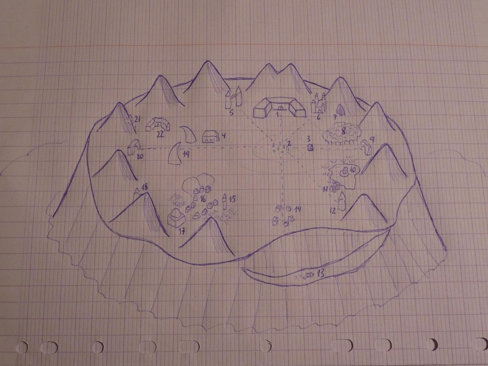

# Nivel 9: La cima, por Carlos de la Cruz

## Introducción

Desde la cima de la Montaña Soberana, los sucesivos Reyes de la Montaña han gobernado las regiones circundantes por tiempo inmemorial. Un Rey ha sucedido a otro, y cada uno ha utilizado los poderes de la Montaña para conseguir cumplir sus sueños, ya fueran pacíficos, bélicos o simplemente megalomaníacos.

Hace décadas que desapareció el último Rey de la Montaña, el Rey Sin Rostro, llamado así porque usaba un casco que le cubría toda la cabeza, y que no mostraba ningún rasgo, sino que reflejaba lo que rodeaba al Rey, como si fuera un extraño espejo.

Desde la desaparición del Rey Sin Rostro, la Montaña Soberana vive en la anarquía, y las regiones vecinas se han independizado de su dominio, dedicándose a buscar su propio destino.

Los habitantes actuales de la cima de la Montaña son los descendientes de los sirvientes y consejeros del último Rey, y algunos se consideran aún sus vasallos. Otros piensan que son la nobleza de este lugar, y existen grupos que se preocupan únicamente por sobrevivir. Pero todos intrigan contra sí por seguir manteniendo una posición política que les haga alzarse con el favor del Rey, cuando éste regrese. Ya sea el Rey Sin Rostro, que vuelva a reclamar su trono, o un nuevo Rey de la Montaña que pase las pruebas de realeza y se alce con el poder.

Justo por debajo de la cima de la Montaña hay un manto de nubes de tormenta que se mantienen de forma permanente aquí, merced a un hechizo protector. Los rayos cruzan frecuentemente las nubes, y una persona que intentara llegar volando a la Montaña sería atacada cada turno por un rayo que hace 15d6 de daño. Si esto no fuera suficiente para detenerle, un viento huracanado trataría de estrellar al intruso contra los flancos de la Montaña.

## Mapa de la cima de la Montaña

  

## Conexiones con otros niveles

* Desde los ascensores en la [sala 13 del nivel 8](./nivel-08.md).

## Leyenda de salas del nivel

### Sección 1 - El Palacio del Rey

Este es el Palacio del Rey de la Montaña. Actualmente está cerrado por poderosos hechizos que impiden que nadie entre en él. Sólo el Rey de la Montaña puede abrir las puertas.

### Sección 2 - El Laberinto de Piedra

Esta sección es un laberinto de grandes piedras cubiertas de extrañas runas. Hay obeliscos, menhires, dólmenes, y todo tipo de estructuras. Algunas piedras están hechas de granito, otras de basalto negro, y aún otras de mármol pulido. Hay hilos de oro, plata y cobre cubriendo las piedras como una telaraña, y joyas y gemas en los lugares apropiados. 

Desde el Palacio del Rey se puede lanzar un hechizo que hace que las piedras cambien de posición, lo que permite modificar el clima de las regiones vecinas, provocar terremotos devastadores o grandes ciclones.

La configuración actual hace que los poderes del frío y del invierno sean más potentes, y esa es la razón de que los glaciares estén creciendo tanto en las comarcas cercanas a la Montaña.

### Sección 3 - La Escalera del Rey

Esta es la escalera desde la que el nuevo Rey de la Montaña debe entrar en la cima. Sólo aquellos que cumplan las terribles pruebas de las profundidades de la Montaña podrán llegar hasta aquí. Sin embargo, en el pasado algunos impostores han cruzado estas escaleras sin ser un Rey auténtico, sino un Falso Rey. Hay dos Gigantes de Bronce custodiando la Escalera, para impedir que nadie las use para bajar. Los Gigantes de Bronce examinarán a cualquiera que suba por las escaleras, para comprobar si son Reyes o Falsos Reyes. Su primera prueba suele ser comprobar si el candidato resiste un sagrado pisotón.

### Sección 4 - Las Barracas

Cuando aún había un Rey de la Montaña, estas eran las dependencias de la Guardia de la Montaña, la Primera Legión, y de su líder, el Gran Mariscal. Cuando los líderes del resto de las Legiones venían a la Montaña a recibir las órdenes de su Rey, se alojaban en estas Barracas.

Cuando el Rey Sin Rostro desapareció, el Gran Mariscal trató de mantener la paz y el orden, hasta que el Rey regresara. Durante un tiempo lo logró, pero durante una reunión con el resto de líderes, el Mariscal de la Xª Legión de Baor (un orco), acusó al Gran Mariscal de querer usurpar el trono, y se inició una lucha que terminó con la muerte del Gran Mariscal. En las décadas que han pasado desde entonces, varios líderes guerreros se han autoproclamado Gran Mariscal, y han empuñado la gran espada Vorpal +3 que es el símbolo de su rango.

El actual señor de las Barracas es el autoproclamado Gran Mariscal Nadaris, un goblin que gobierna un heterogéneo grupo de hombres bestia (35 orcos, 40 goblins, 20 hobgoblins y 18 gnolls), y que está protegido por una fiel banda de 6 trolls. El Gran Mariscal Nadaris no confía en la magia, y suele usar su espada Vorpal para decapitar a cualquier mago o clérigo con el que se cruce.

### Sección 5 - Las Torres de la Hechicería

Estas dos torres gemelas fueron antaño una universidad mágica donde los más grandes hechiceros venían a aprender. Una de las torres sirve aún como escuela de magia, y el Archimago Simplicissimus (Mago de nivel 12º, poseedor de un Bastón de Hechicería y una Túnica de Mago) reside aquí, junto a otros cuatro magos de menor poder (niveles 10, 8, 8 y 7) y varios servidores mundanos y mágicos.

La segunda torre contiene la antigua biblioteca de magia, pero desgraciadamente un Efreeti conjurado por un hechicero hace muchos años se ha hecho fuerte en este lugar, y ya ha amenazado con quemar todos los libros si alguien se atreve a atacarle. Simplicissimus lleva años inventando planes para acabar con el Efreeti y recuperar el acceso a la biblioteca, pero teme que la biblioteca sufra daños catastróficos, y esto ha hecho que siempre encuentre algún pequeño fallo en sus planes, y no los lleve a cabo.

### Sección 6 - El Castillo de Aureus

En este gran castillo vive Aureus, un Gigante de las Tormentas. Junto a él viven 5 Grifos que vigilan que nadie penetre en la fortaleza. Aureus es un mago de nivel 6, y es el encargado de renovar el hechizo que mantiene la nube de tormenta permanente alrededor de la Montaña (nube encargada de lanzar un rayo de 15d6 de daño cada turno a aquellos que traten de llegar volando a la cima de la Montaña). Aureus sale en ocasiones a cazar con sus Grifos por los alrededores de la Montaña, y considera las nubes de tormenta como su coto privado.

### Sección 7 - La Cueva de Hunker

En esta cueva vive Hunker, un Dragón Rojo Adulto. La cueva se interna en espiral en la Montaña hasta llegar a la gran cavidad donde Hunker duerme sobre una cama de oro. En la misma cueva vive una tribu de 50 trogloditas que le adoran como a su dios, y que asumen como tarea sagrada mantener las escamas del Dragón relucientes. En las contadas ocasiones en que Hunker despierta, suele devorar algún que otro troglodita, pero estos se han hecho expertos en determinar si el dragón está a punto de despertar, y procuran tener algún sacrificio preparado previamente para saciar el hambre del dragón (con lo que a veces se puede encontrar a los trogloditas secuestrando gente por la cima de la Montaña).

### Sección 8 - El Bosque de los Colmillos

Este bosque era originalmente un pequeño jardín, cuidado por un Treant llamado Blancorteza. Cuando el Rey Sin Rostro desapareció, Blancorteza trató de mantener el jardín cuidado, pero a medida que los años pasaban y las incursiones de otros habitantes de la cima (en busca de plantas comestibles o curativas) dañaban el jardín, Blancorteza comenzó a actuar de modo más enérgico. Creó grandes muros cubiertos de hiedra venenosa y enredaderas, e hizo crecer grandes plantas carnívoras para acabar con los intrusos. Su protección fue tan eficaz que el jardín creció hasta convertirse en un bosque, gracias a la magia de Blancorteza.

Blancorteza sufrió graves heridas a manos del Dragón Hunker, en una ocasión en que éste se despertó. Temeroso de no poder cuidar su jardín, selló un pacto con un grupo de licántropos que desde entonces usan el bosque como su escondite. Los licántropos son 12 hombres-jabalí liderados por Baden-Urt, un Jabalí Demoníaco que puede asumir una bestial forma semi-humana. 

Blancorteza pasa cada vez más tiempo enraizado y dormitando, en el centro del bosque, y Baden-Urt y sus seguidores usan las trampas del Bosque de los Colmillos para refugiarse después de sus incursiones sobre el resto de comunidades.

### Sección 9 - La Puerta del Crepúsculo

Este gran arco del triunfo está cubierto de runas y bajorrelieves que cambian cada día cuando el sol se pone. Cada noche, las runas, textos y bajorrelieves cambian, mostrando información sobre el modo en el que uno de los viejos Reyes de la Montaña terminó sus días. Un estudioso podrá aprender grandes secretos de la historia del mundo examinando los relieves.

La Puerta del Crepúsculo es un lugar conectado con el Plano Elemental Negativo, y en ocasiones aparecen demonios, no-muertos y espíritus malignos bajo el gran arco. Si tienen la suficiente fuerza de voluntad, estos seres pueden alejarse del arco y tratar de sembrar el mal en la cima de la Montaña.

### Sección 10 - El Lago

Este gran lago se alimenta de un portal al Plano Elemental del Agua. Antaño este portal servía para proveer de agua a los habitantes de la cima de la Montaña, pero desde que el Rey Sin Rostro desapareció, el portal está fuera de control, y trae cada vez más agua. Cada año el lago crece un poco más, y más allá de la orilla la tierra es húmeda y pantanosa.

En el fondo del lago vive una Tortuga Dragón, normalmente letárgica. En ocasiones un monstruo procedente del Plano Elemental del Agua emerge a través del portal, pero la tortuga-dragón vive para estos momentos, que le dan la oportunidad de alimentarse. Hasta ahora, nada más grande que la tortuga-dragón ha atravesado el portal.

En el centro del lago hay una isla con un pequeño templo, protegido por 2d4 elementales de agua (el número concreto cambia cada día). En el centro del templo hay un altar de piedra, y sobre el altar, un Frasco de Agua Inagotable del que mana un gran chorro de agua. Si los héroes se llevan el Frasco pensando que con eso detendrán la expansión del lago, cometerán un error, puesto que el verdadero portal se encuentra en una cueva subterránea debajo de la isla.

### Sección 11 - Aldea de Pescadores

Esta pequeña aldea está formada por cuatro grandes casas de dos pisos, hechas de recia madera. Las casas huelen a humedad y podredumbre, pero sorprendentemente, están habitadas. Los Whately son una familia de siete miembros que viven en la casa más cercana al lago, y los Pikeman son otras cinco personas que viven en la casa opuesta. Se hacen pasar por, pero en realidad los Whately son 7 híbridos de humano y kuo-toa y los Pikeman, 5 ghouls. Ambos mantienen la fachada de ser humanos que viven de pescar en el lago, y de hecho, suelen comerciar con pescado con otros habitantes de este nivel.

Pero tarde o temprano algún ser desprevenido llega a esta zona y cae en la trampa de sus habitantes, siendo normalmente devorado después de haber sido sacrificado a los dioses impíos de los Whately y los Pikeman.

### Sección 12 - Torre de los Vampiros

Esta torre es la residencia de un grupo de 4 Vampiros. Los no-muertos viven protegidos por un pequeño ejército de 30 esqueletos y 15 zombies, que pueblan las salas inferiores de la torre. Los vampiros moran en la última planta, la más elevada, y suelen dormir bastante, ya que no es sencillo obtener alimento en este lugar. 

Cuando el hambre finalmente les obliga a despertar, los vampiros suelen cazar en grupo a una presa inteligente y se la llevan a su torre, donde suelen torturarla antes de beber su sangre hasta la última gota.

### Sección 13 - La Torre Derrumbada

Antaño esta torre se alzaba como una más de las fortalezas mágicas de la cima de la Montaña Soberana. Sin embargo, un día el Rey Sin Rostro realizó un ritual en esta torre, que salió terriblemente mal. La parte de la Montaña donde se alzaba esta torre se derrumbó, y el Rey Sin Rostro murió en la caída. Su cadáver, junto a su casco-espejo, sigue en la torre. 

El derrumbamiento que acabó con la vida del Rey Sin Rostro fue provocado por una invocación fallida. No se recuerda cuál era el objetivo del Rey, pero su invocación fue interrumpida por un grupo de demonios que hizo explotar la torre. 

Los demonios tienen un gran interés en que nadie recupere el cadáver del Rey Sin Rostro y han usado sus poderes de forma sutil, haciendo que los habitantes de la cima hayan olvidado que aquí hubo algún día una torre, o que su Rey murió en este lugar. Cualquiera que recuerde lo que había en este sitio tenderá a olvidarlo, o a no darle importancia alguna. Los habitantes de la cima que llevan poco tiempo aquí son menos susceptibles a este efecto, pero cualquiera que viva un año y un día en este lugar, perderá por completo la capacidad de preguntarse por este lugar.

### Sección 14 - El Pueblo Maldito

Estas ruinas son todo lo que queda de un pueblo que existía en este lugar. Ahora las casas semiderruidas son el hogar de 10 Sabuesos Infernales y 5 demonios. Estos demonios cuidan de los viejos glifos que mantienen el aura de confusión creada por sus señores hace décadas. Pero ni están muy motivados, ni creen que sea divertido llevar a cabo este trabajo.

### Sección 15 - La Torre de vigilancia

Esta torre ha sido construida por los Leales, y sirve como torreta de vigilancia desde la que determinar si algún enemigo se acerca al pueblo. Siempre está ocupada por un grupo de 2d3 guardias humanos, encargados de vigilar los alrededores y, muy especialmente, los sembrados y los corrales. 

### Sección 16 - El Pueblo de los Leales

Este pueblo alberga la mayor concentración de humanos, elfos y enanos de la cima de la Montaña. Son los descendientes de los servidores del Rey (y algunos de los elfos y enanos, los mismísimos servidores), que se agruparon en esta zona, alrededor del Templo del Sol, para darse ayuda y protección mutua. 

Los habitantes de este pueblo se autodenominan “los Leales”, puesto que siguen considerando al Rey de la Montaña como su legítimo líder, y no pierden la esperanza de que el Rey regrese algún día, o que alguna persona vuelva a cumplir las pruebas que le darían el dominio sobre la Montaña.

Las casas del pueblo son de dos y tres pisos, y albergan a una población de 77 humanos (1 paladín, 2 magos, 29 guerreros, 25 mujeres, 20 niños), 20 elfos (12 guerreros, 8 mujeres) y 12 enanos (8 guerreros, 2 mujeres, 2 niños). 

Los cabeza de familia del pueblo se reúnen cada año para escoger al que será su líder y juez durante dicho año. El actual líder es Borri Forjancha, un enano.

### Sección 17 - El Templo del Sol

Este templo está dirigido por Hiperius (Clérigo humano de nivel 12), un sacerdote del dios Lux, señor del sol. La bóveda del templo está hecha de una especie de piedra translúcida que deja pasar la luz del sol. Por la noche, esta misma piedra magnifica la luz procedente de las estrellas, de modo que estas aparecen de forma más vívida sobre la bóveda, y permite a los sacerdotes del Templo estudiar los cielos en busca de respuestas.

Hiperius tiene la asistencia de un grupo de 3 sacerdotes (clérigos de niveles 10, 8 y 7), dedicados al estudio de las estrellas, y protectores de la aldea de los Leales.

### Sección 18 - El Castillo de los Paladines

Este viejo castillo alberga a un grupo de 3 paladines, bajo las órdenes de Lord Radden, un paladín de nivel 10. El castillo albergó en su tiempo a toda una orden de paladines, la Orden de los Héroes, fundada hace siglos por uno de los Reyes de la Montaña. La Orden se ha mantenido activa todo este tiempo, aferrada a las viejas costumbres y a sus antiguos privilegios, que le han permitido subsistir incluso cuando posteriores Reyes de la Montaña no compartían sus objetivos. Actualmente, Lord Radden protege a la aldea de los Leales, y espera la llegada de un nuevo Rey de la Montaña.

### Sección 19 - Los Cuernos

Estas dos enormes estructuras no parecen cumplir ninguna función específica. Suelen estar llenas de pájaros, pero los viejos del lugar dicen que es mejor no acercarse a ella, ni andar por entre los arcos. 

Y llevan razón, pues cualquiera que lo haga sufrirá el impacto de un rayo que le causará 15d6 de daño.

### Sección 20 - La Puerta del Amanecer

Este gran arco del triunfo está cubierto de runas y bajorrelieves que cambian cada día cuando el sol sale. Cada día, las runas, textos y bajorrelieves cambian, mostrando información sobre el modo en el que uno de los viejos Reyes de la Montaña llegó al poder. Un estudioso podrá aprender grandes secretos de la historia del mundo examinando los relieves.

La Puerta del Amanecer es un lugar conectado con el Plano Elemental Positivo, y en ocasiones aparecen devas, solares y espíritus malignos bajo el gran arco. Si tienen la suficiente fuerza de voluntad, estos seres pueden alejarse del arco y tratar de promover el bien en la cima de la Montaña.

### Sección 21 - La Aldea de los Monos Voladores

Los Monos Voladores viven en estas casas, colgadas de la montaña. En base a antiguos pactos, son los únicos seres que pueden atravesar las mágicas nubes de tormenta para acceder a la Montaña. Hay 70 Monos Voladores en la aldea, repartidos a partes iguales entre machos y hembras, y 40 crías.

Los Monos Voladores tienen la misión de arreglar los sistemas mecánicos de la Montaña: fuentes, puertas e incluso trampas desactivadas. Se les puede encontrar en casi todos los niveles, en grupos de 2d3. En ocasiones forrajean por los alrededores de la Montaña en busca de comida.

### Sección 22 - El Gran Almacén

Este es el gran almacén donde aún se comercia con el descendiente de los Senescales del Rey. Esta zona fue durante mucho tiempo el centro logístico de la Montaña, donde se guardaban pertrechos, provisiones y comida, todo bajo la supervisión del Senescal. 

El Senescal actual, Lord Iacob (Semielfo Mago de nivel 10), lleva décadas sirviendo como mediador entre distintos grupos (principalmente, entre la aldea de los Leales y las Barracas). El almacén está protegido por 10 Servidores Invisibles y 4 elementales de tierra. Los Monos Voladores deben obedecer al Senescal, y Lord Iacob les utiliza para obtener suministros y comida, y también como espías. Posiblemente Lord Iacob sea la persona más informada de todo aquello que sucede en el interior de la Montaña y en sus alrededores, y posiblemente podría ser un aliado para un héroe que quiera llegar a ser Rey de la Montaña y restaurar el orden.
