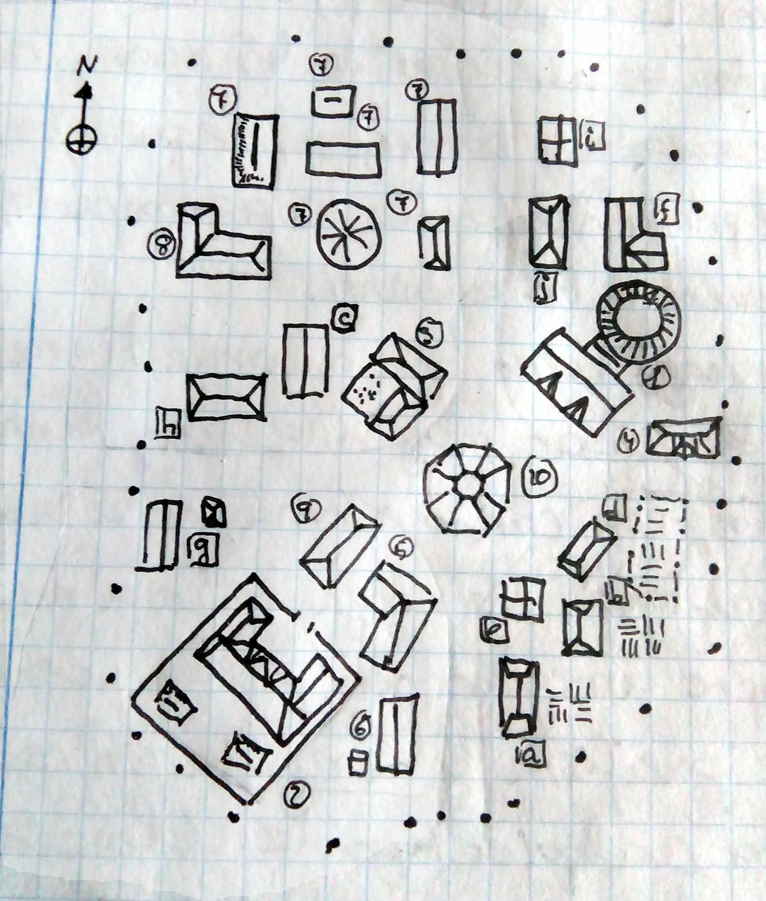

# Piedrainerte, por Sergio Somalo “Tremandur”

Este pueblo está pensado para ubicarse en las cercanías de la Montaña Soberana, sirva como lugar de descanso previo o para recuperarse de las aventuras corridas y sufridas dentro de la Montaña, así como poder ser un lugar donde asentarse, siempre y cuando se mantengan las reglas que lo rigen.

No se ha añadido estadísticas para que pueda ser utilizado con los diferentes sistemas que existen, aunque en la redacción y diseño del mismo se ha tenido en mente siempre sistemas tipo Ad&D o Aventuras en la Marca del Este.

## Mapa

## Historia

El nacimiento del pueblo como asentamiento estable no está muy claro y la verdadera información, según muchos de sus habitantes, se puede encontrar de dos sitios, ambos actualmente inaccesibles. Uno es la torre-biblioteca del centro del pueblo y otra, la mente completamente insondable del viejo Fistandanfi.

Entre las casas que actualmente se mantienen en pie, hay tres edificios que destacan del resto por su antigüedad patente y sus diferentes estilos. Todos los piedrainerteños están de acuerdo que el pueblo nació alrededor de dos de ellos, solo que unos dicen que fue alrededor de la biblioteca y otros alrededor del tempo. En lo que si están de acuerdo que la Torre mística, que presenta unas formas muy diferentes y antiguas al resto, es un punto a evitar.

Cuando la Montaña Soberana comenzó a ser un lugar de peregrinaje, los aventureros buscaban tanto la información que pudiese tener la biblioteca en relación con la montaña como las atenciones del tempo de cara a su salud y heridas. El hecho es que varios de los aventureros que visitaron la montaña, decidieron quedarse a vivir aquí, en el páramo de piedrainerte y comenzaron a edificar y vender sus servicios y habilidades. La existencia de la leyenda de “quien domine la montaña, dominará el mundo”, ha sido un acicate más que importante para que muchos aventureros de diversas nacionalidades, culturas y motivaciones pasen por estas tierras dejando su huella. Algunas de las civilizaciones anteriores poseyeron la montaña y pudieron ser los que crearon un asentamiento anterior al actual. Los tres edificios antiguos y de diferente hechura es un dato a tener en cuenta.

Actualmente el asentamiento, que inicialmente no era más que un grupo de tiendas de campaña alrededor del tempo, se ha convertido en un poblado estable con más de veinte casas, doce familias viviendo en Piedrainerte, la presencia de una posada o fonda, taberna, almacén y herrería, la existencia de una figura de poder legal y sus peculiaridades.

## Sistema Monetario

Si bien las monedas de metales preciosos son vistas dentro del pueblo, es entre los forasteros y en sus intercambios donde se utilizan porque los piedrainerteños no utilizan ni aceptan monedas, sino que utilizan lingotes de oro, plata y cobre puros para sus transacciones. Estos lingotes son de 2, 4 y 12 onzas de peso. La decisión de eliminar las monedas se asentó hace bastante y es uno de los mitos del pueblo, en el que se habla de un secuestro del comercio por un huraño vendedor que fue capaz de hacerse con todos los negocios y él disponía del valor de las monedas según sus apetencias y necesidades. La realidad fue que tras un intento de estafa bastante grande por un extranjero, un juez decidió eliminar esa posibilidad haciendo que se utilizase solo metal puro, la otra razón está olvidad de la mente colectiva y se relaciona con las monedas embrujadas y Fistandanfi, pero actualmente el viejo hombre no es capaz de decir nada. Por ello, todo el que quiera hacerse con objetos o servicios dentro del pueblo ha de fundir sus monedas porque no realizan trueque ni cambio de moneda. La persona encargada de realizar esta tarea y es el herrero del pueblo, el cual lo hace de forma desinteresada y sin cobrar ningún tipo de cargo ni extra. El coste ya se le paga en forma de impuesto recaudado cada cierto tiempo. Por tanto, cualquier Pj deberá decidir cuanta moneda quiere fundir y el DM será el que determinará cuanta cantidad de impureza tiene y cuanto recibe para poder hacer las compras y pagos.

## Las seis casas

La segunda peculiaridad que tiene este pueblo está relacionada con varias casas que hay completamente deshabitadas pero mantenidas de forma impecable. Dentro del los límites de Piedrainerte debe existir al menos seis casas sin habitantes habituales en ellas pero completamente preparadas para poder vivir en cualquier momento. Si en algún momento se da la situación de que alguien se instala en una de estas casas de forma permanente, haciendo que se reduzca la cantidad de casas libres a cinco o menos, entonces se activa una maldición que recae sobre el pueblo desde casi el día que se comenzó a construir.
Esta maldición hace que cualquiera que quiera construir una casa fuera del perímetro del pueblo, marcado con unos pequeños hitos negros, no consiga terminarla nunca, porque hay problemas con las materias primas, la madera se pudre demasiado rápido, la piedra se rompe, la casa se cae si razón aparente, se llena de vegetación en muy poco tiempo... cualquier cosa. Esto hace que el espacio dentro del perímetro se haya ido reduciendo y actualmente no es posible construir nada nuevo. Si se llega a activar la maldición, lo que ocurre es que en la noche de la activación, aparece una columna de humo negro que se mueve muy rápido por el pueblo y entra en una casa, aparentemente al azar, y se lleva a todos sus habitantes.

Para poder llegar a decir que una de las casas vacías está siendo habitada, han de pasar más de cuatro días seguidos viviendo en ella, además de deshacer el petate y dejar cosas dentro. Con dejar el propio petate dentro, la maldición se puede activar. Esto es bien conocido por los piedrainerteños y actualmente hay seis casas deshabitadas, pero no quieren llegar a tener problemas con la maldición y eso hace que el alguacil sea especialmente adusto con los forasteros y todos los habitantes inviten a vivir fuera del pueblo a los aventureros que quieran asentarse mientras estén explorando la montaña y siempre que la posada esté llena. No suelen dejar vivir a nadie dentro de las casas deshabitadas a no ser que lo acepten ellos.

## El pueblo

Y en torno al eje formado por estos dos edificios y la nueva fonda (2), se distribuye todo el pueblo. Los puntos negros que se ven en el mapa, son los hitos que delimitan el espacio de Piedrainerte.

En la parte norte de este eje, se puede ver un conjunto de dos edificios con un patio amurallado, es la Cárcel (3), el lugar donde se recluyen a los reos y se imparte justicia. Detrás de estos edificios se encuentran las seis casas deshabitadas (7), en perfecto estado y cerca está a vieja posada (8). Al lado del templo y cercano a la salida del pueblo por el este hay una casa grande, es el herbolario (4), la tienda de pócimas y hiervas donde hay ungüentos, cataplasmas, pócimas y pastelitos que sirven para prácticamente toda dolencia.

Pasando una zona residencial al sureste de la biblioteca, entre ésta y la nueva fonda, se puede encontrar el almacén (5) y la herrería (6), dos lugares muy frecuentados tanto por forasteros como por piedraineteños. En estos dos edificios se pueden comprar muchas cosas y conseguir el oro necesario para dichas compras.

## PNJs

### Fistandanfi (Mago nivel 16)

Es un anciano bastante olvidadizo que lleva en el pueblo desde hace mucho, de hecho, todos los habitantes lo recuerdan como un anciano y nadie sabría decir si hubo alguien antes de él en Piedrainerte.

Se le puede ver siempre a la misma hora haciendo lo mismo: al amanecer, sale de su casa (d) y con paso rápido se presenta en las puertas de la biblioteca, las mira y vuelve a casa circunspecto. Al anochecer sale del Hiervas y Pócimas, su tienda herbolaria, y deja el pueblo por el camino del norte hasta llegar a la torre mística, la mira y vuelve sin decir nada. Por lo demás, en el pueblo se le conoce por sus pócimas, elixires y de vez en cuando, por sus explosiones. Es muy despistado y se hace muy difícil mantener una conversación coherente con él que dure más allá de los cinco minutos. Todos los habitantes lo ven como un viejo escéntrico al que el encantan sus plantitas y que suele ser generoso con los precios de los preparados que tiene.

Tiene un secreto y es que este pobre hombre es en realidad el último guardián del Códice Rojo y debe protegerlo de las codiciosas manos de Oculuck, un demonio encarnado y encadenado en el cuerpo de un hombre, el místico. Actualmente la lucha está en un ínterin porque se firmó un pacto entre la Orden de los Magos carmesíes y Oculuck. En ese pacto, Fistandanfi está obligado a llevar una persea maldita que hace que no pueda centrar su mente en cualquier pensamiento durante mucho tiempo. Solo hay una situación en la que la persea deja de ejercer su efecto y es cuando se activa la maldición. Entonces Fistandanfi retoma el control de sus pensamientos y sus poderes, vuelve a ser consciente de quién es y de su obligación y centra todo su poder en controlar la acción de Oculuck, que consiste en llevarse el libro de la biblioteca. A cambio de ese control y desgaste, Oculuck, cuando vuelve a su cárcel, se lleva consigo todos los habitantes de la casa que elija.

### Hermano Tom (Clérigo nivel 7)

Es un hombre de alrededor cuarenta y cinco años, con aspecto cansado y bonachón. Se puede decir que fue el primer habitante de esta última época de Piedrainerte, si exceptuamos a Fistandanfi.

Es un clérigo legal bueno que además tiene una forma de pensar muy ingenua, tanto que sus convecinos, con cariño o sorna, depende del vecino, le llaman el “legal-tonto” del pueblo. No niega nada a nadie, busca siempre arreglarlo todo por las buenas, es pacifista y se niega en redondo a que exista cualquier tipo de violencia en su casa (i) o en el tempo que lleva. Como posesiones personales tiene muy pocas cosas pero una de ellas está impregnada de su santidad, convirtiéndose asi en un talismán muy potente, tanto que cuando se activa la maldición del pueblo, el humo negro nunca toca su casa o el tempo, según donde se encuentre el y es su símbolo sagrado, tallado en madera.

El lado oscuro de Tom es que anteriormente fue un inquisidor militante de un dios diferente al que actualmente profesa fe y más beligerante, tanto como que mandó a la hoguera a muchos seguidores de su dios actual y eso ha hecho que haya muchos familiares de los ajusticiados que quieran su cabeza. Su conversión es otra historia pero, tras abrazar su nueva fe, adquirió una penitencia que fue instalarse en Piedrainerte y fundar una misión, cosa que lleva haciendo desde entonces.

### Hernest (Explorador nivel 9)

Este hombre, con una ostentosa cojera, es el alguacil de Piedrainerte y tiene como compañero un búho hembra con muy mala leche. Vive detrás de la cárcel (c) y es un hombre hosco que trata especialmente mal a los forasteros, invitándoles a pernoctar fuera del perímetro del pueblo en sus tiendas de campaña, arguyendo que en ese lugar el no tiene jurisdicción y pueden hacer lo que les plazca. Dentro del pueblo, Hernest es el “brazo armado” de la ley, es decir, es el que se encarga de las situaciones normales y comunes como trifulcas y broncas de poca monta que puedan haber. También es quien mantiente a los presos hasta que son llevados a la ciudad o son liberados.

Su cojera es consecuencia de un accidente tonto, pero a todo el mundo le ha contado que fue en los niveles superiores de la Montaña. Por ser el alguacil, pocos se atreven a contradecirle, él lo sabe y más de uno ha pasado la noche en el calabozo por contrariar a Hernest. La realidad es que nunca ha estado en la Montaña, aunque conoce los caminos que llevan a ella bastante bien Hernest no es amigo ni se siente obligado por nadie, excepto por su jefe y superior, el paladín Hemin.

### Hemin Guay (Paladín caído nivel 7)

Antes de asentarse en Piedrainerte, Henin era un joven paladín, un defensor de la fe con misiones de protección de personas y lugares. Poco antes de llegar a la Montaña, tubo una flaqueza y falló en su misión, lo que hizo que se le impusiese una penitencia. En su último destino como guardián, fue seducido y delante de sus narices le robaron una reliquia importante de la iglesia a la que pertenecía. Su dios lo puso en el punto de mira y le ordenó que se uniese a una expedición que iba a la Montaña soberana para recuperar la reliquia robada (que actualmente se encuentra en la sala 15 del nivel 5 de la montaña). Esta reliquia es un collar de plata. El asalto a la montaña fue un fracaso y además Henin desoyó el mandato de su dios, de forma que se le fue retirada la gracia divina hasta que purgue completamente todos sus pecados. Actualmente lleva viviendo en Piedrainerte cinco años, en la misma casa que el guardabosques (c). Es un hombre de 35 años que no tiene ninguna capacidad especial de paladín, pero dentro del pueblo se le considera una autoridad judicial. No es muy alto, empieza a tener serias entradas en su cabello y canas en la barba. Tiene a Hernest como ayudante e intenta volver al camino recto del que se alejó, trabajando por la comunidad pero con la visión de la justicia de su dios. Todos los habitantes del pueblo saben que no es un paladín, pero los forasteros no tienen por qué saberlo e intentan que así sea.

Su parte oscura es que se ha obsesionado tanto con agradar a su dios que ha perdido el rumbo completamente y empieza a coquetear con fuerzas menos neutras y más oscuras, Dentro de su casa, (c), en una zona donde solo puede acceder él y que Hernest no conoce, hay un pequeño altar donde la figura que representa a su dios, está comenzando a cambiar sus facciones, está mutando.

### Kipi y Kape (Guerreros de nivel 4)

Son dos hombres de 30 años completamente iguales excepto en los criterios morales, de forma que siempre chocan cuando hay que tomar alguna decisión y terminan discutiendo, enfadados y al final resuelven la disputa mediante terceros o al azar, porque a golpes ya han visto demasiadas veces las celdas del pueblo.

Llegaron al pueblo con un grupo de aventureros y con permiso del paladín, se aposentaron en una de las casas vacías. Kipi y Kape siempre discutían y al final uno de ellos, Kipi, siempre pasaba la noche en otra casa, habiendo dejado su petate en ella, de forma que sin que los piedrainerteños lo supiesen y entendiesen (cosa que posteriormente entendió y se convirtió en un secreto de Kipi), la maldición se activó y ésta se cebó con la Gran Fonda, llevándose a la familia de Edgar Kunning y más de diez huéspedes que allí estaban. Después de esto, los gemelos se hicieron con la fonda tras llegar a un acuerdo entre ellos, cosa que no ha vuelto a ocurrir hasta el momento.

Desde entonces se encargan de dar techo, comida y bebida tanto a los del pueblo que lo necesiten como a forasteros. Casi todos los días tienen una bronca y siempre son por chorradas de forma que muchas veces esa bronca da lugar a una situación un tanto absurda y graciosa. Eso si, no se menten en broncas ajenas e intentan que dentro de la Gran Fonda no haya trifulca alguna, cosa en lo que son bastante eficientes.

### Arcenas (Ladrón nivel 12)

Hombrecillo pequeño y delgado, vive en una pequeña casa (e) en frente del almacén que regenta, La Carreta rota. Ladrón a sueldo, ha decidido colgar las ganzúas y apartarse de la acción. Es un hombre honesto, en tanto en cuanto que valora adecuadamente los trabajos, tasa los objetos adecuadamente de forma que si hay algún error en la tasación, es por falta de información, no por mala fe. También es un hombre con un código de conducta en el que no asesina a nadie.

En su almacén, todo lo que hay tiene un precio correcto, compra cosas a su valor real y carga las ventas entre un 1 % y un 5 %. No pretende hacer dinero con el almacén porque realmente ya tiene suficiente y el almacén es su forma de vivir. En su casa tiene todo su equipo de ladrón guardado en un arcón y en otro baúl, con varias trampas y cerrajas hay un pergamino que describe cómo y dónde está escondido todo el tesoro que ha ido acumulando a lo largo de su carrera. También hay un pequeño cofre con un documento muy interesante. El lado oscuro de Arcenas es que nadie puede dejar el Gremio y una vez que entras, formas parte de él hasta la muerte y algunas veces, ni la muerte te salva. Y es que Arcenas ha abandonado el Gremio y ahora vive tranquilo en este pueblo, pero sabe muy bien que no puede estar con la guardia baja, por lo que mantiene un as en la manga para cuando el Gremio intente capturarlo y esclavizarlo. Es un conjunto de pergaminos, guardados en un cofre, que describen dónde está la sede del Gremio y cómo asaltar de forma segura la caja de caudales que hay en su interior. Además se ha encargado personalmente de que ellos sepan de la existencia de parte de este documento. Y ¿por qué ese cofre es su salvaguarda? Porque está encantado y si Arcenas muere o se distancia más de 5 kilómetros del cofre, el encantamiento se activa, desactivándose todas las defensas del baúl que lo contiene y teletrasportándose a un lugar que solo él conoce.

### Filint (Enano nivel 7)

Es un enano que lleva más de 12 años en el pueblo, llegó poco después que el hermano Tom y es su mejor amigo. Tolera las excentricidades de Fistandanfi y acepta a Hemin como la ley en el pueblo. Quizás es el que mejor acepta a los forasteros de todos los piedrainerteños y siempre tiene una jarra fresca de cerveza para cualquier cliente. Es el dueño y fundador de la herrería, además vive en ella.

En realidad es el más tolerado y aceptado en el pueblo porque es el único capaz de crear la “moneda de cambio” que se utiliza en el pueblo. Es capaz de fundir metales en su fragua y separar el metal puro de las impurezas o de otros metales también fundidos y así crear lingotes de oro, plata y cobre puros. Es tremendamente honesto y no cobra por el trabajo. ¿Por qué? Porque la gente del pueblo le regala lo que el necesita o le dona la materia prima, que anteriormente ha sido rcaudado como impuesto por parte de Hemin.

Así, si algún forastero intenta llevarse algo por la fuerza, aunque sea un buen luchador, no suele hacer nada por impedirlo porque sabe que los piedrainerteños lo defenderán.

### Eyvilin (Elfo nivel 9)

Es un elfo especialmente bien vestido, normalmente habla solo en élfico y su orgullo hace que sea difícil que acepte a cualquiera del pueblo como un igual. Vive en una mansión detrás del templo (f) y dentro de Piedrainerte no desempeña ningún papel relevante a parte de tocar y cantar en élfico en a taberna cuando le place, que suele ser casi siempre. Y no hace mas. Entre sus ropas siempre lleva un fajín carmesí bordado con símbolos élficos que procura disimular con sus vestiduras.

Realmente hace mucho más de lo que parece por la comunidad y es vigilar a Fistandanfi, que no le pase nada y que siga vivo. Al sufrir la maldición, muchas veces actúa como un niño pequeño y el ha de ser su niñera, cosa que no le agrada pero entiende la importancia de su trabajo y de la situación, por lo que actúa acorde a ello.

### Místico (Demonio Oculuck)

Muy rara vez sale el místico de su torre, localizada al norte del pueblo, a pocos kilómetros de distancia. Es un hombre que aparenta 45 años, de tez negra, pelo negro y ojos negros. Dentro de sí está encarcelado el demonio Oculuck, el cual se encuentra ligado a su alma por un oscuro pacto. No tiene conciencia de sí mismo porque lleva demasiado con el demonio en su interior y Oculuck se ecarga de que así sea acallándola e incluso a veces, apagando por completo dicha conciencia y consciencia. Cuando se activa la maldición, Okuluck intenta recuperar el libro que lleva tanto tiempo buscando y como no lo consigue, el pacto firmado dice que puede llevarse las almas de una casa. Para ello, sale de la torre hacia el poblado en su forma real, la de un una columna de humo negro con relámpagos rojos en su interior. Si no fuera por la Orden, Oculuck se cobraría almas hasta saciarse pero la presencia de Fistandanfi y sus poderes, es suficiente para refrenarse. Esto no quita que cuando detecta a un grupo potente de aventureros en el pueblo, salga de su torre en forma humana a entrevistarse con ellos, normalmente para pedirles que eliminen al viejo loco, cosa que hasta el momento solo ha ocurrido dos veces y que ha sido frustrado tanto por los habitantes del pueblo como por Eyvilin.

## Familias

Además de todos estos Pnjs, en las casas (a), (b), (g), (h) y (j), viven aventureros que se establecieron y ahí están como familias enteras. En (a) viven los Etnam, una familia de Medianos bastante tranquila y pacífica. En (b) viven los Farrow, una familia formada por dos guerreros que volvieron de la Montaña y decidieron asentarse. En (g) viven los Pitete, una familia que tiene ciertos problemas con los Farrow, cosas de terrenos. En (h) vive Julay, una mujer que da poca guerra y que se centra en trabajar como camarera en la taberna, llevada por Freddy, que vive en la (j), un ladronzuelo que ha entendido que es mejor ser tabernero que robabolsas en la ciudad.
